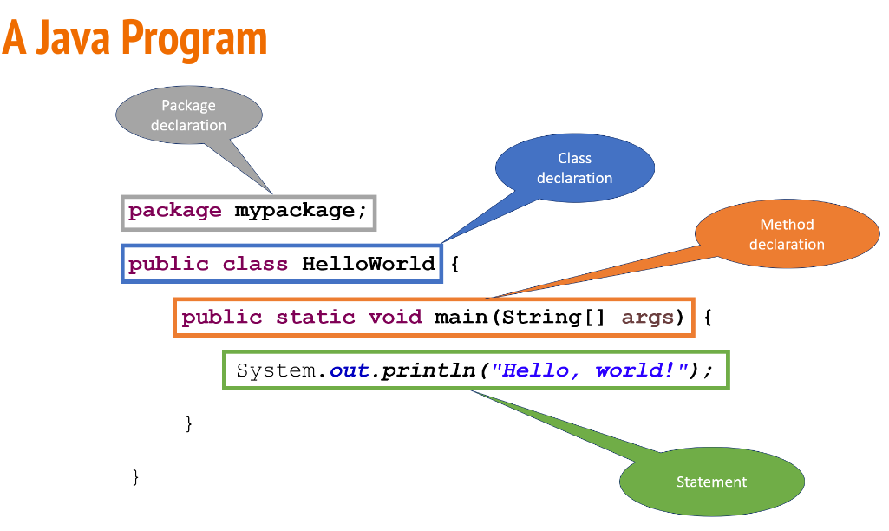
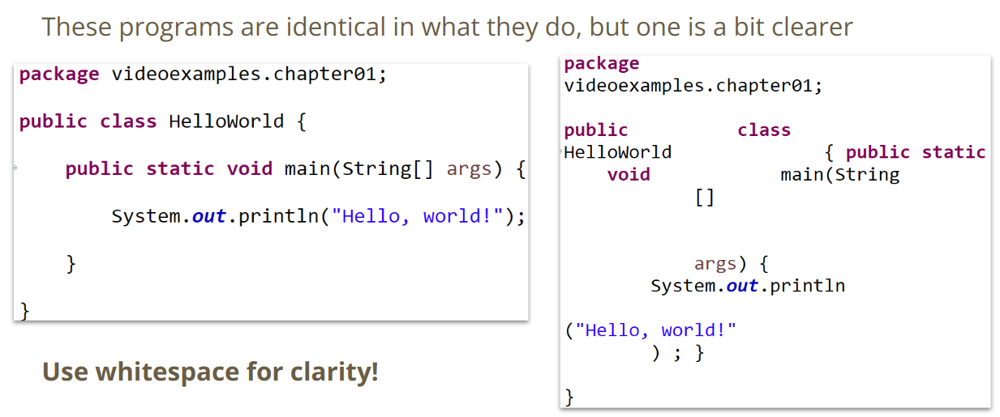
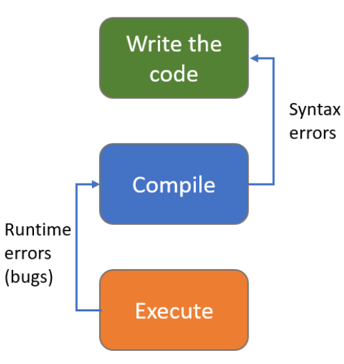
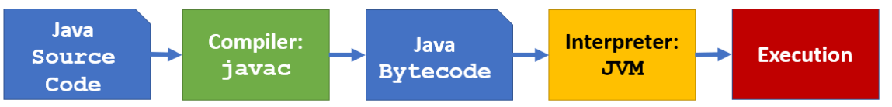
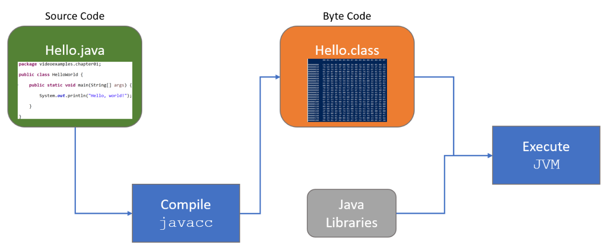
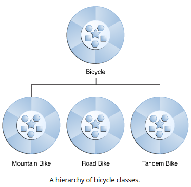
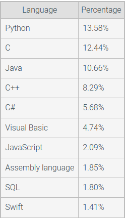

# CSC110 AB Notes

- [Module 1 - Intro to Computers & Java Programming - Slides](https://docs.google.com/presentation/d/1Uh4kWtJzO1zGRaj3QcMiP0LDjg2V5piRg-44zw-cwvE/view)
- [Additional code examples and videos](https://github.com/wadehuber/csc110examples/tree/master/csc110examples/src/videoexamples/chapter01)
- [Oracle Java Tutorials: Lesson - Language Basics](https://docs.oracle.com/javase/tutorial/java/nutsandbolts/index.html)
- [Basic Introduction to Java at www3schools](https://www.w3schools.com/java/java_intro.asp)
    - The first couple chapters

# Google Slides

## What is a computer?

- A **computer** is machine that manipulates data and performs arithmetic and
  logical operations
- A computer consists of:
    - **Hardware** - the parts of a computer that you touch
    - **Software** - the programs and data used by the computer
- We tell a computer what to do using a **program** (application) - a set of
  instructions that the computer executes to perform a task

## Programming Languages

- Programs are written using programming language
- A **programming language** is a set of words and symbols (tokens) that we use
  to write programs
- Each programming language has a **syntax** that describes how the tokens of the
  language can be put together to form valid **statements**
- The **semantics** of a program defines what the statements mean
- A syntactically correct program may not be semantically correct!
- A program will always do _exactly what you tell it to do_, not what we _meant_
  to tell it to do

---

- There are many programming languages in use today such as:
    - Python
    - C++
    - JavaScript
    - C#
    - and hundreds of others...
- In this course, we will be using **Java** as our programming language of
  choice
- Many concepts you will learn will carry over to other languages
    - For example, most languages have for-loops, and the Java syntax is identical
      to C & C++

---

Programming languages are constantly evolving

- **Machine language** is the language of the CPU (binary code)
    - But, they are CPU-specific!
- **Assembly language** is a mnemonic device that maps human-readable
  identifiers to machine language
- **High level languages** are more human-readable and get converted to machine
  language by a compiler
- **Fourth-generation languages** are more natural-language like

## The Java Programming Language

- Java was introduced in 1995
- It was created by a team at Sun Microsystems let by James Gosling
- Java is an **object-oriented programming** language (more on that later!)
- A Java program is made up of one or more **classes** that contain **methods**
  that contain **statements**
- Every Java application must contain a method called main which is where the
  program starts
- The main method often uses other classes and calls other methods

## A Java Program



## Comments

**Comments** are code that the compiler ignores - they allow the programmer to
document their code.

Java has 3 comment formats:

- C style: `/* this is a comment */`
    - can extend multiple lines
- C++ style: `// this is a one line comment`
- **Javadoc:** `/** this is a javadoc comment **/`

Comments do not affect how the program runs - the serve to give hints to other
programmers about what the program is doing

Use comments to clarify the _thought_ behind your code, not what it does. For
example, here are 3 lines of code that do the same thing:

- Bad: `a = t / c; // A is equal to t divided by c`
- Better: `a = t / c; // Compute the average`
- Best: `averageStudents = totalStudents / numberOfClasses;`

- Notice that the best use of comments is using descriptive names instead of
  comments!

## Identifiers

- **Identifiers** are names chosen for things in their program
- **Reserved words** have a predefined meaning to the language, so you cannot
  use them as identifiers
    - See https://docs.oracle.com/javase/tutorial/java/nutsandbolts/_keywords.html
      for a list
- Java identifiers are made up of letters (A-Z), digits (0-9), and the underscore
  (_) and dollar sign ($) characters
- Java identifiers cannot begin with a digit
- Java identifiers are **case-sensitive**
    - So value, Value, VALUE, VaLuE, and vAlUe are 5 distinct identifiers
    - Value, _Value, Value$, and Value1 are also 4 distinct identifiers
    - Note that it is best to use descriptive _names_, not different case to
      differentiate identifiers

### Conventions

- **Capitalize** class names
    - `Circle`
    - `GameBoard`
- Use **ALLCAPS** for constants
    - `PI`
    - `DEFAULT_LENGTH`
- **lowercase** names for packages
    - `project01`
    - `mystuff`
- **camelCase** for method & variable names
    - `avgGrade`
    - `myValue`
    - `bestCaseScenario`
    - `thisOneIsALittleBitLong`

## White Space

- The spaces, blank lines, and tabs in your program are called **white space**
- White space is used to separate the tokens (symbols & words) in your program
- Extra white space in your program is ignored by the compiler
- Use white space to make your code more clear (readable)
    - But, as with comments, you can have too much of a good thing

### Example



## Documenting Your Code

- Strive to write code that does not need to be documented
    - Descriptive variable/method names
    - Classes/methods should encapsulate/do one thing
- Comments should be used to provide the big picture
- Use white space to make your code more readable
- Provide tests to demonstrate how your code works
- Bad programmers write complex code, good programmers write simple code

> Always code as if the guy who ends up maintaining your code will be a violent
> psychopath who knows where you live. Code for readability.
>
> -- John F. Woods, comp.lang.c++

## What Is The Purpose of Programming?

- The purpose of writing any program is to _solve a problem_
- Actually writing the code is not particularly valuable
- Companies do not pay software engineers to write code - they pay them to
  solve problems
    - Code is just the tool they use to solve the problems
- Your value as a programmer is in your problem-solving ability
- The reason you should learn to code is so that you can implement your
  solutions!

## Problem-Solving With Programming

1. Understand the problem
2. Establish requirements
3. Design a solution - break the problem into manageable pieces
4. Implement your solution
5. Refine the solution & consider alternatives
6. Test your solution

## The Program Development Process

1. **Requirements** – an informal description of the program’s needed
   functionality from the user’s point of view
2. **Specification** – a formal description of the programs requirements from
   the programmer’s point of view.
3. **Preconditions & Postconditions** (what the inputs & outputs are)
4. **Design** – translating the specification into procedure
5. **Implementation** – instantiating the design (programming)
6. **Testing** – verifying that the implementation works correctly
7. **Verification & Validation** - verifying that the implementation meets the
   requirements & specification

## How Code Runs



- Write your code using an editor
    - Save your code as ASCII text
- Converts (**compiles**) your **source code** to a form that the computer
  understands (machine language)
    - The compiler my find places where you wrote the code incorrectly (syntax
      errors)
    - If there are syntax errors, you will need to fix them before you move on
- Run (**execute**) your code
    - Errors at this point are called runtime errors and usually indicate a
      problem with the logic of your solution

## How Java Code Runs



Java has a 2-step compilation process - your code is first converted into Java
**Bytecode** and then the **Java Virtual Machine** executes the Java Bytecode

- Note that this means Java is more CPU-independent than other languages as it
  can run on any CPU that has a JVM!



## Program Errors

- **Compile-time Errors** are syntax errors and other problems with your _code_
  that the compiler will find
- **Run-time Errors** occur during program execution and cause the program to
  terminate abnormally (crash)
    - Example: divide by 0, using a null reference
- **Logic Errors** occur when the program terminates successfully, but produces
  incorrect results
    - Example: use of an incorrect formula, incorrectly updating a variable

## Development Environment

- To write and execute your own programs, you will need a development environment
- that consists of the tools you need (**toolchain**):
    - **Editor:** create & modify your source
    - **Compiler:** convert your code to executable format
    - **Test environment (Unit testing)**
    - **Debugger:** help you find errors in your program
- You can use individual programs for each step of the software development
  process
- There are also programs called **integrated development environments (IDEs)**
  that combine all the tools into one software application

## Java IDEs

- There are several popular Java IDEs
    - **Eclipse**
    - IntelliJ
    - NetBeans
    - Repl.it
- They all work a little differently, but the edit/compilation/execution
  process is essentially the same for all of them
- You can also go hardcore and use the command line tools such as javacc to
  compile your source code and java (to run the JVM)

## Object-Oriented Programming

- Java is an **Object-Oriented Programming Language**
- The **object** is the fundamental entity in a Java program
    - A Java program is made up of objects
- An object has some information & some operations
- Represents some real-world entity
- A particular employee in a company
- A window in a GUI
- A character in a game
- Each object handles its own processing and data management

Each object has state and behaviors

- **State - data members / fields / instance variables**
    - What an object knows about itself
- **Behaviors - members / methods / functions**
    - What an object does

The behavior of an object may change its state

- There are often multiple ways to represent a problem
- Usually there is no “one right answer”
- In fact, OOP itself is not always the answer - other paradigms such as
  functional programming are better at solving some problems

### Methods

- Methods define the possible behaviors of the object
- Think of calling a method as “sending a message” that asks the object to do something
    - We say the sender of the method is the **client**
- The message contains the operations name and arguments
- The client doesn’t care _how_ the message is handled, only that it produces an expected result

## Objects vs Classes

A _class_ represents a abstract concept
An _object_ is the realization of a class

- We **instantiate** one or more objects of a specific class
- The Java new operator creates a new object

There can be multiple objects of a given class (called **instances**), but each
object is an instantiation of a single class

### Examples

|  Class  |                 Example Objects                 |
|:-------:|:-----------------------------------------------:|
|  Room   |        Kitchen, Bedroom, Study, Bathroom        |
|  Movie  |   Star Wars, Clueless, Knives Out, Casablanca   |
|  Team   | Diamondbacks, Sun Devils, Cardinals, JoesGarage |
| CSClass |        CSC110AA, CSC205, CSC230, CSC240         |
| States  |      Arizona, Louisiana, New York, Alaska       |

# Programming Basics

Below are the two beginning chapters for learning Java, but the overall tree
for all the chapters can be viewed here: <https://docs.oracle.com/javase/tutorial/java/TOC.html>

- [Object-Oriented Programming Concepts](https://docs.oracle.com/javase/tutorial/java/concepts/index.htmlhttps://docs.oracle.com/javase/tutorial/java/concepts/index.html)
- [Java Tutorials: Language Basics](https://docs.oracle.com/javase/tutorial/java/nutsandbolts/index.html)

```java
// -------------------Hello World------------------
package
mypackage;

public class helloWorld {
    public static void main(String[] args) {
      System.out.println("Hello World!");
    }
}

// -------------------Commenting Styles------------------

// Comment style 1
/* Comment style 2 */
/** Javadoc **/

// -------------------Data Types------------------

String
Text = "This is a string";
int
myNum = 15;
char
alphabet = 'b';
float
fractionalNumber = 15.44f;  // End floats with f 
float scientificNumber = 34e3f;  // Scientific numbers can be used as well
double d1 = 12E4d;  // End doubles with d
double veryLongNumber = 15.22222323232;
boolean thisIsTrue = true;
boolean thisIsAlsoTrue = 1;
long myLong = 1_500_000_000_000_000_000L;  // Remember to end longs with an L

// -------------------Constants------------------

final int myNum = 15;  // Makes variable read-only.
constant float myFloat = 15.12f;

// -------------------Declaring & Initializing------------------

int
x, y, z;
x = y = z = 50;

int
x = 5, y = 5, z = 5;

// -------------------Printing------------------

System.out.println("Hello World!");       // Prints newline, doesn't require args
System.out.print("Hello World!\n");       // Does not print a newline, requires args
System.out.println("" + 2 + 4 + 56 + 2);  // Passing a string as first arg concats
```

## Data Types

| Data Type | Size    | Description                                                                                    |
|:----------|:--------|:-----------------------------------------------------------------------------------------------|
| byte      | 1 byte  | Stores whole numbers from **-128** to **127**                                                  |
| short     | 2 bytes | Stores whole numbers from **-32,768** to **32,767**                                            |
| int       | 4 bytes | Stores whole numbers from </br>**-2,147,483,648** to **2,147,483,647**                         |
| long      | 8 bytes | Stores whole numbers from </br>**-9,223,372,036,854,775,808** to **9,223,372,036,854,775,807** |
| float     | 4 bytes | Stores fractional numbers. Sufficient for storing **6** to **7** decimal digits                |
| double    | 8 bytes | Stores fractional numbers. Sufficient for storing **15** decimal digits                        |
| boolean   | 1 bit   | Stores true or false values                                                                    |
| char      | 2 bytes | Stores a single character/letter or ASCII values                                               |

## Objects

- An object is a software bundle of related state and behavior.
    - _fields_ and _methods_
- In Java, the information about a class are stored in **fields** _(Attributes
  in python)_.
- **Methods** are the actions that an object can perform
- **Data Encapsulation:** Hiding internal state and requiring all interaction
  to be performed through an object's methods.

Benefits of bundling code into individual software objects:

1. **Modularity:** The source code for an object can be written and maintained
   independently of the source code for other objects. Once created, an object
   can be easily passed around inside the system.
2. **Information-hiding:** By interacting only with an object's methods, the
   details of its internal implementation remain hidden from the outside world.
3. **Code re-use:** If an object already exists (perhaps written by another
   software developer), you can use that object in your program. This allows
   specialists to implement/test/debug complex, task-specific objects, which you
   can then trust to run in your own code.
4. **Pluggability and debugging ease:** If a particular object turns out to be
   problematic, you can simply remove it from your application and plug in a
   different object as its replacement. This is analogous to fixing mechanical
   problems in the real world. If a bolt breaks, you replace it, not the entire
   machine.

### Example

#### Create the class

```java
class Bicycle {

    int cadence = 0;
    int speed = 0;
    int gear = 1;

    void changeCadence(int newValue) {
         cadence = newValue;
    }

    void changeGear(int newValue) {
         gear = newValue;
    }

    void speedUp(int increment) {
         speed = speed + increment;   
    }

    void applyBrakes(int decrement) {
         speed = speed - decrement;
    }

    void printStates() {
         System.out.println("cadence:" +
             cadence + " speed:" + 
             speed + " gear:" + gear);
    }
}
```

#### Instantiate The Class & Invoke Methods

```java
class BicycleDemo {
    public static void main(String[] args) {

        // Create two different 
        // Bicycle objects
        Bicycle bike1 = new Bicycle();
        Bicycle bike2 = new Bicycle();

        // Invoke methods on 
        // those objects
        bike1.changeCadence(50);
        bike1.speedUp(10);
        bike1.changeGear(2);
        bike1.printStates();

        bike2.changeCadence(50);
        bike2.speedUp(10);
        bike2.changeGear(2);
        bike2.changeCadence(40);
        bike2.speedUp(10);
        bike2.changeGear(3);
        bike2.printStates();
    }
}
```

#### Output

```java
cadence:50
speed:10
gear:2
cadence:40
speed:20
gear:3
```

## Inheritance



- Inheritance allows a class to _inherit_ commonly used state and behavior from
  other classes.
- In this example, `Bicycle` is now the **superclass** of the other three
  classes.
    - Each class can only have one superclass, but can have unlimited subclasses.

### Inheritance Syntax

```java
class MountainBike extends Bicycle {

    // new fields and methods defining 
    // a mountain bike would go here

}
```

- `MountainBike` now has all the same fields and methods as `Bicycle`, yet it
  allows its code to focus exclusively on the features that make it unique.
- Remember to properly document the state and behavior that each superclass
  defines, since that code will not appear in the source file of each subclass.

## Interface

Methods form an object's _interface_ with the outside world.

- Similar to the buttons on the front of a tv set. The buttons are the interface
  between you and the inner workings on the other side.

In its most common form, an interface is a group of related methods with
empty bodies. A bicycle's behavior, if specified as an interface, might appear
as follows:

```java
interface
Bicycle
{

    //  wheel revolutions per minute
    void changeCadence(int
    newValue
)
    ;

    void changeGear(int
    newValue
)
    ;

    void speedUp(int
    increment
)
    ;

    void applyBrakes(int
    decrement
)
    ;
}
```

To implement this interface, the name of your class would change (to a
particular brand of bicycle, for example, such as ACMEBicycle), and you'd use
the implements keyword in the class declaration:

```java
class ACMEBicycle implements Bicycle {

    int
    cadence = 0;
    int
    speed = 0;
    int
    gear = 1;

    // The compiler will now require that methods
    // changeCadence, changeGear, speedUp, and applyBrakes
    // all be implemented. Compilation will fail if those
    // methods are missing from this class.

    void

    changeCadence(int

    newValue
) {
    cadence = newValue;
}

void changeGear(int
newValue
)
{
    gear = newValue;
}

void speedUp(int
increment
)
{
    speed = speed + increment;
}

void applyBrakes(int
decrement
)
{
    speed = speed - decrement;
}

void printStates()
{
    System.out.println("cadence:" +
        cadence + " speed:" +
        speed + " gear:" + gear);
}
}
```

- This forms a contract between a class and the outside world that is enforced
  by the compiler at build time.
- All methods in the interface must appear in its source code before the class
  will successfully compile.
- The `public` keyword needs to be added at the beginning of the implemented
  interface methods to actually compile the `ACMEBicycle` class.

## What Is a Package?

A package is a namespace that organizes a set of related classes and interfaces.

- Similar to different folders on a PC. Keeps things organized, like having
  HTML in one folder, images in another, and scripts or applications in yet
  another.
- The Java platform provides a vast class library (a set of packages) for
  personal use.
    - The library is called the **Application Programming Interface (API)**.
    - Examples are:
        - `String` object
        - `File` object
        - `Socket` object

## Variables

Java defines the following kinds of variables:

- **Instance Variables (Non-Static Fields)** Technically speaking, objects
  store their individual states in "non-static fields", that is, fields declared
  without the static keyword. Non-static fields are also known as _instance
  variables_ because their values are unique to each _instance_ of a class (to each
  object, in other words); the `currentSpeed` of one bicycle is independent of
  the `currentSpeed` of another.
- **Class Variables (Static Fields)** A _class variable_ is any field declared
  with the static modifier; this tells the compiler that there is exactly one
  copy of this variable in existence, regardless of how many times the class has
  been instantiated. A field defining the number of gears for a particular kind
  of bicycle could be marked as static since conceptually the same number of
  gears will apply to all instances. The code `static int numGears = 6;` would
  create such a static field. Additionally, the keyword final could be added to
  indicate that the number of gears will never change.
- **Local Variables** Similar to how an object stores its state in fields, a
  method will often store its temporary state in local variables. The syntax for
  declaring a local variable is similar to declaring a field (for example,
  `int count = 0;`). There is no special keyword designating a variable as
  `local`; that determination comes entirely from the location in which the
  variable is declared — which is between the opening and closing braces of a
  method. As such, local variables are only visible to the methods in which they
  are declared; they are not accessible from the rest of the class.
- **Parameters** There are examples of parameters, both in the
  `Bicycle` class and in the main method of the "Hello World!" application.
  Recall that the signature for the main method is
  `public static void main(String[] args)`. Here, the args variable is the
  parameter to this method. The important thing to remember is that parameters
  are always classified as <u>variables</u> **not** <u>fields</u>. This applies
  to other parameter-accepting constructs as well (such as constructors and
  exception handlers) that you'll learn about later in the tutorial.

## Operators

## Expressions, Statements, and Blocks

## Control Flow Statements

# ZyBooks

## Computer Program Basics

A computer **program** consists of instructions executing one at a time. Basic
instruction types are:

- **Input:** A program gets data, perhaps from a file, keyboard, touchscreen,
  network, etc.
- **Process:** A program performs computations on that data, such as adding two
  values like x + y.
- **Output:** A program puts that data somewhere, such as to a file, screen,
  network, etc.

Programs use **variables** to refer to data, like `x`, `y`, and `z`. The name is
due to a variable's value varying as a program assigns a variable like`x` with
new values.

## Computational Thinking

_Mathematical thinking_ became increasingly important throughout the industrial
age to enable people to successfully live and work. In the information age,
many people believe **computational thinking**, or creating a sequence of
instructions to solve a problem, will become increasingly important for work
and everyday life. A sequence of instructions that solves a problem is called
an **algorithm**.

## Basic Input

A **Scanner** is a text parser that can get numbers, words, or phrases from an
input source such as the keyboard. Getting input is achieved by first creating a
Scanner object via the statement: `Scanner scnr = new Scanner(System.in);`.
System.in corresponds to keyboard input. Then, given `Scanner` object `scnr`,
the following statement gets an input value and assigns x with that value:
`x = scnr.nextInt() ;`.

```java
// Step 1 - Import the scanner
import java

.
util.Scanner

// Step 2 - Instantiate a scanner object
Scanner
scn = new Scanner(System.in);  // Gets input

// Step 3 - Run the desired object method
age = scn.nextInt();  // Gets the int from the input
```

### Example 1

```java
import java.util.Scanner;

public class Main {
    public static void main(String[] args) {
        System.out.print("Please enter a number: ");
        Scanner scnr = new Scanner(System.in);
        
        int age = scnr.nextInt();
        int ageMultiplier = 3;
        
        System.out.print(age);
        System.out.print(" is what you think your cat's age is. It's actuallY: ");
        System.out.println(age * ageMultiplier);
    }
}
```

## Basic output: Text

- Text in double quotes is a **string literal**.
- `System.out.println` prints a **newline** and `System.out.print` does not.

## Whitespace

**Whitespace** refers to blank spaces (space and tab characters) between items
within a statement and blank lines between statements (called newlines). A
compiler ignores most whitespace.

- Use blank lines to separate conceptually distinct statements.
- Indent lines the same amount.
- Align items to reduce visual clutter.
- Use a single space before and after any operators like `=`, `+`, `*`, or `/`
  to make statements more readable.

### Good Example of Whitespace

```java
import java.util.Scanner;

public class WhitespaceEx {
   public static void main(String[] args) {
      Scanner scnr = new Scanner(System.in);
      int myFirstVar;    // Aligned comments yield less
      int yetAnotherVar; // visual clutter
      int thirdVar;

      // Above blank line separates variable declarations from the rest
      System.out.print("Enter a number: ");
      myFirstVar = scnr.nextInt();

      // Above blank line separates user input statements from the rest
      yetAnotherVar = myFirstVar;        // Aligned = operators
      thirdVar      = yetAnotherVar + 1; 
      // Also notice the single-space on left and right of + and =
      // (except when aligning the second = with the first =)

      System.out.println("Final value is " + thirdVar); // Single-space on each side of +
   }
}
```

### Bad Example of Whitespace

```java

import java.util.Scanner;
public class PastaCalculator {
public static void main (String [] args) {
Scanner scnr = new Scanner(System.in);int numPeople;int totalOuncesPasta;
System.out.println("Enter number of people:");
numPeople = scnr.nextInt(); totalOuncesPasta = numPeople * 3; 
System.out.println("Cook "+totalOuncesPasta+" ounces of pasta.");}}
```

## Errors and Warnings

### Syntax Errors

When a programming language's rules on how symbols can be combined to create a
program are violated.

- Such as forgetting to end a statement with a semicolon.
- An error message is generated by the compiler.

Because a syntax error is detected by the compiler, a syntax error is known as
a type of **compile-time error**.

### Unclear error messages

Sometimes the compiler error message refers to a line that is actually many
lines past where the error actually occurred. Not finding an error at the
specified line, the programmer should look to _previous_ lines.

- It's good practice to fix the first error reported by the compiler and then
  recompile.
    - The remaining error messages may be real but are more commonly due to the
      compiler's confusion caused by the first error, and are irrelevant.

### Logic Errors

A **logic error**, also called a **bug**, is an error that occurs while a
program runs.

_The term bug to describe a runtime error was popularized when in 1947 engineers
discovered their program on a Harvard University Mark II computer was not
working because a moth was stuck in one of the relays (a type of mechanical
switch). They taped the bug into their engineering log book, still preserved
today ([The Moth](http://americanhistory.si.edu/collections/search/object/nmah_334663)._

### Compiling Frequently

It's good practice to compile frequently after a few lines of code to make sure
that everything works, instead of writing large amounts of code only to not be
able to figure out which part is not working.

### Compiler Warnings

A compiler will sometimes report a **warning**, which doesn't stop the compiler
from creating an executable program but indicates a possible logic error.

- I.e. Some compilers will report a warning like "Warning, dividing by 0 is not
  defined."
- By default, Java compilers don't print every possible warning if it thinks
  the code may still run fine, so it's recommended to configure compilers to be
  more picky with warnings than the default.
    - `javac -Xlint <yourFile>` enables all recommended warnings.

### Precision

In programming, every detail counts:

- = and == have different meanings.
- Using `i` where `j` was meant can yield a hard-to-find bug.
- Declaring a variable as `int` when char was needed can cause confusing errors.
- Not considering that `n` could be `0` in `sum/n` can cause a program to fail
  entirely in rare but not insignificant cases.
- The difference between typing `x/2` vs. `x/2.0` can have huge impacts.
- Counting from `i` being `0` to `i < 10` vs. `i <= 10` can mean the difference
  between correct output and a program outputting garbage.
- [Attention To Detail Test](https://www.kent.ac.uk/ces/tests/computer-test.html)
- [Attention To Detail Article](https://robwalling.com/2006/09/11/developer-interview-questions-testing-attention-to-detail/)

## Computers and Programs

### Switches

Switches use **bits _(binary digits)_** set to either **0** or **1** to build
connections of switches called _circuits_.

### Processors and Memory

To support different calculations, circuits called **processors** were created
to process (aka execute) a list of desired calculations, with each calculation
called an **instruction**. The instructions were specified by configuring
external switches, as in the figure above. Processors used to take up entire
rooms but today fit on a chip about the size of a postage stamp, containing
millions or even billions of switches.

---

Instructions are stored in a memory. A **memory** is a circuit that can store
**0**s and **1**s in each of a series of thousands of addressed locations, like
a series of addressed mailboxes that each can store an envelope (the 0s and 1s).
Instructions operate on data, which is also stored in memory locations as 0s and
1s.

Thus, a computer is basically a processor interacting with a memory.

- The arrangement is akin to a chef (processor) who executes instructions of a
  recipe (program), each instruction modifying ingredients (data), with the
  recipe and ingredients kept on a nearby counter (memory).

### Instructions

Sample types of instructions, where `X`, `Y`, `Z`, and `num` are each an
integer:

|      Instruction      | Description                                                                           |
|:---------------------:|:--------------------------------------------------------------------------------------|
| `Add X`, `#num`, `Y`  | Adds data in memory location `X` to the number `num`, storing result in location `Y`. |
| `Sub X`, `#num`, `Y`  | Subtracts `num` from data in location `X`, storing result in location `Y`.            |
| `Mul X` , `#num`, `Y` | 	Multiplies data in location `X` by `num`, storing result in location `Y`.            |
| `Div X`, `#num`, `Y`  | Divides data in location `X` by `num`, storing result in location `Y`.                |
|        `Jmp Z`        | Tells the processor that the next instruction to execute is in memory location `Z`.   |

For example, the instruction `Mul 97, #9, 98` would multiply the data in memory
location `97` by the number `9`, storing the result into memory location `98`.
So if the data in location `97` were `20`, then the instruction would multiply
`20` by `9`, storing the result `180` into location `98`. That instruction would
actually be stored in memory as **0s** and **1s**, such as `011 1100001 001001
1100010`, where `011` specifies a multiply instruction and `1100001`, `001001`,
and `1100010` represent `97`, `9`, and `98` (as described previously).

- The programmer-created sequence of instructions is called a **program**,
  **application**, or just **app**

When powered on, the processor starts by executing the instruction at
location `0`, then location `1`, then location `2`, etc. The above program
performs the calculation over and over again. If location `97` is connected
to external switches and location `99` to external lights, then the computer
programmer could set the switches to represent a particular Celsius number,
and the computer would automatically output the Fahrenheit number using the
lights.

### Writing Computer Programs

Originally programmers in the 1940's wrote instructions in binary, known as
**machine instructions**, and a sequence of machine instructions together form
an**executable program**.

Because binary is difficult to understand, programmers created programs called
_assemblers__ to automatically translate human-readable instructions, such as
`Mul 97, #9, 98`, known as **assembly** language instructions, into machine
instructions.

In the 1960's and 1970's, programmers created **high-level languages** to
support programming using formulas or algorithms.

- Early high-level languages included **FORTRAN _(Formula Translator)_** or
  **ALGOL _(Algorithmic Language)_**

To support high-level languages, programmers created **compilers**, which are
programs that automatically translate high-level language programs into
executable programs.

Using this approach, executables can only run on a particular processor type
(like an x86 processor); to run a program on multiple processor types, the
programmer must have the compiler generate multiple executables. Some newer
high-level languages like Java use an approach that allows the same
executable to run on different processor types.

The approach involves having the compiler generate an executable using machine
instructions of a "virtual" processor; such an executable is sometimes called
**bytecode**. Then, the real processor runs a program, sometimes called a
**virtual machine**, that executes the instructions in the bytecode. Such an
approach may yield slower program execution, but has the advantage of portable
executables.

## Computer Tour

- _This section is a direct copy-paste due to the history behind everything and
  the length of it all_

---

### Short History

The term computer has changed meaning over the years. The term originally
referred to a person that performed computations by hand, akin to an accountant
("We need to hire a computer.") In the 1940s/1950s, the term began to refer to
large machines like in the earlier photo. In the 1970s/1980s, the term expanded
to also refer to smaller home/office computers known as personal computers or
PCs ("personal" because the computer wasn't shared among multiple users like the
large ones) and to portable/laptop computers. In the 2000s/2010s, the term may
also cover other computing devices like pads, book readers, and smartphones.

The term computer even refers to computing devices embedded inside other
electronic devices such as medical equipment, automobiles, aircraft, consumer
electronics, military systems, etc.

In the early days of computing, the physical equipment was prone to failures.
As equipment became more stable and as programs became larger, the term
_software_became popular to distinguish a computer's programs from the hardware
on which they ran.

---

### Computer Components

- **Input/output devices:** A **screen** (or monitor) displays items to a user.
  The above examples displayed textual items, but today's computers display
  graphical items, too. A **keyboard** allows a user to provide input to the
  computer, typically accompanied by a mouse for graphical displays. Keyboards
  and mice are increasingly being replaced by touchscreens. Other devices
  provide additional input and output means, such as microphones, speakers,
  printers, and USB interfaces. I/O devices are commonly called _peripherals_
- **Storage:** A **disk** (aka _hard drive_) stores files and other data, such
  as program files, song/movie files, or office documents. Disks are
  _non-volatile_, meaning they maintain their contents even when powered off.
  They do so by orienting magnetic particles in a 0 or 1 position. The disk
  spins under a head that pulses electricity at just the right times to orient
  specific particles (you can sometimes hear the disk spin and the head clicking
  as the head moves). New _flash_ storage devices store 0s and 1s in a
  non-volatile memory, rather than disk by tunneling electrons into special
  circuits on the memory's chip and removing them with a "flash" of electricity
  that draws the electrons back out.
- **Memory:** **RAM (random-access memory)** temporarily holds data read from
  storage and is designed such that any address can be accessed much faster than
  disk, in just a few clock ticks (see below) rather than hundreds of ticks.
  The "random access" term comes from being able to access any memory location
  quickly and in arbitrary order, without having to spin a disk to get a proper
  location under a head. RAM is costlier per bit than disk, due to RAM's higher
  speed. RAM chips typically appear on a printed-circuit board along with a
  processor chip. RAM is volatile, losing its contents when powered off. Memory
  size is typically listed in bits or in bytes, where a byte is 8 bits. Common
  sizes involve megabytes (million bytes), gigabytes (billion bytes), or
  terabytes (trillion bytes).
- **Processor:** The **processor** runs the computer's programs, reading and
  executing instructions from memory, performing operations, and reading/writing
  data from/to memory. When powered on, the processor starts executing the
  program whose first instruction is (typically) at memory location 0. That
  program is commonly called the **BIOS (basic input/output system)**, which
  sets up the computer's basic peripherals. The processor then begins executing
  a program called an operating system (OS). The **operating system** allows
  a user to run other programs and interfaces with the many other peripherals.
  Processors are also called CPUs (central processing units) or microprocessors
  (a term introduced when processors began fitting on a single chip, the
  "micro-"suggesting something small). Because speed is so important, a
  processor may contain a small amount of RAM on its own chip, called **cache**
  memory, accessible in one clock tick rather than several, for maintaining a
  copy of the most-used instructions/data.
- **Clock:** A processor's instructions execute at a rate governed by the
  processor's **clock**, which ticks at a specific frequency. Processors have
  clocks that tick at rates such as 1 MHz (1 million ticks/second) for an
  inexpensive processor ($1) like those found in a microwave oven or washing
  machine, to 1 GHz (1 billion ticks/second) for costlier ($10-$100) processors
  like those found in mobile phones and desktop computers. Executing about 1
  instruction per clock tick, processors thus execute millions or billions of
  instructions per second.

Computers typically run multiple programs simultaneously, such as a web browser,
an office application, a photo editing program, etc. The operating system
actually runs a little of program A, then a little of program B, etc.,
switching between programs thousands of times a second.

---

After computers were invented and occupied entire rooms, engineers created 
smaller switches called **transistors**, which in 1958 were integrated onto a 
single chip called an **integrated circuit**, or IC. Engineers continued to make 
transistors smaller, leading to **Moore's Law**: the doubling of IC capacity 
roughly every 18 months, which continued for several decades.

Note: Moore actually said every 2 years. And the actual trend has varied 
from 18 months. The key is that doubling occurred roughly every two years, 
causing much improvement over time. [Intel: Moore's Law](https://www.intel.com/content/www/us/en/silicon-innovations/moores-law-technology.html).

By 1971, Intel produced the first single-IC processor named the 4004, called 
a _microprocessor_ (_micro-_ suggesting something small), having 2,300 
transistors. New, more powerful microprocessors appeared every few years, and 
by 2012, a single IC had several billion transistors containing multiple 
processors (each called a _core_).

- **_A side note:_** A common way to make a PC faster is to add more RAM. A 
  processor spends much of its time moving instructions/data between memory 
  and storage, because not all of a program's instructions/data may fit in 
  memory—akin to a chef who spends most of his/her time walking back and forth 
  between a stove and pantry. Just as adding a larger table next to the stove 
  allows more ingredients to be kept close by, a larger memory allows more 
  instructions/data to be kept close to the processor. Moore's Law results in 
  RAM being cheaper a few years after buying a PC, so adding RAM to a 
  several-year-old PC can yield good speedups for little cost.

#### Exploring Further

- [Video: Where's the disk/memory/processor in a desktop computer (20sec)](http://www.youtube.com/watch?v=8Qybq1SAVWo)
- [Link: What's Indide a Computer](http://computer.howstuffworks.com/inside-computer.htm)
  (HowStuffWorks.com)
- [Video: How Memory Works (1:49)](https://www.youtube.com/watch?v=Ye6W6mMSPl0)
- [Link: How Microprocessors Work](http://www.howstuffworks.com/microprocessor.htm)
  (HowStuffWorks.com)

## Language History

- _This section is a direct copy-paste due to the history behind everything and
  the length of it all_

---

In 1978, Brian Kernighan and Dennis Ritchie at AT&T Bell Labs (which used 
computers extensively for automatic phone call routing) published a book 
describing a new high-level language with the simple name **C**, being named 
after another language called B (whose name came from a language called BCPL). 
C became the dominant programming language in the 1980s and 1990s.

In 1985, Bjarne Stroustrup published a book describing a C-based language 
called **C++**, adding constructs to support a style of programming known as 
object-oriented programming, along with other improvements. The unusual ++ part 
of the name comes from ++ being an operator in C that increases a number, so 
the name C++ suggests an increase or improvement over C.

In 1991, James Gosling and a team of engineers at Sun Microsystems (acquired by 
Oracle in 2010) began developing the **Java** language with the intent of 
creating a language whose executable could be ported to different processors, 
with the first public release in 1995.

The language had a C/C++ style and for portability reasons was designed to 
execute on a virtual machine. Java was initially intended to be run on consumer 
appliances like interactive TVs. Web browsers like Netscape Navigator began 
providing support for running Java programs within the browser, bringing much 
attention to the language. The Java language continues to evolve for the 
programming of traditional computers and consumer devices. Java should not be 
confused with JavaScript, which is an entirely different language used for 
developing web applications that was named similarly.

A January 2022 survey ranking languages by their popularity, based on 
programming related searches using popular search engines, yielded the 
following:



## Precision, logic, and computational thinking

Many people find that programming encourages precise, logical thought that can 
lead to better writing and speaking, clearer processes, and more. The thought 
processes needed to build correct, precise, logical programs is sometimes called 
**computational thinking** and has benefits beyond programming.