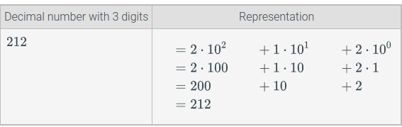
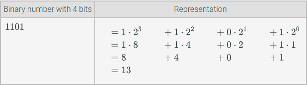
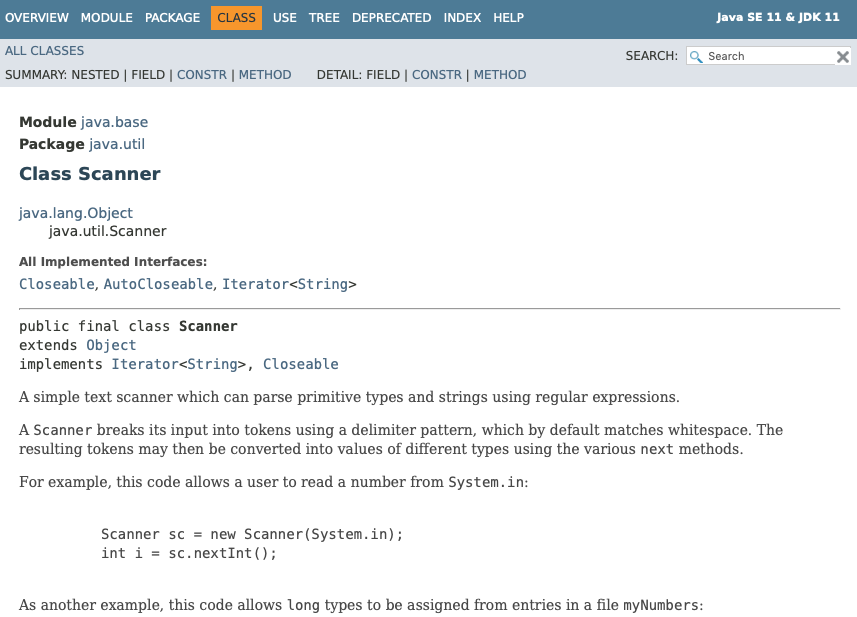
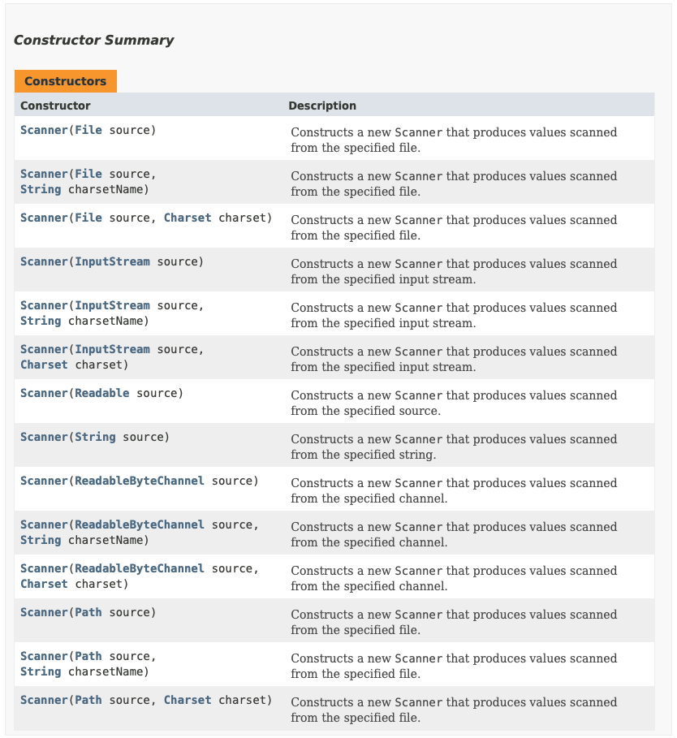
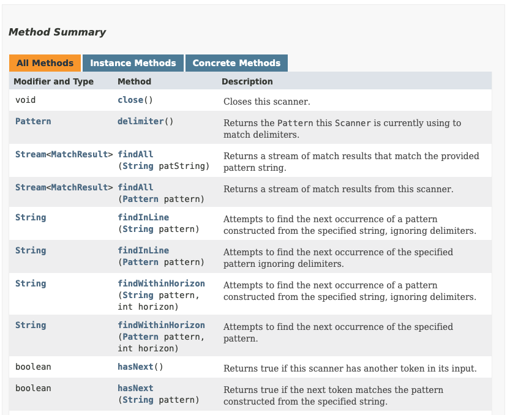
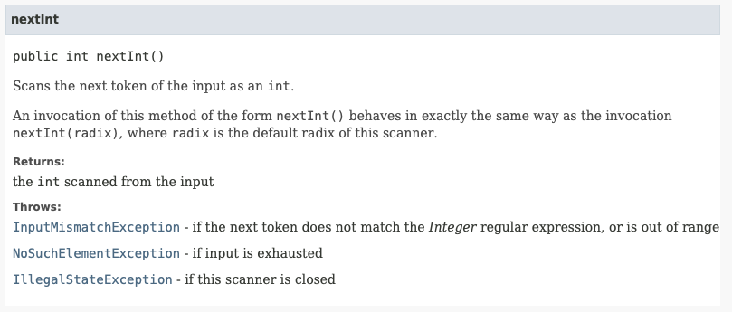
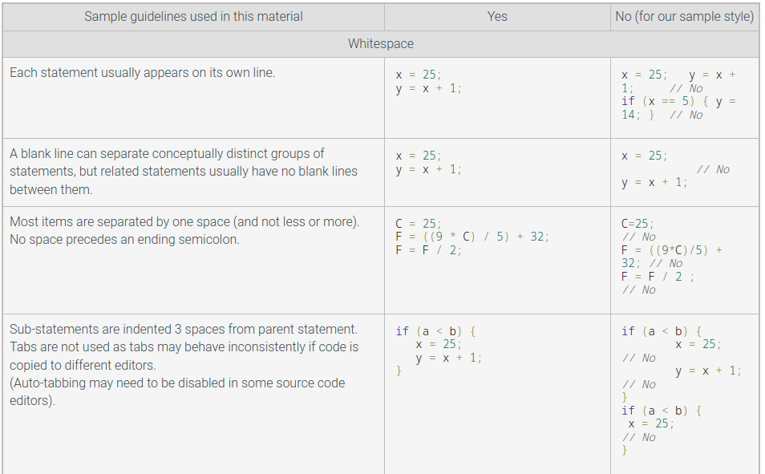
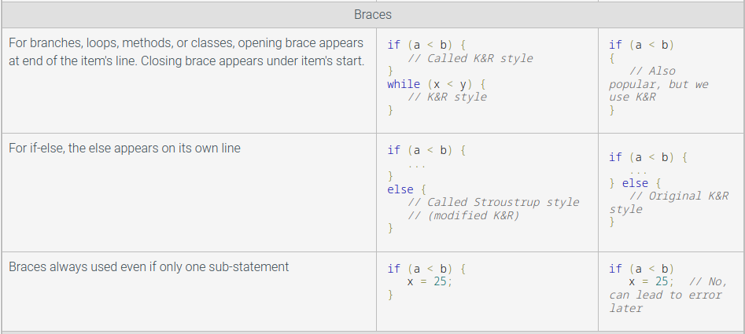
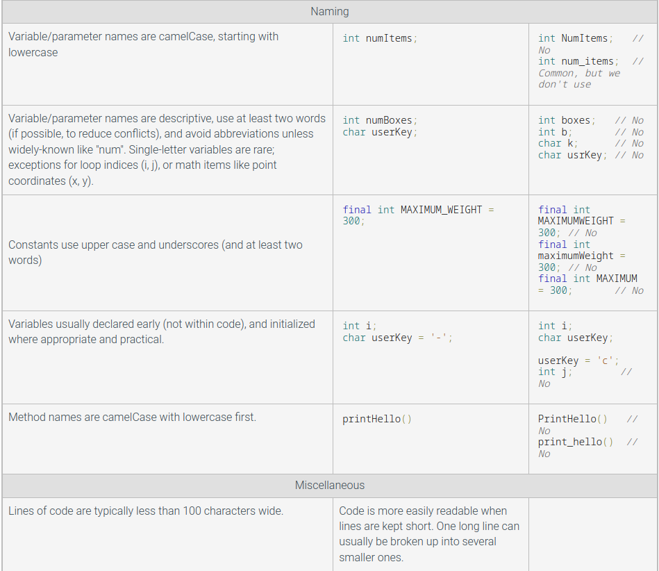

# CSC110AB - Module 2

# Table of Contents

- [General Notes](#general-notes)
- [Zybooks](#zybooks)
  - [Variables and Assignments](#variables-and-assignments)
  - [Variables (Int)](#variables-int)
    - [Variable Declarations](#variable-declarations)
    - [Assignment Statements](#assignment-statements)
    - [Initializing Variables](#initializing-variables)
    - [Assignment Statement With Same Variable On Both Sides](#assignment-statement-with-same-variable-on-both-sides)
    - [Common Errors](#common-errors)
  - [Identifiers](#identifiers)
    - [Rules For Identifiers](#rules-for-identifiers)
    - [Style Guidelines For Identifiers](#style-guidelines-for-identifiers)
    - [Java Reserved Words / Keywords](#java-reserved-words--keywords)
  - [Arithmetic Expressions](#arithmetic-expressions)
    - [Basics](#basics)
    - [Evaluation of Expressions](#evaluation-of-expressions)
  - [Arithmetic Expressions (int)](#arithmetic-expressions-int)
    - [Style: Single Space Around Operators](#style-single-space-around-operators)
    - [Compound Operators](#compound-operators)
  - [Floating-point numbers (double)](#floating-point-numbers-double)
    - [Floating-point (double) variables](#floating-point-double-variables)
    - [Choosing a Variable Type (double vs int)](#choosing-a-variable-type-double-vs-int)
    - [Floating-point Division By Zero](#floating-point-division-by-zero)
    - [Manipulating Floating-point Output](#manipulating-floating-point-output)
  - [Scientific Notation For Floating-point Literals](#scientific-notation-for-floating-point-literals)
  - [Constant Variables](#constant-variables)
  - [Using Math Methods](#using-math-methods)
    - [Basics](#basics-1)
    - [Calls in Arguments](#calls-in-arguments)
  - [Integer Division and Modulo](#integer-division-and-modulo)
    - [Division: Integer Rounding](#division-integer-rounding)
    - [Division: Divide by 0](#division-divide-by-0)
    - [Modulo (%)](#modulo-)
  - [Type Conversions](#type-conversions)
    - [Type Casting](#type-casting)
    - [Common Errors](#common-errors-1)
  - [Binary](#binary)
    - [Base 10 Table](#base-10-table)
    - [Base 2 Table](#base-2-table)
  - [Characters](#characters)
    - [Basics](#basics-2)
    - [Getting a Character From Input](#getting-a-character-from-input)
    - [A Character Is Internally Stored As a Number](#a-character-is-internally-stored-as-a-number)
    - [Escape sequences](#escape-sequences)
    - [Outputting Multiple Character Variables With One Output Statement](#outputting-multiple-character-variables-with-one-output-statement)
    - [Common Errors](#common-errors-2)
  - [Strings](#strings)
    - [String Variables and Assignments](#string-variables-and-assignments)
    - [Getting a String Without Whitespaces From Input](#getting-a-string-without-whitespaces-from-input)
    - [Getting a String With Whitespaces From Input](#getting-a-string-with-whitespaces-from-input)
    - [Mixing next() and nextLine()](#mixing-next-and-nextline)
    - [Integer Overflow](#integer-overflow)
  - [Numeric Data Types](#numeric-data-types)
    - [Integer Numeric Data Types](#integer-numeric-data-types)
    - [Floating-point Numeric Data Types](#floating-point-numeric-data-types)
  - [Random Numbers](#random-numbers)
    - [Generating a Random Number](#generating-a-random-number)
    - [Specific ranges](#specific-ranges)
    - [Pseudo-random](#pseudo-random)
  - [Reading API Documentation](#reading-api-documentation)
    - [Oracle's Java API Specification](#oracles-java-api-specification)
    - [Class Overview](#class-overview)
    - [Constructor Summary](#constructor-summary)
    - [Method Summary](#method-summary)
    - [Constructor and Method Details](#constructor-and-method-details)
  - [Debugging](#debugging)
  - [Style Guidelines](#style-guidelines)
    - [Style Guide Examples](#style-guide-examples)

# General Notes

[](https://www.youtube.com/watch?v=FZhZgLF-2L4 "Java Math and random classes")

- YouTube video covering Java Math & Random classes 

**Incremental development** is the process of writing, compiling, and testing a
small amount of code, then writing, compiling, and testing a small amount more
(an incremental amount), and so on.


# Zybooks

## Variables and Assignments

A **variable**, such as `x` or `numPeople`, is used to hold a value.

An **assignment** assigns a variable a value, such as `x = 5`. That means that
x is now assigned with 5 and will keep that value during future uses of the
variable, until it is assigned again.

- The left side of an assignment must be a variable, and the right side an
  expression.
    - `x = 5`
    - `numPeople = 22`
    - `dayOfWeek = "Tuesday"`
- The `=` does <u>**not**</u> mean equality like it does in mathematics, it is
  an assignment of a left-side variable with a right-side value.

It's possible for variables to appear on the right side of an assignment as
well:

- ```java
  int x = 1;       // x = 1
  x = x + 1;   // x = 2 - This is one way to increment a variable by 1
  int y = 3;
  x = x + y;   // x = 5
  
  ========Incrementing===========
  int z = 10;
  z = z + 1;
  z += 1;
  z++;
  ++z;
  ```

- **Incrementing** a value is when you increase its value by 1 using one of the
  following formats:
    - `x = x + 1`
    - `x++`
        - Returns the value of the variable and increments it **after**.
    - `++x`
        - Increments the value of the variable **before** returning its value.

## Variables (Int)

### Variable Declarations

A **variable declaration** is a statement that declares a new variable,
specifying the variable's name and _type_: `int myNum;`. The compiler ensures
space in memory for the variable capable of storing the specified type _(int)_.

- Every variable corresponds to a location in memory where the value is stored.
  When the variable is called, it goes to the address in memory where the value
  is to retrieve that value.
- Modern compilers may optimize variables away, allocate variables on the stack,
  or use registers for variables.

### Assignment Statements

An **assignment statement** assigns the variable on the left-side of the `=`
with the current value of the right-side expression: `myAge = 12 + 12` assigns
`myAge` with the value of `24`.

- If the variable has already been declared or initialized, then the type does
  not need to be stated again when assigning.

An **expression** may be a number ot a calculation.

- An integer appearing in an expression is called an **integer literal**.
    - It's good practice to minimize the use of literal numbers in code. It
      improves readability

### Initializing Variables

An integer is initialized when it is **first** assigned a value, which is often
done when it is declared:

```java
int avgLifeSpan = 70;
```

- Initializing is not required.

### Assignment Statement With Same Variable On Both Sides

Assignment statements are read left-to-right, meaning that you can have the same
variable on both sides of the equation:

```java
package mypackage;

public class Person {
    public static void main(String[] args) {
        int age;
        
        age = 10;       
        System.out.println(age)   // Prints out: 10
        
        age = age + 2;
        System.out.println(age)   // Prints out: 12  
    }
}
```

### Common Errors

**A common error is to read a variable that has not yet been assigned a value.**

- Always assign a variable a value before reading it.
- <u>**Do not write statements in reverse:**</u>
    - `numPeople + numAdults = numPeople;`
    - `10 = jellyBeansCount`

## Identifiers

### Rules For Identifiers

A name created by a programmer for an item like a variable or method is
called an **identifier**. An identifier must:

- be a sequence of letters (`a-z`, `A-Z`), underscore (`_`),
  dollar signs (`$`), and digits (`0-9`)
- start with a letter, underscore, or dollar sign

**_Note:_** `_` and `$` are both considered letters, but it's good practice to
**not** use either in programmer-created identifiers.

- Identifiers are **case-sensitive**, so upper and lower case letters differ and
  can create entirely different variables.

A **reserved word** is a word that is part of the language, like `int`, `short`,
or `double`. A reserved word is also known as a **keyword**.

- A programmer cannot use a reserved word as an identifier.
- Many language editors will automatically color a program's reserved words.

### Style Guidelines For Identifiers

Naming conventions (style) are often defined by your company, team, teacher,
etc. Two common conventions for naming variables:

- **Camel Case:** **Lower camel case** combines multiple words, removing spaces
  and capitalizing each word except the first:
    - `Spider-Man` -> `spiderMan`
    - `Number of People` -> `numberOfPeople`
    - `people_on_bus` -> `peopleOnBus`
- **Snake Case:** Words are lowercase and separated by an underscore:
    - `Spider-Man` -> `spider_man`
    - `Number of People` -> `number_of_people`
    - `peopleOnBus` -> `people_on_bus`

Either convention can be chosen, just be consistent with the chosen one.

- Create meaningful identifier names that self-describe an item's purpose.
- Avoid abbreviations unless they're well-known like `num` in `numPassengers`.
- Do not use overly long identifier names like `averageAgeOfUclaGraduateStudent`.

### Java Reserved Words / Keywords

|          |            |              |
|:--------:|:----------:|:------------:|
| abstract |   final    |    public    |
|  assert  |  finally   |    return    |
| boolean  |   float    |    short     |
|  break   |    for     |    static    |
|   byte   |    goto    |   strictfp   |
|   case   |     if     |    super     |
|  catch   | implements |    switch    |
|   char   |   import   | synchronized |
|  class   | instanceof |     this     |
|  const   |    int     |    throw     |
| continue | interface  |    throws    |
| default  |    long    |  transient   |
|    do    |   native   |     try      |
|  double  |    new     |     void     |
|   else   |  package   |   volatile   |  
|   enum   |  private   |    while     |
| extends  | protected  |              |

- `true`, `false`, and `nul` are also reserved and used for literals.

## Arithmetic Expressions

### Basics

- An **expression** is any individual item or combination of items, like variables,
  literals, operators, and parentheses, that evaluates to a value, often used on
  the right side of an assignment statement: `2 * (x + 1)`
- A **literal** is a specific value in code like `2`. An `operator` is a symbol
- An **operator** is a symbol that performs a built-in calculation, like `+`,
  which performs addition.

#### Other Arithmetic Operators:

| Arithmetic Operator | Description                                                                                                                 |
|:-------------------:|:----------------------------------------------------------------------------------------------------------------------------|
|        **+**        | The **addition** operator is **+**, as in x + y.                                                                            | 
|        **-**        | The **subtraction** operator is **-**, as in x - y. </br>Also, the - operator is for **negation**, as in -x + y, or x + -y. |
|        __*__        | The **multiplication** operator is __*__, as in x * y.                                                                      |
|        **/**        | The **division** operator is **/**, as in x / y.                                                                            |

### Evaluation of Expressions

An expressions **evaluates** to a value, which replaces the expression. An
expression is evaluated using the order of standard mathematics, known in
programming as **precedence rules**:

| Operator / Convention | Description                                                                                             | Explanation                                                                                                                                                                                                                      |
|:---------------------:|:--------------------------------------------------------------------------------------------------------|:---------------------------------------------------------------------------------------------------------------------------------------------------------------------------------------------------------------------------------|
|        **( )**        | Items within parentheses are evaluated first                                                            | In **2 * (x + 1)**, the **x + 1** is evaluated first, </br>with the result then multiplied by **2**.                                                                                                                             |
|      **unary -**      | 	**-** used for negation (_unary minus_) is next                                                        | In **2 * -x**, the **-x** is computed first, with the result then multiplied by **2**.                                                                                                                                           |
|       __* / %__       | Next to be evaluated are __*__, **/**, and **%**, </br>having equal precedence.                         | (**%** is discussed elsewhere)                                                                                                                                                                                                   |
|        **+ -**        | 	Finally come **+** and **-** with equal precedence.                                                    | In **y = 3 + 2 * x**, the **2 * x** is evaluated first, with the result then </br>added to **3**, because * has higher precedence than **+**. Spacing </br>doesn't matter: **y = 3+2 * x** would still evaluate **2 * x** first. |
|   **left-to-right**   | If more than one operator of equal precedence </br>could be evaluated, evaluation occurs left to right. | In **y = x * 2 / 3**, the **x * 2** is first evaluated, with the result then divided by **3**.                                                                                                                                   |

- It helps to use parenthesis to explicitly make the order of evaluation,
  improving code readability and making the order clear.
- A common error is to omit parentheses and assume a different order of
  evaluation than actually occurs, leading to a bug.

#### Example:

<u>Calories burned by men and
women</u>: [Source](https://web.archive.org/web/20120422154143/http://fitnowtraining.com/2012/01/formula-for-calories-burned/)

> Men: Calories = [(Age * 0.2017) + (Weight * 0.09036) + (Heart Rate * 0.6309) - 55.0969] * Time / 4.184 \
> Women: Calories = [(Age * 0.074) - (Weight * 0.05741) + (Heart Rate * 0.4472) - 20.4022] * Time / 4.184

Converted To Programming Notation:

> caloriesMan = ( (ageYears * 0.2017) + (weightPounds * 0.09036) + (heartBPM * 0.6309) - 55.0969 ) * timeMinutes /
> 4.184  \
> caloriesWoman = ( (ageYears * 0.074) - (weightPounds * 0.05741) + (heartBPM * 0.4472) - 20.4022 ) * timeMinutes /
> 4.184

## Arithmetic Expressions (int)

### Style: Single Space Around Operators

It's good practice to include a single space around operators for readability,
except when using the **unary minus (`-`)**, also known as the negative sign:

- `x = 1 + 2`
- `x = -1 - -y`

### Compound Operators

Special operators called **compound operators** provide a shorthand way to
update a variable, such as `userAge += 1` being shorthand for
`userAge = userAge + 1`. Other compound operators include:

- `-=`
- `*=`
- `/=`
- `%=`

## Floating-point numbers (double)

### Floating-point (double) variables

- A **floating-point number** is a real number containing a decimal point that
  can appear anywhere (or "float") in the number.
    - _98.6_
    - _0.0000001_
    - -_20.1234_
- A **double** variable stores a floating-point number
    - `double milesTravel;` declares a double variable
- A **floating-point literal** is a number with a fractional part, even if
  the fraction is 0, as in _1.0_, _0.0_, or _99.573_.
    - It's good practice to always have a digit before the decimal point:
        - **.2** -> **0.2**
- Use **floating-point** numbers when performing division with fractions instead
  of **integers**.

Scanner's `nextDouble()` method reads a floating-point value from input.

- Very large and very small floating-point values may be printed using
  scientific notation.
    - Ex: If a floating variable holds the value `299792458.0` (the speed of
      light in m/s), the value will be printed as `2.99792458E8`.

### Choosing a Variable Type (double vs int)

A variable's type should be based on the type of value held. Use integers for
whole numbers that do not require a decimal, and floating-point variables when
a decimal is required _(such as with fractions and averages)_.

### Floating-point Division By Zero

Dividing a nonzero floating-point number by zero is undefined in regular
arithmetic. Many programming languages produce an error when performing
floating-point division by 0, but Java does not.

Java handles this operation by producing **infinity** or **-infinity**,
depending on the signs of the operands. Printing a floating-point variable
that holds infinity or -infinity outputs Infinity or -Infinity.

If the dividend and divisor in floating-point division are both 0, the
division results in a "not a number". **Not a number (_NaN_)** indicates an
unrepresentable or undefined value. Printing a floating-point variable
that is _not a number_ outputs `NaN`.

### Manipulating Floating-point Output

By default, most programs output up to 5 decimal places. It's better to be
specific with the amount of decimal points by changing how many are produced:

```java
System.out.printf("%.2f", myFloat);
```

- The last digit will be rounded.
- The `%` is a substitution string that can be used with different letters after
  it to indicate the _type_ of data to substitute. The value that will replace
  the `%` comes as the second parameter, `myFloat`.

  ```java
  System.out.printf("%s", "This is a string");
  System.out.printf("%d", 52);
  System.out.printf("%f", 52.0);  // Will print the maximum amount of decimals
  ```

## Scientific Notation For Floating-point Literals

Scientific notation is useful for representing floating-point numbers that
are much greater than or much less than **0**, such as **6.02 x 10<sup>23</sup>**

To write a floating-point literal using **scientific notation**, write an **e**
preceding the power-of-10 exponent:

- **6.023 x 10<sup>23</sup>** -> **6.023e23**
- **1.23 x 10<sup>-4</sup> -> 1.23e-4**
    - equals **0.000123**

## Constant Variables

When a variable represents a literal, the variable's value should not be changed
in the code (one way to do this is by preceding the variable declaration with
`final`).

- An initialized variable whose value cannot change is called a
  **constant variable**, and is also known as a **final variable**.
- It's good practice to name constant variables in only upper-case letters with
  words separated by underscores, to make constant variables clearly visible in
  code.

## Using Math Methods

### Basics

A standard **Math class** has about 30 math operations in the form of methods.

- The `Math` class is part of Java's standard language package.

A **method** is a list of statements executed by invoking the method's name,
such invoking is known as a **method call**.

- Any method input values or arguments appear within `( )`, separated by
  commas if more than one.

```java
public class CalcSquareRoot {
    public static void main(String[] args) {
        double squareToFind = 36.0;
        
        squareRoot = Math.sqrt(squareToFind);
        
        System.out.println(squareRoot);
    }
}
```

- [Java Math Class Documentation](https://docs.oracle.com/javase/8/docs/api/java/lang/Math.html)

### Calls in Arguments

Commonly a method call's argument itself includes a method call:

- `Math.pow(2.0, Math.pow(x, y) + 1).`

## Integer Division and Modulo

### Division: Integer Rounding

When the operands of `/` are integers, the operator performs integer division,
which does not generate any fraction.

- Integers are rounded down, not up.
- If at least one operand is a floating-point value, then floating-point
  division occurs.

### Division: Divide by 0

For integer division, the second operand of `/` or `%` must never be `0`,
because division by `0` is mathematically undefined. A **divide-by-zero** error
occurs at runtime if a divisor is `0`, causing a program to terminate.

- A _divide-by-zero_ error is an example of a **runtime error**, a severe
  error that occurs at runtime and causes a program to terminate early.

### Modulo (%)

The **modulo operator (%)** evaluates the remainder of the division of two
integer operands

- `23 % 10` is `3`
- `11 % 5` is `1`

#### Modulo Use-Cases

- `randNum % 10`
    - **Yields 0 - 9:** Possible remainders are 0, 1, ..., 8, 9. Remainder 10 is
      not possible:
        - Ex: `19 % 10` is `9`, but `20 % 10` is `0`.
- `randNum % 51`
    - **Yields 0 - 50:** Note that `% 50` would yield `0 - 49`.
- `(randNum % 9) + 1`
    - **Yields 1 - 9:** The `% 9` yields 9 possible values `0 - 8`, so the
      `+ 1` yields `1 - 9`.
- `(randNum % 11) + 20`
    - **Yields 20 - 30:** The `% 11` yields 11 possible values `0 - 10`, so
      the `+ 20` yields `20 - 30`.

Modulo can also be used to get the digit in a specific place of a number by
using it with a power of 10 (10, 100, 1000, etc.).

- This can also be used with phone numbers to only get specific digits in it:

```java
tmpVal = phoneNum / 10000; // / 10000 shifts right by 4, so 136555. 
prefixNum = tmpVal % 1000; // % 1000 gets the right 3 digits, so 555.
```

- Dividing by a power of 10 shifts a value right. `321 / 10` is `32`.
  `321 / 100` is `3`.
- `%` by a power of 10 gets the rightmost digits. `321 % 10` is `1`. `321 % 100`
  is `21`.

## Type Conversions

A type conversion is a conversion of one data type to another, such as an
`int` to a `double`. The compiler automatically performs several common
conversions between int and double types, such automatic conversions are
known as **implicit conversion**.

- If a `double` is used in arithmetic, the other value is assigned as a `double`
  as well, and a floating-point operation is performed.
- For assignments, the right side type is converted to the left side type if
  the conversion is possible without loss of precision.
- _double-to-int_ conversion may lose precision, so is not automatic.
- Because of implicit conversion, statements like `double someDoubleVar = 0;`
  or `someDoubleVar = 5;` are allowed, but discouraged. Using `0.0` or `5.0` is
  preferable.

### Type Casting

A **type cast** explicitly converts a value of one type to another type. To
type cast, precede an expression with `(type)` to convert the expression's value
to the indicated type.

- `(double)myIntVar` converts `myIntVar` to a double if wasn't already one.

### Common Errors

- A common error is to accidentally perform integer division when floating-point
  division was intended. The program below undesirably performs integer division
  rather than floating-point division.
- A common error is to cast the entire result of integer division, rather
- the operands, thus not obtaining the desired floating-point division.

## Binary

a compiler must allocate some finite quantity of bits (e.g., **32 bits**) for a
variable, and that quantity of bits limits the range of numbers that the
variable can represent.

Because each memory location is composed of bits (0s and 1s), a processor
stores a number using **base 2**, known as a **binary number**.

For a number in the more familiar **base 10**, known as a decimal number, each
digit must be **0-9** and each digit's place is weighed by increasing powers
of **10**.

The compiler translates decimal numbers into binary numbers before storing the
number into a memory location.

### Base 10 Table



### Base 2 Table



---

## Characters

### Basics

A variable of **char** type can store a single character like the letter `m`.

- A **character literal** is surrounded with single quotes: `char myChar = 'm';`.

### Getting a Character From Input

Java does not have a method for getting one character from input. Instead, the
following sequence can be used:

```java
myChar = scnr.next().charAt(0); 
```

- `next()` gets the next sequence of non-whitespace characters (as a string),
  and `charAt(0)` gets the first character in that string.

### A Character Is Internally Stored As a Number

Under the hood, a char variable stores a number.

- Ex: `a` is stored as `97`. In an output statement, the compiler outputs the
  number's corresponding character.

The numbers for each letter correspond to their **ASCII** values.

---

ASCII is an early standard for encoding characters as numbers. The following
table shows the ASCII encoding as a decimal number (Dec) for common printable
characters (for readers who have studied binary numbers, the table shows the
binary encoding also). Other characters such as control characters (e.g.,
a "line feed" character) or extended characters (e.g., the letter "n" with a
tilde above it as used in Spanish) are not shown.
Source: <http://www.asciitable.com/>.

Many earlier programming languages like C or C++ use ASCII. Java uses a
more recent standard called Unicode. ASCII can represent 255 items, whereas
Unicode can represent over 64,000 items; Unicode can represent characters from
many different human languages, many symbols, and more. (For those who have
studied binary: ASCII uses 8 bits, while Unicode uses 16, hence the 255 versus
64,000). Unicode's first several hundred items are the same as ASCII. The
Unicode encoding for these characters has 0's on the left to yield 16 bits.

#### Table 1

|  Binary  | Dec | Char  |
|:--------:|:---:|:-----:|
| 010 0000 | 32  | space |
| 010 0001 | 33  |   !   |
| 010 0010 | 34  |   "   |
| 010 0011 | 35  |   #   |
| 010 0100 | 36  |   $   |
| 010 0101 | 37  |   %   |
| 010 0110 | 38  |   &   |
| 010 0111 | 39  |   '   |
| 010 1000 | 40  |   (   |
| 010 1001 | 41  |   )   |
| 010 1010 | 42  |   *   |
| 010 1011 | 43  |   +   |
| 010 1100 | 44  |   ,   |
| 010 1101 | 45  |   -   |
| 010 1110 | 46  |   .   |
| 010 1111 | 47  |   /   |
| 011 0000 | 48  |   0   |
| 011 0001 | 49  |   1   |
| 011 0010 | 50  |   2   |
| 011 0011 | 51  |   3   |
| 011 0100 | 52  |   4   |
| 011 0101 | 53  |   5   |
| 011 0110 | 54  |   6   |
| 011 0111 | 55  |   7   |
| 011 1000 | 56  |   8   |
| 011 1001 | 57  |   9   |
| 011 1010 | 58  |   :   |
| 011 1011 | 59  |   ;   |
| 011 1100 | 60  |   <   |
| 011 1101 | 61  |   =   |
| 011 1110 | 62  |   >   |
| 011 1111 | 63  |   ?   |

#### Table 2

|  Binary  | Dec | Char |
|:--------:|:---:|:----:|
| 100 0000 | 64  |  @   |
| 100 0001 | 65  |  A   |
| 100 0010 | 66  |  B   |
| 100 0011 | 67  |  C   |
| 100 0100 | 68  |  D   |
| 100 0101 | 69  |  E   |
| 100 0110 | 70  |  F   |
| 100 0111 | 71  |  G   |
| 100 1000 | 72  |  H   |
| 100 1001 | 73  |  I   |
| 100 1010 | 74  |  J   |
| 100 1011 | 75  |  K   |
| 100 1100 | 76  |  L   |
| 100 1101 | 77  |  M   |
| 100 1110 | 78  |  N   |
| 100 1111 | 79  |  O   |
| 101 0000 | 80  |  P   |
| 101 0001 | 81  |  Q   |
| 101 0010 | 82  |  R   |
| 101 0011 | 83  |  S   |
| 101 0100 | 84  |  T   |
| 101 0101 | 85  |  U   |
| 101 0110 | 86  |  V   |
| 101 0111 | 87  |  W   |
| 101 1000 | 88  |  X   |
| 101 1001 | 89  |  Y   |
| 101 1010 | 90  |  Z   |
| 101 1011 | 91  |  [   |
| 101 1100 | 92  |  \   |
| 101 1101 | 93  |  ]   |
| 101 1110 | 94  |  ^   |
| 101 1111 | 95  |  _   |

#### Table 3

|  Binary  | Dec |    Char     |
|:--------:|:---:|:-----------:|
| 110 0000 | 96  |      `      |
| 110 0001 | 97  |      a      |
| 110 0010 | 98  |      b      |
| 110 0011 | 99  |      c      |
| 110 0100 | 100 |      d      |
| 110 0101 | 101 |      e      |
| 110 0110 | 102 |      f      |
| 110 0111 | 103 |      g      |
| 110 1000 | 104 |      h      |
| 110 1001 | 105 |      i      |
| 110 1010 | 106 |      j      |
| 110 1011 | 107 |      k      |
| 110 1100 | 108 |      l      |
| 110 1101 | 109 |      m      |
| 110 1110 | 110 |      n      |
| 110 1111 | 111 |      o      |
| 111 0000 | 112 |      p      |
| 111 0001 | 113 |      q      |
| 111 0010 | 114 |      r      |
| 111 0011 | 115 |      s      |
| 111 0100 | 116 |      t      |
| 111 0101 | 117 |      u      |
| 111 0110 | 118 |      v      |
| 111 0111 | 119 |      w      |
| 111 1000 | 120 |      x      |
| 111 1001 | 121 |      y      |
| 111 1010 | 122 |      z      |
| 111 1011 | 123 |      {      |
| 111 1100 | 124 | {pipe char} |
| 111 1101 | 125 |      }      |
| 111 1110 | 126 |      ~      |

--- 

### Escape sequences

In addition to regular characters like `Z`, `$`, or `5`, character encoding
includes numbers for several special characters.

- A newline character is encoded as `10`. Because no visible character exists
  for a newline, the language uses an escape sequence: A two-character sequence
  starting with `\` that represents a special character.
- Ex: `\n` represents a newline character.

Escape sequences also enable representing characters like `'`, `"`, or `\`.

- `myChar = '\''` assigns `myChar` with a single-quote character.
- `myChar = '\\'` assigns `myChar` with `\`
    - just `'\'` would yield a compiler error, since `\'` is the escape sequence
      for `'`, and then a closing `'` is missing.

#### Common Escape Sequences

| Escape Sequence |     Char     |
|:---------------:|:------------:|
|       \n        |   newline    |
|       \t        |     tab      |
|       \\'       | single quote |
|       \\"       | double quote |
|       \\\       |  backslash   |

### Outputting Multiple Character Variables With One Output Statement

```java
System.out.print("" + c1 + c2);
```

- The initial `""` tells the compiler to output a string of characters, and the
  `+`'s concatenate the subsequent characters into such a string.

### Common Errors

- A common error is to use double quotes rather than single quotes around a
  character literal, as in `myChar = "x"`, yielding a compiler error.
- Similarly, a common error is to forget the quotes around a character literal,
  as in `myChar = x`, usually yielding a compiler error (unless `x` is also a
  declared variable, then perhaps yielding a logic error).

## Strings

A **string** is a sequence of characters. A **string literal** surrounds a
character sequence with double quotes.

- `"Hello"`
- `"Goodbye"`
- `"42"`
- Various characters may be in a string.

### String Variables and Assignments

A string variable is a reference type variable that refers to a String object.
An **object** consists of some internal data items plus operations that can be
performed on that data.

- Assigning one String variable to another String variable causes both variables
  to refer to the same String, and does not create a new String.

```java
String myString = "This is a string!";
```

### Getting a String Without Whitespaces From Input

A whitespace character is a character used to represent horizontal and vertical
spaces in text, and includes spaces, tabs, and newline characters.

```java
userString = scnr.next();
```

- Above shows the basic approach to get a string from input into variable
  userString. The approach automatically skips initial whitespace, then gets
  characters until the next whitespace is seen:

### Getting a String With Whitespaces From Input

```java
firstString = scnr.nextLine();
secondString = sncr.nextLine();
```

- Gets all remaining text on the input line, up to the next newline character
  _(which is removed from input but not put in stringVar)_.

### Mixing `next()` and `nextLine()`

`next()` leaves the newline in the input, while `nextLine()` does not.

- Because of this, use two `nextLine()` method calls to skip the newline
  character.
- Using `nextline()` after `next()` will get any whitespace before the next
  character.

### Integer Overflow

An integer variable cannot store a number larger than the maximum supported by
the variable's data type. An **overflow** occurs when the value being assigned
to a variable is greater than the maximum value the variable can store.

- _A common error is to try to store a value greater than about _2 billion_ into
  an int variable_
- Common source of overflow involves intermediate calculations.

Storing a 32-bit `int` as a 64-bit `long` would work for larger numbers.

## Numeric Data Types

### Integer Numeric Data Types

|   Declaration   |    Size     | Supported Number Range                                      |
|:---------------:|:-----------:|:------------------------------------------------------------|
|  `byte myVar;`  | **8 bits**  | **-128 to 127**                                             |
| `short myVar; ` | **16 bits** | **32,768 to 32,767**                                        |
|  `int myVar;`   | **32 bits** | **-2,147,483,648 to 2,147,483,647**                         |
|  `long myVar;`  | **64 bits** | **-9,223,372,036,854,775,808 to 9,223,372,036,854,775,807** |

- **int** is the most commonly used integer type
- **long** is used for integers expected to exceed _~2 billion_.
- **short** is rarely used. One situation is to save memory when storing many
  smaller numbers.
    - _In an array for example_
- _A common error made by a program's user is to enter the wrong type, such as
  entering a string when the input statement was `myInt = scnr.nextInt();` where
  `myInt` is an `int`, which can cause strange program behavior._

### Floating-point Numeric Data Types

| Declaration |    Size     | Supported Number Range                            |
|:-----------:|:-----------:|:--------------------------------------------------|
| `float x;`  | **32 bits** | **-3.4x10<sup>38</sup> to 3.4x10<sup>38</sup>**   |
| `double x;` | **64 bits** | **-1.7x10<sup>308</sup> to 1.7x10<sup>308</sup>** |

- The compiler uses one bit for sign, some bits for the mantissa, and some for
  the exponent.
    - The mantissa is the **6.02** in **6.02e23**
- **double** is the most commonly-used floating-point type
- **float** is typically only used in memory-saving situations, as discussed
  above.
- The mantissa is limited to **~7** significant digits for float and **~16**
  for double.

A variable cannot store a value larger than the maximum supported by the
variable's data type. An **overflow** occurs when the value being assigned
to a variable is greater than the maximum value the variable can store.
Overflow with floating-point results in infinity.

On some processors, especially low-cost processors intended for "embedded"
computing, like systems in an automobile or medical device, floating-point
calculations may run slower than integer calculations, such as 100 times slower.
Floating-point types are typically only used when really necessary. On more
powerful processors like those in desktops, servers, smartphones, etc., special
floating-point hardware nearly or entirely eliminates the speed difference.

Floating-point numbers are sometimes used when an integer exceeds the range of
the largest integer type.

## Random Numbers

### Generating a Random Number

The **Random** class provides methods that return a random integer in the range
from **-2<sup>31</sup>** to **2<sup>31</sup> - 1** or a programmer-defined
range.

```java
import java.util.Random

public class ThreeRandomValues {
public static void main(String[] args) {
        Random randGen = new Random();            // New random number generator
        
        System.out.println(randGen.nextInt());
        System.out.println(randGen.nextInt());
        System.out.println(randGen.nextInt());
        System.out.println(randGen.nextInt());
        System.out.println(randGen.nextInt(20));  // Returns a number 0 to 19
    }       
}
```

### Specific ranges

A formula for determining the ranges:

> **randGen.nextInt((y - x) + 1) + x**

- **x** is the lower boundary of the desired range
- **y** is the upper boundary of the desired range

1. Determine the desired range: **10 - 15**
2. Add one to the upper boundary: **10 - 16**
3. Subtract the upper boundary from the lower: **16 - 10 = 6**
4. Use the result in your random generator: `randGen.nextInt(6)`
5. Add the lower boundary to the random integer that gets produced:
   ```java
   myRandNum = randGen.nextInt(6) + 10;
   ```
   
---
   
### Pseudo-random

The integers generated by a Random object are known as pseudo-random. 
"Pseudo" means "not actually, but having the appearance of". Internally, 
the `nextInt()` method has an equation to compute the next "random" integer 
from the previous one, (invisibly) keeping track of the previous one. For 
the first call to `nextInt()`, no previous random integer exists, so the method 
uses an integer known as the seed. `Random()` seeds the pseudo-random number 
generator with a number based on the current time. Since, the time is different 
for each program run, the program will get a unique sequence.

Reproducibility is important for testing some programs. (Players of classic 
arcade games like Pac-man may notice that the seemingly-random actions of 
objects actually follow the same pattern every time the game is played, 
allowing players to master the game by repeating the same winning actions). 

A programmer can specify the seed when the Random object is created, as in 
`Random randGen = new Random(5);` or using the `setSeed()` method, as in 
`randGen.setSeed(5);` With a specific seed, each program run will yield the 
same sequence of pseudo-random numbers.


---

## Reading API Documentation

### Oracle's Java API Specification

The [Oracle's Java API Specification](https://docs.oracle.com/en/java/javase/12/docs/api/index.html)
provides detailed documents describing how to use the extensive set of classes 
Java provides for creating programs.

- The class documentation is known as an **Application Programming Interface
  (API)**.

The main page of the Java documentation lists all Java modules. 

- A **module** is a group of related packages. 
- A **package** is a group of related classes. 

Organizing classes into modules and packages helps programmers find needed 
classes. 

- _Ex: The java.base module defines Java's foundational packages and APIs._
- [java.base module documentation](https://docs.oracle.com/en/java/javase/11/docs/api/java.base/java/lang/Module.html)

### Class Overview

The Scanner class is located in the package `java.util`. The Java documentation 
for a class consists of four main elements. The following uses the Scanner 
class to illustrate these documentation elements. The documentation for the 
Scanner is located at: [Scanner class documentation](https://docs.oracle.com/en/java/javase/12/docs/api/java.base/java/util/Scanner.html).

**Class overview:** The first part of the documentation provides an overview of 
the class, describing the class' functionality and providing examples of how the 
class is commonly used in a program.



- The package in which a class is located appears immediately above the class 
  name.
  - This package is located in `java.util`
- To use a class, a program must include an import statement that informs the 
  compiler of the class' location.

```java
import packageName.ClassName;
```

### Constructor Summary

**Constructor summary:** Provides a list and brief description of the 
constructors that can be used to create objects of the class.



- When you use `scnr = new Scanner(System.in);`, you're constructing a `Scanner`
  object.
  - `System.in` is a `InputStream` object automatically created when a Java
    program executes.
  - The matching constructor is `Scanner(InputStream source`.

### Method Summary

**Method summary:** Provides a list and brief description of all methods that 
can be called on objects of the class. The Java documentation only lists the 
public methods that a program may use.



### Constructor and Method Details

**Constructor and Method Details:** The documentation also provides a detailed
description of all constructors and methods for the class.

For each method, the documentation provides the method declaration, a 
description of the method, a list of parameters (if any), a description of the
method's return value, and a list of possible exceptions the method may throw.



## Debugging

- **Debugging:** The process of determining and fixing the cause of a problem 
  in a computer program.
- **Troubleshooting:** Another word for debugging.

Some good steps for methodically debugging:

1. Predict a _possible_ cause of the problem
2. Conduct a test to validate that cause
   - _Note that a temporary statement commonly has a "FIXME" comment to remind_
     the programmer to delete this statement.
     - `// FIXME delete`
3. Repeat

_A common error among new programmers is to try to debug without a methodical 
process, instead staring at the program, or making random changes to see if 
the output is improved._

Some methods for validating possible causes:

- Manually set a variable to a value.
- Insert print statements to observe variable values.
- Comment out unused code.
- Visually inspect the code (not every test requires modifying/running the 
  code).

Statements inserted for debugging must be created and removed with care. 

- A common error is to forget to remove a debug statement, such as a temporary 
  statement that manually sets a variable to a value. Left-aligning such a 
  statement and/or including a FIXME comment can help the programmer remember.
- Another common error is to use `/* */` to comment out code that itself 
  contains `/* */` characters. The first `*/` ends the comment before intended, 
  which usually yields a syntax error when the second `*/` is reached or sooner.

## Style Guidelines

Each programming team, whether a company, open source project, or a classroom, 
may have **style guidelines** for writing code. 

- **K&R style** for braces and indents is named after C language creators 
  Kernighan and Ritchie. 
- **Stroustrup style** for braces and indents is named after C++ language 
  creator Bjarne Stroustrup.
- [Google's Java Style Guidelines](https://google.github.io/styleguide/javaguide.html)

### Style Guide Examples



---



---



---


