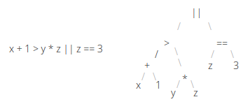
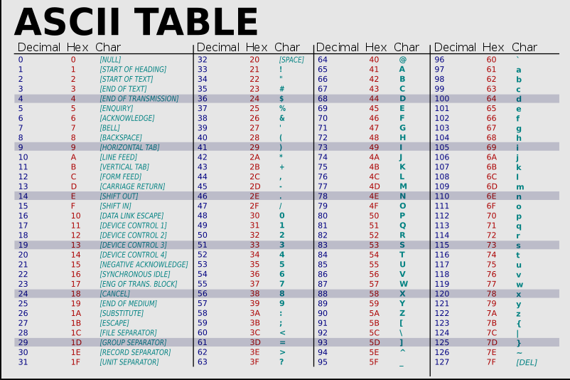
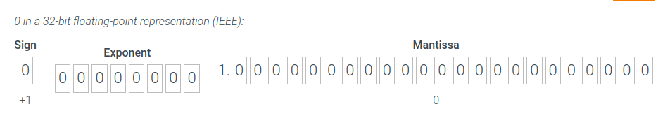

# CSC110AB Module 3

<!-- TOC -->
* [CSC110AB Module 3](#csc110ab-module-3)
* [General Notes](#general-notes)
  * [Optional Material](#optional-material)
    * [Conditional Statements / Decision Statements](#conditional-statements--decision-statements)
    * [String Class](#string-class)
* [Google Slides - Conditionals and Loops - `if`, `if-else`, `switch`](#google-slides---conditionals-and-loops---if--if-else--switch)
  * [Boolean Expressions](#boolean-expressions)
  * [Flow Control](#flow-control)
  * [Conditional Statements](#conditional-statements)
    * [Java's Conditional Statements](#javas-conditional-statements)
      * [`if` Statement](#if-statement)
  * [Logical Operators](#logical-operators)
    * [Logical NOT](#logical-not)
    * [Logical AND and Logical OR](#logical-and-and-logical-or)
  * [Short-Circuited Operators](#short-circuited-operators)
  * [The `if-else` Statement](#the-if-else-statement)
  * [The Ternary Conditional Operator](#the-ternary-conditional-operator)
  * [Nested `if` Statements](#nested-if-statements)
  * [Comparing Data](#comparing-data)
    * [Floating Point Values](#floating-point-values)
    * [Comparing Characters](#comparing-characters)
    * [Comparing Strings - Lexicographic Ordering](#comparing-strings---lexicographic-ordering)
    * [Comparing with `==` vs `equals`](#comparing-with--vs-equals)
    * [The switch Statement](#the-switch-statement)
* [Microsoft Word Notes](#microsoft-word-notes)
* [Zybooks](#zybooks)
  * [If-else Branches](#if-else-branches)
  * [Detecting Equal Values With Branches](#detecting-equal-values-with-branches)
  * [Equality and Inequality Operators](#equality-and-inequality-operators)
  * [Comparing Characters, Strings, and Floating-point Types](#comparing-characters-strings-and-floating-point-types)
  * [Detecting Ranges With Branches (General)](#detecting-ranges-with-branches--general-)
  * [Detecting Ranges Using Logical Operators](#detecting-ranges-using-logical-operators)
    * [Logical `AND`, `OR`, and `NOT` (General)](#logical-and--or--and-not--general-)
    * [Logical Operators](#logical-operators-1)
  * [Detecting ranges implicitly vs. explicitly](#detecting-ranges-implicitly-vs-explicitly)
  * [Detecting Ranges With Gaps](#detecting-ranges-with-gaps)
    * [Basic Ranges With Gaps](#basic-ranges-with-gaps)
    * [Ranges With Gaps Using Logical Operators](#ranges-with-gaps-using-logical-operators)
  * [Detecting Multiple Features With Branches](#detecting-multiple-features-with-branches)
    * [Output](#output)
  * [Nested `if-else` Statements](#nested-if-else-statements)
  * [Common Branching Errors](#common-branching-errors)
    * [Missing Braces](#missing-braces)
  * [Order of Evaluation](#order-of-evaluation)
    * [Precedence rules](#precedence-rules)
    * [Common Errors](#common-errors)
  * [Switch Statements](#switch-statements)
    * [Switch Statement](#switch-statement)
    * [Switch Statement General Form](#switch-statement-general-form)
    * [Omitting The Break Statement](#omitting-the-break-statement)
  * [Boolean Data Type](#boolean-data-type)
  * [Uses of Boolean Data Types](#uses-of-boolean-data-types)
  * [String Comparisons](#string-comparisons)
    * [String Comparison: Relational](#string-comparison--relational)
      * [Other Methods for Comparing](#other-methods-for-comparing)
  * [String Access Operations](#string-access-operations)
    * [String Character Indices](#string-character-indices)
    * [Working With The End of a String](#working-with-the-end-of-a-string)
  * [Character Operations](#character-operations)
    * [Example](#example)
  * [More String Operations](#more-string-operations)
  * [Finding in a string / Getting a substring](#finding-in-a-string--getting-a-substring)
  * [Combining / Replacing](#combining--replacing)
  * [Conditional Expressions](#conditional-expressions)
  * [Floating-point Comparison](#floating-point-comparison)
      * [Output](#output-1)
  * [Short Circuit Evaluation](#short-circuit-evaluation)
<!-- TOC -->

# General Notes

- A **core generic top-level domain (core gTLD)** name, which can be found at
  [ICANN: gTLDSs](https://archive.icann.org/en/tlds/), is one of the following
  Internet domains:
    - .com
    - .net
    - .org
    - .info
- [Chapter 3 Q&A](https://docs.google.com/document/d/13zBpGPBEmvh0t_w4f4HjnvNLbcGM52cQku4EOeNuZwg/view)

## Optional Material

### Conditional Statements / Decision Statements

- [if-else Statements and More](https://docs.oracle.com/javase/tutorial/java/nutsandbolts/if.html)
- [Decisions Part 1: if statements](https://youtu.be/vXlQzJgN0bQ)
- [Decisions Part 3: if-else statements](https://youtu.be/V2Ic-Xfe9Lg)
- [Decisions Part 5: if-else-if](https://youtu.be/AwigRPFwzMg)

### String Class

- [String Part1: Introduction to the String Class](https://youtu.be/yXtoSrGDkuc)
- [String Part2: charAt](https://youtu.be/EmnyO6fiuL8)
- [String part 3: substring](https://youtu.be/US4v4SD0iiU)
- [String Part 4: length](https://youtu.be/65DgXDcP8qY)
- [String Part 5: indexOf](https://youtu.be/9TULr-VxeyE)
- [String Part 6: compareTo](https://youtu.be/iTC43mLZG38)
- [String Part 7: equals](https://youtu.be/nwQOinU5MVY)

# Google Slides - Conditionals and Loops - `if`, `if-else`, `switch`

## Boolean Expressions

- **Boolean expressions:** Java expressions that evaluate to `true` or `false`.
    - You can use **relational operators** to perform comparisons

```java
int num = 42;
int value = 23;
int count = 4;

count < 8       // evaluates to true
value <= num     // evaluates to true
num <= num      // evaluates to true
1516 >= value   // evaluates to true
count == 8      // evaluates to false
value == value  // evaluates to true
count != 8      // evaluates to true
value != value  // evaluates to false
```

## Flow Control

- Your program is made up of statements organized into **code blocks**
    - Code blocks are made up of one or more statements
- **Flow control** statements allow us to skip or repeat statements based on
  evaluating certain boolean expressions that evaluate to true or false

## Conditional Statements

**Conditional statements** (sometimes called **selection statements**) let us
specify a condition that must be `true` before a statement or block of code will
be executed.

### Java's Conditional Statements

* The `if` statement
* The `if-else` statement
* The `switch` statement

#### `if` Statement

```java
if (hoursWorked == 40)
    System.out.println("Have a good weekend!");

if (bountyHunters > 6) {
    System.out.println("We will find Solo");
}
	
if (spot != 'x') {
    System.out.println("No treasure here");
}
```

- “**if**” is a Java reserved word
- The condition must be a boolean expression
    - It must evaluate to true or false
- If the condition is `true`, then the code block is executed
- If the condition is `false`, then the code block is skipped
- Always put braces around the statements you want to include in the code block
    - For one line of code it isn’t required, but do it anyway to avoid bugs
      later

## Logical Operators

| Operator       | Description | Example                    | Evaluation                                                                                                                   |
|----------------|-------------|----------------------------|------------------------------------------------------------------------------------------------------------------------------|
| `!`            | Logical NOT | `! finished`               | `true` if finished is `false` and<br/>`false` if finished is `true`                                                          |
| `&&`           | Logical AND | `good && ready`            | `true` if both `good` and `ready` are `true`,<br/>`false` otherwise                                                          |
| `&vert;&vert;` | Logical OR  | `fix &vert;&vert; replace` | `true` if `fix` is `true`, `replace` is `true`, or both `fix`<br/>and `replace` are `true`.<br/>`false` if neither is `true` |

- The logical AND (`&&`) and logical OR (`||`) operators are `binary operators`
  (they operate on two operands)
- The logical NOT operator (`!`) is a `unary operator` - it operates on just one
  operand
- We can show the result of logical expressions using a `truth table` that shows
  all possible `true-false` combinations of the terms

### Logical NOT

| a       | !a      |
|---------|---------|
| `false` | `true`  |
| `true`  | `false` |

- The logical NOT operation is also called **logical negation** or **logical
  complement**
- If a boolean condition a is true, then `!a` is `false`
- If a boolean condition a is false, then `!a` is `true`

### Logical AND and Logical OR

The logical AND expression: `a && b`

- `true` if both `a` and `b` are `true`
- `false` otherwise

The logical OR expression: `a || b`

- `true` if `a` or `b` or both are `true`
- `false` otherwise

there are four possible combinations of values - here is the true table for both
`&&` and `||`:

| a       | b       | a && b  | a &vert;&vert; b |
|---------|---------|---------|------------------|
| `false` | `false` | `false` | `false`          |
| `false` | `true`  | `false` | `true`           |
| `true`  | `false` | `false` | `true`           |
| `true`  | `true`  | `true`  | `true`           |

## Short-Circuited Operators

If the left operand is sufficient to determine the result, the right operand is
not evaluated:

```java
if (count != 0 && total/count > MAX)
	   System.out.println("Testing");
```

- If `count` is not zero, then the 2nd boolean operation is not evaluated
- **This type of processing must be used carefully**

## The `if-else` Statement

```java
if (condition) {
// code block 1 - executed if condition is true
}
else {
// code block 2 - executed if condition is not true
}
```

- One or the other will be executed, _but not both_

## The Ternary Conditional Operator

Java has a ternary (3 operands) conditional operator that uses a boolean
condition to determine which of two expressions is evaluated:

```java
condition ? expression1 : expression2
```

- If `condition` is `true`, `expression1` is evaluated
- if `condition` is `false`, `expression2` is evaluated
- In general, `if-else` statement should be used instead

```java
// Ternary Operator
System.out.println ("Your change is " 
    + count + ((count == 1) ? "Dime" : "Dimes"));
    
// if-else - Preferred method
System.out.print ("Your change is ");
if (count == 1) {
System.out.println ("Dime");
}
else {
System.out.println ("Dimes");
}
```

- If `count` equals `1`, then `Dime` is printed
- If `count` is anything other than `1`, then `Dimes` is printed

## Nested `if` Statements

A nested `if` statement is when you have an `if` or `if-else` statement inside
the code block of another `if` (or `if-else`) statement

```java
if (num1 < num2) {
  if (num1 < num3) {
    min = num1;
  }
  else {
    min = num3;
  }
}
else {
  if (num2 < num3) {
    min = num2;
  }
  else {
    min = num3;
  }
}
```

## Comparing Data

### Floating Point Values

- You should rarely use the equality operator (`==`) when comparing two floating
  point values (`float` or `double`)
- Two floating point values are equal only if their underlying binary
  representations match exactly
- Computations often result in slight differences that may be irrelevant
- In many situations, you might consider two floating point numbers to be “close
  enough” even if they aren't exactly equal

To determine the equality of two floats, you may want to use the following
technique:

  ```java
  if (Math.abs(f1 - f2) < TOLERANCE)
   System.out.println("Essentially equal");
  ```

- If the difference between the two floating point values is less than the
  tolerance, they are considered to be equal
- The tolerance could be set to any appropriate level, such as 0.000001

### Comparing Characters

- Java character data is based on the Unicode character set
    - Unicode establishes a particular numeric value for each character, and
      therefore an ordering
- Appendix C provides an overview of Unicode

### Comparing Strings - Lexicographic Ordering

Because comparing characters and strings is based on a character set, it is
called a **lexicographic ordering**

- Lexicographic ordering is not strictly alphabetical when uppercase and
  lowercase characters are mixed
  - For example, the string "Great" comes before the string "fantastic" because
    all of the uppercase letters come before all of the lowercase letters in
    Unicode
- Also, short strings come before longer strings with the same prefix
  (lexicographically)
  - Therefore "book" comes before "bookcase"

The equals method can be called with strings to determine if two strings contain
exactly the same characters in the same order:

```java
if (name1.equals(name2))
   System.out.println("Same name");
```

The `String compareTo` method determines if one string comes before another. 

Calling `name1.compareTo(name2)`

- returns zero if `name1` and `name2` are equal (contain the same characters)
- returns a negative value if `name1` is less than `name2`
- returns a positive value if `name1` is greater than `name2`

```java
if (name1.compareTo(name2) < 0)
     System.out.println(name1 + "comes first");
  else
     if (name1.compareTo(name2) == 0)
    	System.out.println("Same name");
     else
        System.out.println(name2 + "comes first");
```

### Comparing with `==` vs `equals`

The == operator can be applied to objects

- it returns `true` if the two references are aliases of each other
- The `equals` method is defined for all objects, and unless we redefine it when
  we write a class, it has the same semantics as the `==` operator
- It has been redefined in the `String` class to compare the characters in the
  two strings
- You can/should redefine the `equals` method to return `true` under whatever
  conditions are appropriate

### The switch Statement

The switch statement evaluates an expression, then attempts to match the result
to one of several possible **cases**:

```java

// Integer Example
int code = 12;

switch (code)
{
  case 10:	
    System.out.println("Hello.");             
    break;
  
  case 12 :
    System.out.println("Good-bye.");
    break;
  
  default : 
    System.out.println("Until next time.");
}

// Char Example
switch (option)
{
   case 'A':
  	   aCount++;
   	   break;
   case 'B':
  	   bCount++;
  	   break;
   case 'C':
  	   cCount++;
  	   break;
}

// String Example
String drinkSize = " ";

System.out.print("Enter drink size:");
drinkSize = scan.next();

switch (drinkSize) //switching on a String
{
   case "Small": cost = 5.95;
      break;
   case "Medium": cost = 7.95;
      break;
   case "Large": cost = 9.95;
      break;
	default: cost = 0.00;
	   break;
}
System.out.println("Your cost is: " + cost)
```

- The flow of control transfers to the code block associated with the first case
  value that matches
- The expression of a switch statement must result in an integral type, meaning
  an integer _(`byte`, `short`, `int`, `long`)_ or a `char`
- It cannot be a boolean value or a floating point value (`float` or `double`)
- The implicit boolean condition in a switch statement is equality
- You cannot perform relational checks with a switch statement
- Often a **break** statement is used as the last statement in each case's
  statement list
  - If a break statement is not used, the flow of control will continue into the 
    next case
- A switch statement can have an optional **default** case
- If the **default** case is present, control will transfer to it if no other
  case value matches
  - If there is no **default** case, and no other value matches, control falls
    through to the statement after the switch

# Microsoft Word Notes

[Java Foundations Chapter 4 Notes](https://docs.google.com/document/d/13zBpGPBEmvh0t_w4f4HjnvNLbcGM52cQku4EOeNuZwg/view)

# Zybooks

## If-else Branches

A **branch** is a sequence of statements only executed under a certain
condition.

An `if-else` branch has two branches: The first branch is executed `IF` an
expression is `true`, `ELSE` the other branch is executed.

```java
int x = 5;
int y = 10;

if (expression1) {
  // Statements that execute when expression1 is true
  // (first branch)
} else if (expression2) {
  // Statements that execute when expression1 is false and expression2 is true
  // (second branch)
} else {
  // Statements that execute when expression1 is false and expression2 is false
  // (third branch)
}
```

- It's possible to repeat the `else if` branch as many times as necessary.

## Detecting Equal Values With Branches

An `if` statement executes a group of statements if an expression is true.

- An `if` statement is surrounded by **Braces {}**, also known as _curly
  braces_.

```java
public static void main(String[] args) {
    int numOne = 5;
    int numTwo = 5;
    
    if (numOne == numTwo) {
        System.out.print("True");
    } else {
        System.out.print("False");
    }
}
```

- Each branch's expression is checked in sequence. As soon as one branch's
  expression is found to be true, that branch's statements execute (and no
  subsequent branch is considered). If no expression is true, the else branch
  executes.

## Equality and Inequality Operators

The **inequality operator (!=)** evaluates to `true` if the left and right
sides are **not** equal, or different.

- The expression evaluates to a **Boolean**, which is a type that has just two
  values: `true` and `false`.

| Operator |              Description               | Example (assume `x` is `3`)                |
|:--------:|:--------------------------------------:|:-------------------------------------------|
|   `==`   |   `a == b` means `a` is equal to `b`   | `x == 3` is `true`<br/>`x == 4` is `false` |
|   `!=`   | `a != b` means `a` is not equal to `b` | `x != 3` is `false`<br/>`x != 4` is `true` |

## Comparing Characters, Strings, and Floating-point Types

The **relational** and **equality** operators can be used with the following
built-in types:

- Integer
- Character
- Floating-point

Floating-point types should not be compared using the equality operators due to
the imprecise representation of floating-point numbers.

For strings, use `equals()` and `compareTo()`.

## Detecting Ranges With Branches (General)

```java
public static void main(String[] args) {
    int x = 15;
    
    if (x < 10) {
        // Do this code if x is anywhere from -infinity to 09
    } else if (x < 15) {
        // Do this code if x is anywhere from 10 - 14
    } else if (x < 30) {
        // Do this code if x is anywhere from 14 to 29
    } else {
        // Do this code if x is anywhere from 30 to infinity
    }
}
```

## Detecting Ranges Using Logical Operators

### Logical `AND`, `OR`, and `NOT` (General)

A **logical operator** treats operands as being true or false, and evaluates to
true or false. Logical operators include:

- `AND`
    - Returns `true` if both expressions evaluate to `true`
    - Returns `false` if either expression doesn't evaluate to `true`
- `OR`
    - Returns `true` if either expressions evaluate to `true`
    - Returns `false` if both expressions evaluate to `false`
- `NOT`
    - Returns `true` is the expressions **does not** evaluate to `true`
    - Returns `false` is the expressions **does** evaluate to `true`

Logical operator Description
a AND b Logical AND: true when both of its operands are true.
a OR b Logical OR: true when at least one of its two operands are true.
NOT a Logical NOT: true when its one operand is false, and vice-versa.

| Logical Operator | Description                                                          |
|:----------------:|:---------------------------------------------------------------------|
|    `a AND b`     | **Logical AND:** true when both of its operands are true.            |
|    `a OR b `     | **Logical OR:** true when at least one of its two operands are true. |
|     `NOT a`      | **Logical NOT:** true when its one operand is false, and vice-versa. |

```java
public static void main(String[] args) {
    int x = 5;
    int y = 10;
    
    if ((x > 5) && (y < 10)) {
        // Do this code
        System.out.println();
    } else {
        // Do this code
        System.out.println();
    }
    
    if ((x > 5) || (y < 10)) {
        // Do this code
        System.out.println();
    } else {
        // Do this code
        System.out.println();
    }
    
    if (!(x > 5)) {
        // Do this code if x is NOT greater than 5
        System.out.println();
    } else {
        // Do this code if x IS greater than 5
        System.out.println();
    }
}
```

### Logical Operators

| Logical Operator | Description                                                                          |
|:----------------:|:-------------------------------------------------------------------------------------|
|     `a && b`     | **Logical AND (`&&`):** true when both of its operands are true                      |
|  `&#124;&#124;`  | **Logical OR (`&#124;&#124;`):** true when at least one of its two operands are true |
|       `!a`       | **Logical NOT (`!`):** true when its one operand is false, and vice-versa.           |

- A common error is to use `&` instead of `&&` and `|` instead `||`. `&` and `|`
  are not logical operators and may produce unexpected output.

## Detecting ranges implicitly vs. explicitly

```java
// =============Implicit=============

if (x < 0) {
    // Negative
} else if ((x >= 0) && (x <= 10)) {
    // 0..10
} else if ((x >= 11) && (x <= 20)) {
    // 11..20
} else {
    // 21+
}

// =============Explicit=============

if (x < 0) {
    // Negative
} else if (x <= 10) {  // x >= 0 is implicit
    // 0..10
} else if (x <= 20) {  // x > 10 is implicit
    // 11..20
} else {               // x > 20 is implicit
    // 21+
}
```

## Detecting Ranges With Gaps

### Basic Ranges With Gaps

```java
import java.util.Scanner;

public class MovieTicketPrices {
  public static void main(String[] args) {
     int userAge;
     int movieTicketPrice;     
     Scanner scnr = new Scanner(System.in);

     System.out.println("Enter your age: ");
     userAge = scnr.nextInt();

     if (userAge <= 12) {         // Age 12 and under
        System.out.println("Child ticket discount.");
        movieTicketPrice = 11;
     }
     else if (userAge >= 65) {    // Age 65 and older
        System.out.println("Senior ticket discount.");
        movieTicketPrice = 12;
     }
     else {                       // All other ages
        movieTicketPrice = 14;
     }

     System.out.println("Movie ticket price: $" +
        movieTicketPrice);
  }
}
```

### Ranges With Gaps Using Logical Operators

```java
if (officeNum >= 100 && officeNum <= 150) {
   // valid office number
}
else if (officeNum >= 200 && officeNum <= 250) {
   // valid office number
}
else {
   // invalid office number
}
```

## Detecting Multiple Features With Branches

```java
import java.util.Scanner;

public class AgeStats {
   public static void main(String[] args) {
      Scanner scnr = new Scanner(System.in);
      int userAge;

      System.out.print("Enter age: ");
      userAge = scnr.nextInt();

      // Note that more than one "if" statement can execute
      if (userAge < 16) {
         System.out.println("Enjoy your early years.");
      }

      if (userAge > 15) {
         System.out.println("You are old enough to drive.");
      }

      if (userAge > 17) {
         System.out.println("You are old enough to vote.");
      }

      if (userAge > 24) {
         System.out.println("Most car rental companies will rent to you.");
      }

      if (userAge > 34) {
         System.out.println("You can run for president.");
      }
   }
}
```

### Output

```java
Enter age: 12
Enjoy your early years.

...

Enter age: 27
You are old enough to drive.
You are old enough to vote.
Most car rental companies will rent to you.

...

Enter age: 99
You are old enough to drive.
You are old enough to vote.
Most car rental companies will rent to you.
You can run for president.
```

## Nested `if-else` Statements

```java
if (numItems > 3) {     
   if (totalCost > 100) {       // numItems > 3 and totalCost > 100
      saleDiscount = 20;
   }
   else if (totalCost > 50) {  // numItems > 3 and totalCost > 50
      saleDiscount = 10;
   }
}
else if (numItems > 0) {
   ...
}
```

## Common Branching Errors

### Missing Braces

When a branch has a single statement, the braces are optional, but good practice
always uses the braces. Always using braces even when a branch only has one
statement prevents the common error of mistakenly thinking a statement is part
of a branch.

```java
// ============WITHOUT BRACES============ (Not Recommended)
if (numSales < 20)
   salesBonus = 0;
else
   totBonus = totBonus + 1; 
   salesBonus = 20;  // This is not considered part of the else statement
   
// ============WITH BRACES============ (Recommended)
if (numSales < 20) {
   salesBonus = 0;
} else {
   totBonus = totBonus + 1; 
   salesBonus = 20;
}
```

## Order of Evaluation

### Precedence rules

| Operator / Convention | Description                                                                      | Explanation                                                                                                                                                                                  |
|:---------------------:|:---------------------------------------------------------------------------------|:---------------------------------------------------------------------------------------------------------------------------------------------------------------------------------------------|
|         `( )`         | Items within parentheses are<br/>evaluated first                                 | In `(a * (b + c)) - d`, the `+` is evaluated first, then `*`, then `-`.                                                                                                                      |
|          `!`          | `!` (logical **NOT**) is next                                                    | `! x &#124;&#124; y` is evaluated as `(!x) &#124;&#124; y`                                                                                                                                   |
|      `* / % + -`      | Arithmetic operators (using<br/>their precedence rules; see<br/>earlier section) | `z - 45 * y < 53` evaluates `*` first, then `-`, then `<`.                                                                                                                                   |
|   `<   <=   >   >=`   | Relational operators                                                             | `x < 2 &#124;&#124; x >= 10` is evaluated as `(x < 2) &#124;&#124; (x >= 10)` because `<`<br/>and `>=` have precedence over `&#124;&#124;`.                                                  |
|       `==   !=`       | Equality and inequality<br/>operators                                            | `x == 0 && x >= 10` is evaluated as `(x == 0) && (x >= 10)` because<br/>`<` and `>=` have precedence over `&&`. <br/>`==` and `!=` have the same precedence and are evaluated left to right. |
|         `&&`          | Logical **AND**                                                                  | `x == 5 &#124;&#124; y == 10 && z != 10` is evaluated as <br/>`(x == 5) &#124;&#124; ((y == 10) && (z != 10))` because <br/>`&&` has precedence over `&#124;&#124;`.                         |
|    `&#124;&#124;`     | Logical **OR**                                                                   | `&#124;&#124;` has the lowest precedence of the listed arithmetic, logical, <br/>and relational operators.                                                                                   |

---



- The expression is actually treated like a "tree", evaluated from the bottom
  upwards.
- Good style would use parentheses to make order of evaluation explicit.

### Common Errors

- Missing Parenthesis
- Math expression for range
    - `16 < age < 25`

## Switch Statements

### Switch Statement

A **switch** statement can more clearly represent multi-branch behavior
involving a variable being compared to constant values.

The program executes the first **case** whose constant expression matches the
value of the switch expression, executes that case's statements, and then jumps
to the end. If no case matches, then the **default case** statements are
executed.

```java
switch (a) {
  case 0:
     // Print "zero"
     break;

  case 1:
     // Print "one"
     break;

  case 2:
     // Print "two"
     break;

   default:
     // Print "unknown"
     break;
}
// Input: a = 1 | Output: "one"
// Input: a = 5 | Output: "unknown"
```

- Switch statements can be rewritten as multi-branch `if-else` statements, but a
  switch statement may make the programmer's intent clearer.

### Switch Statement General Form

- The switch statement's expression should be an integer, char, or string.
- The expression should not be a Boolean or a floating-point type.
- Each case must have a constant expression like 2 or 'q'
    - A case expression cannot be a variable.
- The order of cases doesn't matter assuming break statements exist at the end
  of each case.
- _Good practice is to always have a default case for a switch statement. A
  programmer may be sure all cases are covered only to be surprised that some
  case was missing._

```java

import java.util.Scanner;

/* Estimates dog's age in equivalent human years.
   Source: www.dogyears.com
*/

public class DogYears {
   public static void main(String[] args) {
      Scanner scnr = new Scanner(System.in);
      int dogAgeYears;

      System.out.print("Enter dog's age (in years): ");
      dogAgeYears = scnr.nextInt();

      switch (dogAgeYears) {
         case 0:
            System.out.println("That's 0..14 human years.");
            break;

         case 1:
            System.out.println("That's 15 human years.");
            break;

         case 2:
            System.out.println("That's 24 human years.");
            break;

         case 3:
            System.out.println("That's 28 human years.");
            break;

         case 4:
            System.out.println("That's 32 human years.");
            break;

         case 5:
            System.out.println("That's 37 human years.");
            break;

         default:
            System.out.println("Human years unknown.");
            break;
      }
   }
}
```

### Omitting The Break Statement

Omitting the **break** statement for a case will cause the statements within the
next case to be executed. Such "falling through" to the next case can be useful
when multiple cases, such as cases 0, 1, and 2, should execute the same
statements.

```java
import java.util.Scanner;

public class DogYearsMonths {
   public static void main(String[] args) {
      Scanner scnr = new Scanner(System.in);
      int dogAgeYears;
      int dogAgeMonths;

      System.out.print("Enter dog's age (in years): ");
      dogAgeYears = scnr.nextInt();

      if (dogAgeYears == 0) {
         System.out.print("Enter dog's age in months: ");
         dogAgeMonths = scnr.nextInt();

         switch (dogAgeMonths) {
            case 0:
            case 1:
            case 2:
               System.out.println("That's 0..14 human months.");
               break;

            case 3:
            case 4:
            case 5:
            case 6:
               System.out.println("That's 14 months to 5 human years.");
               break;

            case 7:
            case 8:
               System.out.println("That's 5..9 human years.");
               break;

            case 9:
            case 10:
            case 11:
            case 12:
               System.out.println("That's 9..15 human years.");
               break;

            default:
               System.out.println("Invalid input.");
               break;
         }
      }
      else {
         System.out.println("FIXME: Do earlier dog years cases");
         switch (dogAgeYears) {
         }
      }
   }
}
```

## Boolean Data Type

**Boolean** refers to a quantity that has only two possible values, `true` or
`false`. Java has the built-in data type **boolean** for representing Boolean
quantities.

A Boolean variable may be set using true or false keywords:

- `boolean isMale = true;` - Assigns `isMale` with the boolean value `true`
- `boolean isFemale = false;` - Assigns `isFemale` with the boolean
  value `false`

## Uses of Boolean Data Types

An expression that combines logical and relational operators can be simplified
by assigning boolean variables with the result of the expression using
relational operators:

```java
isHot = (currentTemp > desiredTemp);
isReallyHot = (currentTemp > (desiredTemp + 5.0));
isHumid = (currentHumidity > 0.50);
   
if (isReallyHot) {
   // Use A/C and evaporative cooler
   acOn = true;
   evapCoolerOn = true;
}
else if (isHot && isHumid) {
   // Use A/C
   acOn = true;
   evapCoolerOn = false;
}
else if (isHot && !isHumid) {
   // Use evaporative cooler
   acOn = false;
   evapCoolerOn = true;
}
else {
   acOn = false;
   evapCoolerOn = false;
}
```

## String Comparisons

Equal strings have the same number of characters, and each corresponding
character is identical.

- Use the **equals** method to return `true` if two strings are equal, or
  `false` if two they are not.
    - Do **not** use `==` to compare two strings.
    - `str1.equals(str2)`

```java
import java.util.Scanner;

public class StringEquality {
   public static void main(String[] args) {
      Scanner scnr = new Scanner(System.in);
      String userWord;

      System.out.print("Enter a word: ");
      userWord = scnr.next();

      if (userWord.equals("USA")) {
         System.out.println("United States of America");
      } 
      else {
         System.out.println(userWord);
      }
   }
}
```

### String Comparison: Relational

Strings are sometimes compared relationally (less than, greater than), as when
sorting words alphabetically. A comparison begins at index 0 and compares each
character until the evaluation results in false, or the end of a string is
reached.

- `'A'` is `65`, `'B'` is `66`, etc., while `'a'` is `97`, `'b'` is `98`, etc.
    - So `"Apples"` is less than `"apples"` because `65` is less than `97`.



- If existing characters are equal, the shorter string is less than.

#### Other Methods for Comparing

- `compareTo()`
    - `str1.compareTo(str2)`
- `compareToIgnoreCase()`
- `equalsIgnoreCase()`

<u>How `compareTo()` Returns Values:</u>

| Relation               | Returns         | Expression to detect        |
|------------------------|-----------------|-----------------------------|
| str1 less than str2    | Negative number | `str1.compareTo(str2) < 0`  |
| str1 equal to str2     | 0               | `str1.compareTo(str2) == 0` |
| str1 greater than str2 | Positive number | `str1.compareTo(str2) > 0`  |

- _A common error is to forget that case matters in a string comparison. A
  programmer can compare strings while ignoring case using
  `str1.equalsIgnoreCase(str2)` and `str1.compareToIgnoreCase(str2)`._

## String Access Operations

### String Character Indices

A string is a sequence of characters in memory. Each string character has a
position number called an **index**, starting with 0 (not 1).

- For string `"Hello, World!"`, `e` is at index **1**, and `,` is at index
  **5**.

### Working With The End of a String

- If a string's length is known, the last character is at **index length - 1**.
- The method `str1.length()` returns the length of a string as well.
    - "Hello there".length
- A string's length is 1 greater than the string's last index.
- Does not work with appending character literals
    - Single characters in a single quote `h`.

To append to a string:

- Use `+`
    - `"Hey" + "!!!"` returns `"Hey!!!"`
- Use `str1.concat(str2)`

_A common error is to access an invalid string index, especially exactly one
larger than the largest index._

## Character Operations

All `Character` operations below must prepend `Character.` as in
`Character.isLetter`.

|      Method       | Description                                | Example                                                                                         |
|:-----------------:|--------------------------------------------|-------------------------------------------------------------------------------------------------|
|   `isLetter(c)`   | true if alphabetic:<br/>**a-z** or **A-Z** | `isLetter('x') // true`<br/>`isLetter('6') // false`<br/>`isLetter('!') // false`               |
|   `isDigit(c)`    | true if digit:<br/>**0-9**.                | `isDigit('x') // false`<br/>`isDigit('6') // true`                                              |
| `isWhitespace(c)` | true if<br/>**whitespace**.                | `isWhitespace(' ')  // true`<br/>`isWhitespace('\n') // true`<br/>`isWhitespace('x')  // false` |
| `toUpperCase(c)`  | Uppercase<br/>version                      | `toUpperCase('a')  // A`<br/>`toUpperCase('A')  // A`<br/>`toUpperCase('3')  // 3`              |
| `toLowerCase(c)`  | Lowercase<br/>version                      | `toLowerCase('A')  // a`<br/>`toLowerCase('a')  // a`<br/>`toLowerCase('3')  // 3`              |

### Example

```java
import java.util.Scanner;

public class CheckingPasscodes {
   public static void main (String [] args) {
      Scanner scnr = new Scanner(System.in);
      boolean hasDigit;
      String passCode;

      hasDigit = false;
      passCode = scnr.next();

      /* Your solution goes here  */
      for(int i = 0; i < passCode.length(); i++) {
         if (Character.isDigit(passCode.charAt(i))) {
            hasDigit = true;
         }
      }

      if (hasDigit) {
         System.out.println("Has a digit.");
      }
      else {
         System.out.println("Has no digit.");
      }
   }
}
```

## More String Operations

The following are all methods of the `String` class.

- [Java String Class Documentation](https://docs.oracle.com/en/java/javase/12/docs/api/java.base/java/lang/String.html)

## Finding in a string / Getting a substring

|    Method     | Constructors                                                                                                                                                                                                                                                                                     | Examples                                                                                                                                                                                                                                                                                                                                                            |
|:-------------:|:-------------------------------------------------------------------------------------------------------------------------------------------------------------------------------------------------------------------------------------------------------------------------------------------------|:--------------------------------------------------------------------------------------------------------------------------------------------------------------------------------------------------------------------------------------------------------------------------------------------------------------------------------------------------------------------|
|  `indexOf()`  | 	`indexOf(item)` gets index of first item occurrence in a string, else `-1`. Item may be **char**, **String variable**, or **string literal**.<br/><br/>`indexOf(item, indx)` starts at index `indx`.<br/><br/>`lastIndexOf(item)` finds the last occurrence of the item in a string, else `-1`. | `// userText is "Help me!"`<br/>`userText.indexOf('p')     // Returns 3`<br/>`userText.indexOf('e')     // Returns 1 (first occurrence)`<br/>`userText.indexOf('z')     // Returns -1`<br/>`userText.indexOf("me")    // Returns 5`<br/>`userText.indexOf('e', 2)  // Returns 6 (starts at index 2)`<br/>`userText.lastIndexOf('e') // Returns 6 (last occurrence)` |
| `substring()` | `substring(startIndex)` returns substring starting at `startIndex`.<br/><br/>`substring(startIndex, endIndex)` returns substring starting at startIndex and ending at `endIndex - 1`. The length of the substring is given by `endIndex - startIndex`.                                           | `// userText is "http://google.com"`<br/>`userText.substring(7)      // Returns "google.com"`<br/>`userText.substring(13)     // Returns ".com"`<br/>`userText.substring(0, 7)   // Returns "http://"`<br/>`userText.substring(13, 17) // Returns ".com"`<br/><br/>`// Returns last 4: ".com"`<br/>`userText.substring(userText.length() - 4, userText.length())`   |

## Combining / Replacing

The String class has more methods for modifying strings.

|     Method     | Constructors                                                                                                                                                                                                                                                                                     | Examples                                                                                                                                                                                                                                                                                                                                          |
|:--------------:|:-------------------------------------------------------------------------------------------------------------------------------------------------------------------------------------------------------------------------------------------------------------------------------------------------|:--------------------------------------------------------------------------------------------------------------------------------------------------------------------------------------------------------------------------------------------------------------------------------------------------------------------------------------------------|
|    `concat`    | `concat(moreString)` creates<br/>a new String that appends the<br/>String `moreString` at the end.                                                                                                                                                                                               | `// userText is "Hi"`<br/>`userText = userText.concat(" friend"); // Now "Hi friend"`<br/>`newText = userText.concat(" there");`<br/>`// newText is "Hi friend there"`                                                                                                                                                                            |
|  `replace()`   | `replace(findStr, replaceStr)`<br/>returns a new String in which all<br/>occurrences of findStr have been<br/>replaced with replaceStr.<br/><br/>`replace(findChar, replaceChar)`<br/>returns a new String in which all<br/>occurrences of `findChar` have<br/>been replaced with `replaceChar`. | `// userText is "Hello"`<br/>`userText = userText.replace('H', 'j'); // Now "jello"`<br/>`// userText is "You have many gifts"`<br/>`userText = userText.replace("many", "a plethora of"); // Now "You have a plethora of gifts"`<br/>`// userText is "Goodbye"`<br/>`newText = userText.replace("bye"," evening"); // newText is "Good evening"` |
| `str1 + str2`  | Returns a new String that is<br/>a copy of `str1` with `str2` appended.<br/><br/>`str1` may be a String variable or<br/>string literal.Likewise for `str2`.<br/>One of `str1` or `str2` (not both)<br/>may be a character.                                                                       | `// userText is "A B"`<br/>`myString = userText + " C D";`<br/>`// myString is "A B C D"`<br/>`myString = myString + '!';`<br/>`// myString now "A B C D!"`<br/>`myString = myString + userText;`<br/>`// myString now "A B C D!A B"`                                                                                                             |
| `str1 += str2` | Shorthand for `str1 = str1 + str2`.<br/><br/>`str1` must be a String variable,<br/>and `str2` may be a String<br/>variable, a string literal, or a<br/>character.                                                                                                                                | `// userText is "My name is "`<br/>`userText += "Tom"; // Now "My name is Tom"`                                                                                                                                                                                                                                                                   |

- Strings are considered **immutable**, meaning they cannot be changed.
    - The String's characters aren't changed, instead the variable is being
      assigned
      with the new String.

## Conditional Expressions

A **Conditional expression** has the form `condition ? exprWhenTrue :
exprWhenFalse`.

- All three operands are expressions.
- If `condition` is `true`, then `expreWhenTrue` is evaluated.
- If `condition` is `false`, then `expreWhenFalse` is evaluated.
- The `?` and `:` together are referred to as a **ternary operator**.
- Good practice is to restrict conditional expressions to an assignment
  statement as in: `y = (x == 2) ? 5 : 9 * x;`
    - Common practice is put parenthesis around the first expression of the
      conditional expression to enhance readability.

## Floating-point Comparison

**Do not** compare floating-point numbers with `==`.

- Some floating-point numbers cannot be exactly represented in the limited
  available memory bits like 64 bits.

Floating-point numbers expected to be equal may be close but not exactly equal.

- Floating-point numbers should be compared for "close enough" rather than exact
  equality.
    - Ex. `If (x - y) < .0001` then `x` and `y` are deemed equal.
- The difference may be negative, so use `Math.abs` with floats:
    - `If Math.abs(x - y) < .0001`
- Rounding occurs when variables are printed due to the limited number of
  printed digits.

```java
// examples of what is NOT okay for floating-point numbers (like doubles)
x == y;
x == 25.0;
x == 25;

// Figuring out the value of a floating point
float x = 25.0;
String numIsTwentyFive;
numIsTwentyFive = (x - 25.0) < 0.0001 ? "Yes it is 25." : "No, it's not 25.";
```

The difference threshold indicating that floating-point numbers are equal is
called the **epsilon**.

- Epsilon's value depends on the program's expected values, but `0.0001` is
  common.

To observe the inexact value stored in a floating point value, use the
`BigDecimal` class:

```java
import java.math.BigDecimal;

public class DoublePrecisionEx {
   public static void main(String[] args) {
      double sampleValue1 = 0.2;
      double sampleValue2 = 0.3;
      double sampleValue3 = 0.7;
      double sampleValue4 = 0.0;
      double sampleValue5 = 0.25;

      System.out.println("sampleValue1 with System.out.println " + sampleValue1);
      
      // Uses BigDecimal to print floating-point values without rounding
      System.out.println("sampleValue1 is " + new BigDecimal(sampleValue1));
      System.out.println("sampleValue2 is " + new BigDecimal(sampleValue2));
      System.out.println("sampleValue3 is " + new BigDecimal(sampleValue3));
      System.out.println("sampleValue4 is " + new BigDecimal(sampleValue4));
      System.out.println("sampleValue5 is " + new BigDecimal(sampleValue5));

      return;
   }
}
```

<u>32-bit representation of floating-point values:</u>



#### Output

```java
sampleValue1 with System.out.println 0.2
sampleValue1 is 0.200000000000000011102230246251565404236316680908203125
sampleValue2 is 0.299999999999999988897769753748434595763683319091796875
sampleValue3 is 0.6999999999999999555910790149937383830547332763671875
sampleValue4 is 0
sampleValue5 is 0.25
```

## Short Circuit Evaluation

**Short circuit evaluation** skips evaluating later operands if the result of
the logical operator can already be determined.

- The logical `AND` operator short circuits to false if the first operand
  evaluates to false, and skips evaluating the second operand.
- The logical `OR` operator short circuits to true if the first operand is true,
  and skips evaluating the second operand.

|             Operator             |                                 Example                                  | Short Circuit Evaluation                                                                                                                                                                                                   |
|:--------------------------------:|:------------------------------------------------------------------------:|:---------------------------------------------------------------------------------------------------------------------------------------------------------------------------------------------------------------------------|
|      `operand1 && operand2`      |           `true && operand2`<br/><br/><br/>`false && operand2`           | <br/> If the first operand evaluates to `true`, `operand2` is evaluated.<br/><br/>If the first operand evaluates to `false`, the result of the<br/>`AND` operation is always `false`, so `operand2` is <br/>not evaluated. |
| `operand1 &vert;&vert; operand2` | `true &vert;&vert; operand2`<br/><br/><br/>`false &vert;&vert; operand2` | If the first operand evaluates to `true`, the result of the<br/>`OR` operation is always `true`, so `operand2`<br/>is not evaluated.<br/><br/>If the first operand evaluates to `false`, `operand2` is<br/>evaluated.      |  If the first operand evaluates to `false`, `operand2` is evaluated.                                                                                                                                                                                                         |

