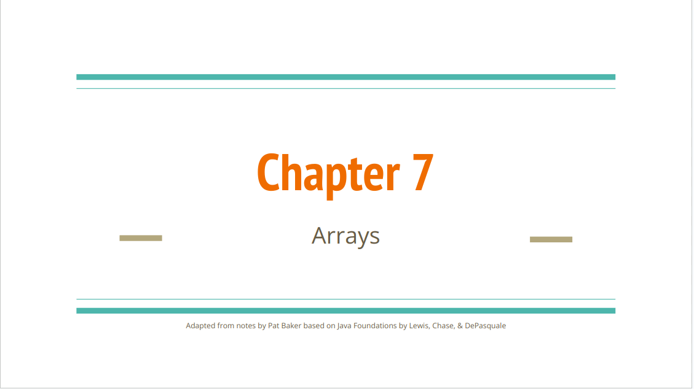
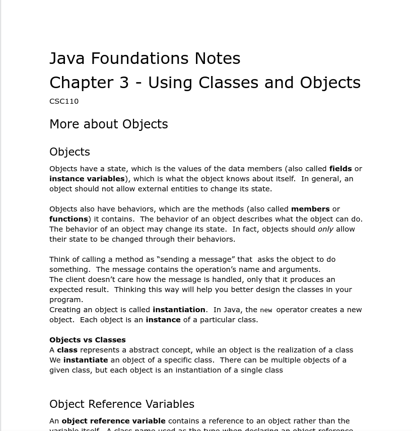
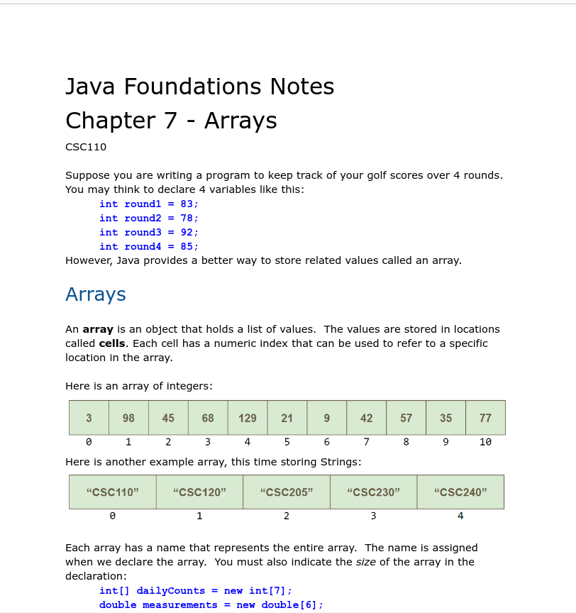

# Module 6 - Arrays

<!-- TOC -->
* [Module 6 - Arrays](#module-6---arrays)
* [General Notes](#general-notes)
* [Module Materials](#module-materials)
  * [Instructor Slides - PDF](#instructor-slides---pdf)
* [Chapter Notes](#chapter-notes)
  * [Chapter 3](#chapter-3)
  * [Chapter 7](#chapter-7)
  * [Sample Code & Videos](#sample-code--videos)
  * [Web Resources](#web-resources)
* [ZyBooks](#zybooks)
  * [Array Concept (General)](#array-concept--general-)
  * [Array Declarations and Accessing Elements](#array-declarations-and-accessing-elements)
    * [Using An Expression For An Array Index](#using-an-expression-for-an-array-index)
  * [Loops and arrays](#loops-and-arrays)
  * [Array Initialization](#array-initialization)
  * [Iterating Through An Array Using Loops](#iterating-through-an-array-using-loops)
    * [Common Error: Accessing Out Of Range Array Element](#common-error--accessing-out-of-range-array-element)
  * [Multiple Arrays](#multiple-arrays)
    * [Example](#example)
      * [Output](#output)
<!-- TOC -->

# General Notes

# Module Materials

## Instructor Slides - PDF

> **Instructor Slides:** [PDF](assets/arrays.pdf)
>
> <a href="assets/arrays.pdf"></a>

# Chapter Notes

## Chapter 3

> Java Foundations: [Chapter 3](assets/java_foundations_chapter_3.docx)
> 
> <a href="assets/java_foundations_chapter_3.docx"></a>

## Chapter 7

Read part 1, stopping at 2D Arrays

> Java Foundations: [Chapter 7](assets/java_foundations_chapter_7.docx)
> 
> <a href="assets/java_foundations_chapter_7.docx"></a>

## Sample Code & Videos

[GitHub Link](https://github.com/wadehuber/csc110examples/tree/master/csc110examples/src/videoexamples/module07)

## Web Resources

- **Oracle Docs:** [Arrays](https://docs.oracle.com/javase/tutorial/java/nutsandbolts/arrays.html)
- **Video:** [Introduction to Arrays Video by Author John Lewis](https://mediaplayer.pearsoncmg.com/_ph_cc_ecs640480_set.title.Overview_of_Arrays__/aw/streaming/aw_lewis_javafound_3/Video7_1.m4v)
- **Video:** [Introduction to Arrays - Part 1](https://youtu.be/Mo5xZYJb9NI)
- **Video:** [Java Programming Tutorial 27 - Introduction to Arrays](https://youtu.be/L06uGnF4IpY)
- **Video:** [Java Arrays: Finding the maximum and minimum value in an array](https://www.youtube.com/watch?v=rxJRJV3eEaI)

# ZyBooks

## Array Concept (General)

An **array** is a special variable having one name, but storing a list of data
items, with each item being directly accessible.

- Some languages use a construct similar to an array called a **vector**. Each
  item in an array is known as an **element**.

In an array, each element's location number is called the **index**.

- You can access any element directly using
  ```java
  myArray[index]
  myArray[2]  // Index is 2
  
  // Syntax for other languages
  myVector.at(3)
  ```
    - Many languages have the index start at `0`.

## Array Declarations and Accessing Elements

- An **array** is an ordered list of items of a given data type.
- Each item in an array is called an **element**.
- An **array reference** variable can refer to arrays of various sizes.
- The `new` keyword creates space in memory to store the array with the specific
  number of elements.
- `[ ]` are brackets
- `{ }` are braces
- The number in brackets is the **index**.
- THe first array element is at index **0**.
- Arrays are initialized with a default value or **0** if not specified.

```java

public class ArrayExample {
  public static void main (String [] args) {
     int[] itemCounts = new int[3];

     itemCounts[0] = 122;
     itemCounts[1] = 119;
     itemCounts[2] = 117;

     System.out.print(itemCounts[1]);
  }
}
```

_If the size of an array is known, good practice is to combine the array
reference variable declaration with the array allocation._

- Do not declare and initialize separately if you know the size of the array.

### Using An Expression For An Array Index

```java
import java.util.Scanner;

public class OldestPeople {
   public static void main(String[] args) {
      Scanner scnr = new Scanner(System.in);
      int[] oldestPeople = new int[5]; 
      int nthPerson;                   // User input, Nth oldest person

      oldestPeople[0] = 122; // Died 1997 in France
      oldestPeople[1] = 119; // Died 1999 in U.S.
      oldestPeople[2] = 117; // Died 1993 in U.S.
      oldestPeople[3] = 117; // Died 1998 in Canada
      oldestPeople[4] = 116; // Died 2006 in Ecuador

      System.out.print("Enter N (1-5): ");
      nthPerson = scnr.nextInt();

      if ((nthPerson >= 1) && (nthPerson <= 5)) {
         System.out.print("The " + nthPerson + "th oldest person lived ");
         System.out.println(oldestPeople[nthPerson - 1] + " years.");
      }
   }
}
```

- Array index must be a valid `int`.

## Loops and arrays

- Get an array's **length** property using `.length` after the array's name.

```java
int arrayLength = myArray.length;
```

## Array Initialization

- Integers and floating-point data types default to zero when initialized.
- Boolean elements default to `false` when initialized.

```java
// Initializing an array
int[] myVals = {10, 10, 10, 10}; 
```

## Iterating Through An Array Using Loops

```java
// Iterating through myArray
for (i = 0; i < myArray.length; ++i) {
   // Loop body accessing myArray[i]
}
```

### Common Error: Accessing Out Of Range Array Element

A common error is to try to access an array with an index that is out of the
array's index range.

## Multiple Arrays

**Parallel arrays** are when the contents at any given index in the two arrays
are related:

- `letterWeights[0]` holds a weight of 1.0 ounce
- `postageCosts[0]` holds the postage cost of 1.0 ounce

### Example

```java
import java.util.Scanner;
 
public class PostageCalc {
   public static void main (String [] args) {
      Scanner scnr = new Scanner(System.in);
      // Weights in ounces
      double[] letterWeights = {1.0, 2.0, 3.0, 3.5, 4.0, 5.0, 6.0,
                                7.0, 8.0, 9.0, 10.0, 11.0, 12.0, 13.0};
      // Costs in cents (usps.com 2017)
      int[] postageCosts = {49, 70, 91, 112, 161, 182, 203,
                            224, 245, 266, 287, 308, 329, 350};
      double userLetterWeight;
      boolean foundWeight;
      int i;
 
      // Prompt user to enter letter weight
      System.out.print("Enter letter weight (in ounces): ");
      userLetterWeight = scnr.nextDouble();
 
      // Postage costs is based on smallest letter weight greater than
      // or equal to mailing letter weight
      foundWeight = false;
 
      for (i = 0; (i < letterWeights.length) && (!foundWeight); ++i) {
         if( userLetterWeight <= letterWeights[i] ) {
            foundWeight = true;
            System.out.print("Postage for USPS first class mail is ");
            System.out.print(postageCosts[i]);
            System.out.println(" cents");
         }
      }
 
      if( !foundWeight ) {
         System.out.println("Letter is too heavy for USPS " +
                            "first class mail.");
      }
   }
}
```

#### Output

```java
Enter letter weight (in ounces): 3
Postage for USPS first class mail is 91 cents

...

Enter letter weight (in ounces): 9.5
Postage for USPS first class mail is 287 cents

...

Enter letter weight (in ounces): 16
Letter is too heavy for USPS first class mail.
```