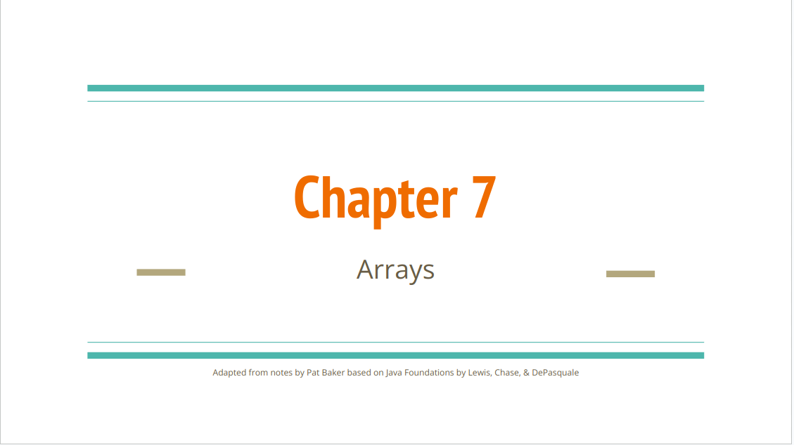
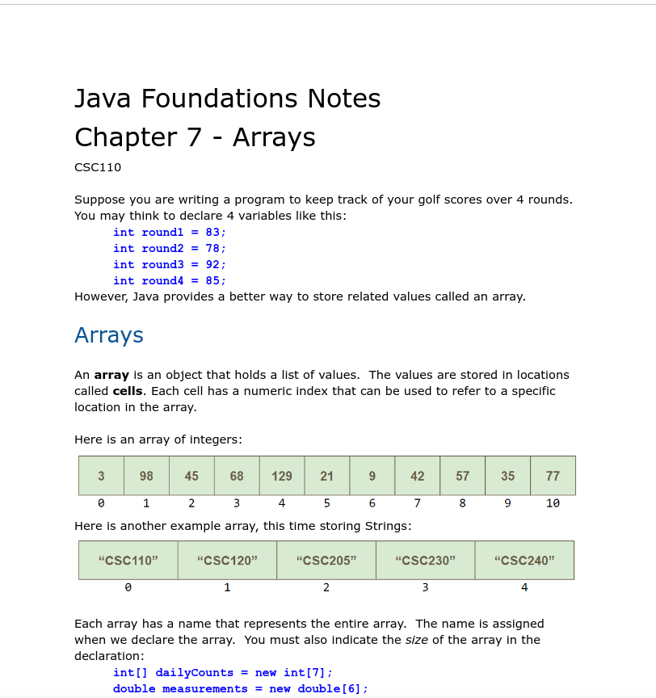

# Module 7 - Arrays, Enhanced Loops, and Comparing

<!-- TOC -->
* [Module 7 - Arrays, Enhanced Loops, and Comparing](#module-7---arrays-enhanced-loops-and-comparing)
* [General Notes](#general-notes)
* [Module 7 Materials](#module-7-materials)
  * [Instructor Slides](#instructor-slides)
  * [Chapter 7](#chapter-7)
  * [Sample Code & Videos](#sample-code--videos)
  * [Web Resources](#web-resources)
* [ZyBooks](#zybooks)
  * [Swapping Two Variables (General)](#swapping-two-variables--general-)
  * [Modifying & Copying / Comparing Arrays](#modifying--copying--comparing-arrays)
    * [Modifying Arrays](#modifying-arrays)
    * [Copying Arrays](#copying-arrays)
  * [Debugging Example: Reversing an Array](#debugging-example--reversing-an-array)
  * [Two-dimensional Arrays](#two-dimensional-arrays)
  * [Enhanced for loop: Arrays](#enhanced-for-loop--arrays)
    * [Common Error: Modifying The Loop Variable](#common-error--modifying-the-loop-variable)
<!-- TOC -->

# General Notes

# Module 7 Materials

## Instructor Slides

> **Instructor Slides:** [PDF](assets/arrays.pdf)
>
> <a href="assets/arrays.pdf"></a>

## Chapter 7

Read part 2

> Java Foundations: [Chapter 7](assets/java_foundations_chapter_7.docx)
> 
> <a href="assets/java_foundations_chapter_7.docx"></a>

## Sample Code & Videos

**Code Examples:** [GitHub Link](https://github.com/wadehuber/csc110examples/tree/master/csc110examples/src/videoexamples/module08)

## Web Resources

- [Basic Loops - For Each Loop also called an Enhanced For Loop](https://youtu.be/eByBsjUazII)
- [2-D Arrays - Introduction](https://youtu.be/B-DhUO3xNYQ)
- [2-D Arrays - Using a nested for loop to visit every element in the array](https://youtu.be/EVl_NBNKOAA)
- [Nested Loops & 2D Arrays](https://www.youtube.com/watch?v=w-9ZTeO7q_E)

# ZyBooks

## Swapping Two Variables (General)

- **Swapping** two variables x and y means to assign y's value to x, and x's
  value to y
- A **temporary variable** is a variable used briefly to store a value.
    - A common method for swapping uses a temporary variable.
- Most swaps are actually performed between two list elements.
    - For example, reversing a list with N elements can be achieved by swapping
      element 1 and N, element 2 and N-1, element 3 and N-2, etc. (stopping at
      the middle of the list).

## Modifying & Copying / Comparing Arrays

### Modifying Arrays

```java
import java.util.Scanner;

public class NegativeToZero {
   public static void main(String[] args) {
      Scanner scnr = new Scanner(System.in);
      final int NUM_ELEMENTS = 8;             // Number of elements
      int[] userVals = new int[NUM_ELEMENTS]; // User numbers
      int i;                                  // Loop index

      // Prompt user to input values
      System.out.println("Enter " + NUM_ELEMENTS + " integer values...");
      for (i = 0; i < userVals.length; ++i) {
         System.out.print("Value: ");
         userVals[i] = scnr.nextInt();
      }

      // Convert negatives to 0
      for (i = 0; i < userVals.length; ++i) {
         if (userVals[i] < 0) {
            userVals[i] = 0;
         }
      }

      // Print numbers
      System.out.print("New numbers: ");
      for (i = 0; i < userVals.length; ++i) {
         System.out.print(userVals[i] + " ");
      }
   }
}
```

### Copying Arrays

```java
import java.util.Scanner;

public class NegativeToZeroCopy {
   public static void main(String[] args) {
      Scanner scnr = new Scanner(System.in);
      final int NUM_ELEMENTS = 8;               // Number of elements
      int[] userVals = new int[NUM_ELEMENTS];   // User numbers
      int[] copiedVals = new int[NUM_ELEMENTS]; // New numbers
      int i;                                    // Loop index

      // Prompt user for input values
      System.out.println("Enter " + NUM_ELEMENTS + " integer values...");
      for (i = 0; i < userVals.length; ++i) {
         System.out.print("Value: ");
         userVals[i] = scnr.nextInt();
      }

      // Convert nums to newNums
      for (i = 0; i < userVals.length; ++i) {
         copiedVals[i] = userVals[i];
      }

      // Convert negatives to 0
      for (i = 0; i < copiedVals.length; ++i) {
         if (copiedVals[i] < 0) {
            copiedVals[i] = 0;
         }
      }

      // Print numbers
      System.out.println("\nOriginal and new values: ");
      for (i = 0; i < userVals.length; ++i) {
         System.out.println(userVals[i] + " became " + copiedVals[i]);
      }
      System.out.println();
   }
}
```

## Debugging Example: Reversing an Array

```java
import java.util.Scanner;

public class ArrayReverseElem {
   public static void main(String[] args) {
      Scanner scnr = new Scanner(System.in);
      final int NUM_ELEMENTS = 8;             // Number of elements
      int[] userVals = new int[NUM_ELEMENTS]; // User numbers
      int i;                                  // Loop index
      int tempVal;                            // Temp variable for swapping

      // Prompt user to input values
      System.out.println("Enter " + NUM_ELEMENTS
              + " integer values...");
      for (i = 0; i < userVals.length; ++i) {
         System.out.print("Value: ");
         userVals[i] = scnr.nextInt();
      }

      // Reverse array's elements
      for (i = 0; i < (userVals.length / 2); ++i) {
         tempVal = userVals[i];                           // Temp for swap
         userVals[i] = userVals[userVals.length - 1 - i]; // First part of swap
         userVals[userVals.length - 1 - i] = tempVal;     // Swap complete
      }

      // Print numbers
      System.out.print("\nNew values: ");
      for (i = 0; i < userVals.length; ++i) {
         System.out.print(userVals[i] + " ");
      }
   }
}
```

## Two-dimensional Arrays

```java
double[ ] [ ] rainfall = new double [ 4 ] [ 7 ];
                                 // [row] [col] 
int numberOfRows = rainfall.length;
int numberOfColumns = rainfall[0].length;  

// General Syntax
for (int row = 0; row < numberOfRows; row++){
    for (int col = 0; col < numberOfColumns; col++){
        rainfall[row][col] = 5.0;
     } 
   }
   
// Initializing a 2D array
int[][] numVals = { {22, 44, 66}, {97, 98, 99} };

// Use multiple lines to make rows more visible
int[][] numVals = {
      {22, 44, 66}, // Row 0
      {97, 98, 99}  // Row 1
};
```

## Enhanced for loop: Arrays

The **enhanced for loop** is also called a **for-each loop**.

- The enhanced for loop declares a new **loop variable**, whose scope is limited
  to the for loop, that will be assigned with each successive element of an
  array.

<u>Limitations of the for-each loop:</u>

- **for-each loops** are not appropriate when you want to modify the array.
- **for-each loops** do not keep track of index. So we can not obtain array
  index using **for-each loop**.
- **for-each loops** only iterate forward over the array in single steps

```java
// Syntax
for (type var : array) 
{ 
    statements using var;
}
```

- Compared to a regular for loop, an enhanced for loop decreases the amount of
  code needed to iterate through arrays, thus enhancing code readability and
  clearly demonstrating the loop's purpose.
- An enhanced for loop also prevents a programmer from writing code that
  incorrectly accesses elements outside the array's range.

### Common Error: Modifying The Loop Variable

A common error is modifying the loop variable in an attempt to modify the
array's elements. 

The loop variable is a copy of the current array element in the iteration. Thus,
assigning the loop variable with a value only modifies the loop variable and
does not change the array element.