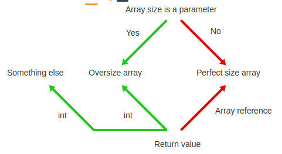
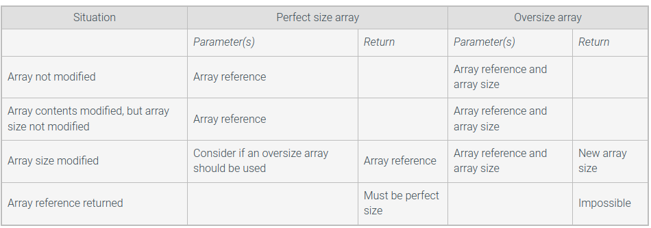
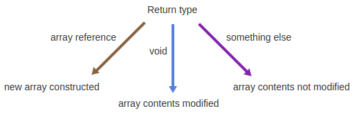

# Module 8 - User-defined Method Basics

# General Notes

# Zybooks

## User-defined Method Basics

### Methods (General)

Program redundancy can be reduced by creating a grouping of predefined
statements for repeatedly used operations, known as a **method**.

A **method** is a named list of statements.

- A **method definition** consists of the new method's name and a block of
  statements.
  ```java
  public static double calcPizzaArea() { 
      /* block of statements */ 
  }
  ```
- A **Method call** is an invocation of a method's name, causing the method's
  statements to execute.
- A **block** is a list of statements surrounded by braces.

```java
public class PizzaArea { 
   public static double calcPizzaArea() {
      double pizzaDiameter;
      double pizzaRadius;
      double pizzaArea;
      double piVal = 3.14159265;

      pizzaDiameter = 12.0;
      pizzaRadius = pizzaDiameter / 2.0;
      pizzaArea = piVal * pizzaRadius * pizzaRadius;
      return pizzaArea;
   }

   public static void main(String[] args) {  
      System.out.println("12 inch pizza is " +   
       calcPizzaArea() + " inches squared"); 
   }
}
```

- Both the methods `calcPizzaArea()` and `main()` use the **access modifiers**
  `public static`.
    - `public` indicates the method may be called from any class in the program.
    - `static` indicates the method only uses values that passed to the method.
- A program must define a `main()` method, which is automatically called first
  when a program executes.

### Returning a Value From a Method

A value is returned using a **return statement**.

```java
public class SquareComputation {

   public static int computeSquare(int numToSquare) {
      return numToSquare * numToSquare;
   }

   public static void main (String [] args) {
      int numSquared;

      numSquared = computeSquare(7);
      System.out.println("7 squared is " + numSquared);
  }
}
```

- A method can only return one value.

### Parameters

- **Parameter:** A method input specified in a method definition.
- **Argument:** A value provided to a method's parameter during a method call.

A parameter is like a variable declaration. Upon a call, the parameter's memory
location is allocated, and the parameter is assigned with the argument's value.
Upon returning to the original call location, the parameter is deleted from
memory.

### Multiple or No Parameters

```java
// Multiple parameters
public static double calcPizzaVolume(double pizzaDiameter, double pizzaHeight) {
    /* Code Statements */
}

// No parameters
public static void doSomething() {
    /* Code Statements */
}
```

### Calling Methods From Methods

```java
public class MethodsCallingMethods {

   public static double calcCircleArea(double circleDiameter) {
      double circleRadius;
      double circleArea;
      double piVal = 3.14159265;
           
      circleRadius = circleDiameter / 2.0;
      circleArea = piVal * circleRadius * circleRadius;
           
      return circleArea;
   }

   public static double pizzaCalories(double pizzaDiameter) {
      double totalCalories;
      double caloriesPerSquareInch = 16.7;    // Regular crust pepperoni pizza
           
      totalCalories = calcCircleArea(pizzaDiameter) * caloriesPerSquareInch;
           
      return totalCalories;
   }

   public static void main (String [] args) {
      System.out.printf("12 inch pizza has %.2f calories.\n", pizzaCalories(12.0));
      System.out.printf("14 inch pizza has %.2f calories.\n", pizzaCalories(14.0));
   }
}

/* Output:
 * 12 inch pizza has 1888.73 calories.
 * 14 inch pizza has 2570.77 calories.
 */
```

## Print Methods

### Printing From a Method

The **void** keyword indicates a method does not return a value. A method with a
void return type is often called a **void method**.

- Once a void method finishes execution, control returns back to the caller
  and no value is returned.
- A print method prints out arguments passed to the parameter, but does not have
  to return anything.

```java
import java.util.Scanner;

public class MenuSystem {
   public static void printMenu() {
      System.out.println("Today's Menu:");
      System.out.println("   1) Gumbo");
      System.out.println("   2) Jambalaya");
      System.out.println("   3) Quit\n");
   }
   
   public static void main(String[] args) {
      Scanner scnr = new Scanner(System.in);
      boolean quit = false;
      int choice;

      while (!quit) {
         printMenu();
         System.out.print("Enter choice: ");
         choice = scnr.nextInt(); 
         if (choice == 3) {
            System.out.println("Goodbye");
            quit = true;
         }
         else {
            System.out.print("Order: ");
            if (choice == 1) {
               System.out.println("Gumbo");
            }
            else if (choice == 2) {
               System.out.println("Jambalaya");
            }
            System.out.println();
         }  
      }  
   }
}
```

## Reasons for Defining Methods

- Improve program readability
- Modular and incremental program development
    - **Modular Development:** The process of dividing a program into separate
      modules that can be developed and tested separately and then integrated
      into
      a single program.
    - **Incremental Development:** The process in which a programmer writes,
      compiles, and tests a small amount of code, then writes, compiles, and
      tests a small amount more (an incremental amount), and so on.
    - **Method Stub:** A method definition whose statements have not yet been
      written.
- Avoid writing redundant code
    - The skill of decomposing a program's behavior into a good set of methods
      is
      a fundamental part of programming that helps characterize a good
      programmer.
    - Each method should have easily-recognizable behavior, and the behavior of
      `main()` (and any method that calls other methods) should be easily
      understandable via the sequence of method calls.
- Methods may cause slightly slower execution, but have other far more
  important advantages, like improved readability.

### Method Stub

```java
import java.util.Scanner;

public class MileageCalc {
   public static double convKilometersToMiles(double numKm) {
      System.out.println("FIXME: Convert km to m");
      return 0.0;
   }
 
   public static double convLitersToGallons(double numLiters) {
      System.out.println("FIXME: Convert l to gal");
      return 0.0;
   }
 
   public static double calcMpg(double distMiles, double gasGallons) {
      System.out.println("FIXME: Calculate MPG");
      return 0.0;
   }
 
   public static void main(String[] args) {
      Scanner scnr = new Scanner(System.in);
      double distKm;
      double distMiles;
      double gasLiters;
      double gasGal;
      double userMpg;
   
      System.out.print("Enter kilometers driven: ");
      distKm = scnr.nextDouble();
      System.out.print("Enter liters of gas consumed: ");
      gasLiters = scnr.nextDouble();
   
      distMiles = convKilometersToMiles(distKm);
      gasGal = convLitersToGallons(gasLiters);
      userMpg = calcMpg(distMiles, gasGal);
   
      System.out.println("Miles driven: " + distMiles);
      System.out.println("Gallons of gas: " + gasGal);
      System.out.println("Mileage: " + userMpg + " mpg");
   }
}
```

## Writing Mathematical Methods

### Mathematical Methods

A method is commonly defined to compute a mathematical calculation involving
several numerical parameters and returning a numerical result.

<u>Convert height in feet and inches to total centimeters:</u>

```java
import java.util.Scanner;

public class HeightConverter {

   /* Converts a height in feet/inches to centimeters */
   public static double heightFtInToCm(int heightFt, int heightIn) {
      final double CM_PER_IN = 2.54;
      final int IN_PER_FT = 12;
      int totIn;
      double cmVal;

      totIn = (heightFt * IN_PER_FT) + heightIn; // Total inches
      cmVal = totIn * CM_PER_IN;                 // Conv inch to cm
      return cmVal;
   }

   public static void main(String[] args) {
      Scanner scnr = new Scanner(System.in);
      int userFt;  // User defined feet
      int userIn;  // User defined inches

      // Prompt user for feet/inches
      System.out.print("Enter feet: ");
      userFt = scnr.nextInt();

      System.out.print("Enter inches: ");
      userIn = scnr.nextInt();

      // Output the conversion result
      System.out.print("Centimeters: ");
      System.out.println(heightFtInToCm(userFt, userIn));
   }
}
```

### Modular Methods for Mathematical Expressions

Complex mathematical methods often call other mathematical methods.

<u>Program to calculate cylinder volume and surface area by calling a modular
method for the cylinder's base:</u>

```java
import java.util.Scanner;

public class Demo {
   public static double calcCircularBaseArea(double radius) {
      return Math.PI * radius * radius;
   }

   public static double calcCylinderVolume(double baseRadius, double height) {
      return calcCircularBaseArea(baseRadius) * height;
   }

   public static double calcCylinderSurfaceArea(double baseRadius, double height) {
      return (2 * Math.PI * baseRadius * height) + (2 * calcCircularBaseArea(baseRadius));
   }

   public static void main(String[] args) {
      double radius;  // User defined feet
      double height;  // User defined height
      Scanner scnr = new Scanner(System.in);

      // Prompt user for radius
      System.out.println("Enter base radius: ");
      radius = scnr.nextDouble();
      
      // Prompt user for height
      System.out.println("Enter height: ");
      height = scnr.nextDouble();

      // Output the cylinder volume result
      System.out.print("Cylinder volume: ");
      System.out.printf("%.1f\n", calcCylinderVolume(radius, height));

      // Output the cylinder surface area result
      System.out.print("Cylinder surface area: ");
      System.out.printf("%.3f\n", calcCylinderSurfaceArea(radius, height));
   }
}
```

## Methods With Loops

### Average List of Numbers

```java
import java.util.Scanner;

public class ListAverage {
   // Method prompts to enter a list of values
   public static double computeAverage(Scanner scnr, int numCount) {
      double valuesSum = 0;
      int currValue = 0;

      for (int i = 0; i < numCount; ++i) {
         System.out.print("Enter number: ");
         currValue = scnr.nextInt(); 
         valuesSum += currValue;
      }

      return valuesSum / numCount;
   }
   
   public static void main(String [] args) {
      Scanner scnr = new Scanner(System.in);
      int numValues;
      double averageVal;
      
      System.out.println("Enter number of values: ");
      numValues = scnr.nextInt(); 
      averageVal = computeAverage(scnr, numValues);
      
      System.out.print("Average: ");
      System.out.printf("%.3f", averageVal);
      System.out.println("");
   }
}
```

### Least-Common Multiple Calculator

```java
import java.util.Scanner;

public class LeastCommonMultiple {

   // Method prompts user to enter positive non-zero number
   public static int promptForPositiveNumber(Scanner scnr) {
      int userNum;

      userNum = 0;

      while (userNum <= 0) {
         System.out.println("Enter a positive number (>0): ");
         userNum = scnr.nextInt();

         if (userNum <= 0) {
            System.out.println("Invalid number.");
         }
      }

      return userNum;
   }

   // Method returns greatest common divisor of two inputs
   public static int findGCD(int aVal, int bVal) {
      int numA;
      int numB;

      numA = aVal;
      numB = bVal;

      while (numA != numB) { // Euclid's algorithm
         if (numB > numA) {
            numB = numB - numA;
         } else {
            numA = numA - numB;
         }
      }

      return numA;
   }

   // Method returns least common multiple of two inputs
   public static int findLCM(int aVal, int bVal) {
      int lcmVal;

      lcmVal = Math.abs(aVal * bVal) / findGCD(aVal, bVal);

      return lcmVal;
   }

   public static void main(String[] args) {
      Scanner scnr = new Scanner(System.in);
      int usrNumA;
      int usrNumB;
      int lcmResult;

      System.out.println("Enter value for first input");
      usrNumA = promptForPositiveNumber(scnr);

      System.out.println("\nEnter value for second input");
      usrNumB = promptForPositiveNumber(scnr);

      lcmResult = findLCM(usrNumA, usrNumB);

      System.out.println("\nLeast common multiple of " + usrNumA
              + " and " + usrNumB + " is " + lcmResult);
   }
}
```

## Parameter Error Checking

### Verifying Parameter Values

A good practice is to check that a parameter's value is within an expected
range. If not, the method might take one or more various actions, such as:

- An error message
- Assigning a valid value
- Returning a value indicating failure
- Exiting the program
- Etc.

#### Example

```java
public class DatePrinterWithCheck {
   public static void printDate(int currDay, int currMonth, int currYear) {

      // Parameter error checking
      if ((currDay < 1) || (currDay > 31)) {
         System.out.println("Invalid day (" + currDay + "). Using 1.");
         currDay = 1;
      }

      if ((currMonth < 1) || (currMonth > 12)) {
         System.out.println("Invalid month (" + currMonth + "). Using 1.");
         currMonth = 1;
      }

      // Begin method's normal behavior
      System.out.print(currMonth + "/" + currDay + "/" + currYear);
   }

   
   public static void main(String[] args) {
      printDate(30, 7, 2012);
      System.out.print("\n\n");

      printDate(40, 7, 2012);
      System.out.print("\n\n");

      printDate(30, 13, 2012);
      System.out.print("\n\n");
   }
}
```

## Scope of Variable / Method Definitions

- The name of a defined variable or method item is only visible to part of a
  program, known as the item's **scope**.
- Because a compiler scans a program line-by-line from top-to-bottom, the scope
  of a variable starts _after_ the declaration until the method's end.
- A variable declared within a class but outside any method is called a _**class
  member variable**_ or **field**.
    - A field's scope extends from the class's opening brace to the class's
      closing brace, and reaches into methods regardless of where the field is
      declared within the class.
- If a method's local variable (including a parameter) has the same name as a
  field, then in that method the name refers to the local item and the field is
  inaccessible.
    - Attempting to declare a method's local variable as the same name as a
      method
      parameter will generate a compiler error.
- If a method updates a field, the method has effects that go beyond its
  parameters and return value, sometimes known as **side effects**.
- **A method also has scope**, which extends from the class's opening brace to
  the class's closing brace.
    - A method can access any other method defined in the same class, regardless
      of the order in which the methods are defined.
    - [Method Definition and Overloading](http://docs.oracle.com/javase/tutorial/java/javaOO/methods.html)

## Common Errors

- Copy-pasting code among methods, but then not completing all necessary
  modifications to the pasted code.
- Returning the wrong variable or no variable when one is required to be
  returned.

## Unit Testing (Methods)

- **Unit Testing:** The process of individually testing a small part or unit of
  a program, typically a method.
- A unit test is usually conducted by creating a **testbench** _(a.k.a. test
  harness)_, which is a separate program whose sole purpose is to check that a
  method returns correct output values for a variety of input values.
    - Each unique set of input values is known as a **test vector**.

### Example For hrMinToMin()

```java
public class HrMinToMinTestHarness {
   public static int hrMinToMin(int origHours, int origMinutes) {
      int totMinutes;     // Resulting minutes

      totMinutes = (origHours * 60) + origMinutes;

      return origMinutes;
   }

   public static void main(String[] args) {
      System.out.println("Testing started");

      System.out.println("0:0, expecting 0, got " + hrMinToMin(0, 0));
      System.out.println("0:1, expecting 1, got " + hrMinToMin(0, 1));
      System.out.println("0:99, expecting 99, got " + hrMinToMin(0, 99));
      System.out.println("1:0, expecting 60, got " + hrMinToMin(1, 0));
      System.out.println("5:0, expecting 300, got " + hrMinToMin(5, 0));
      System.out.println("2:30, expecting 150, got " + hrMinToMin(2, 30));
      // Many more test vectors would be typical...

      System.out.println("Testing completed");
   }
}
/* Output:
* Testing started
* 0:0, expecting 0, got 0
* 0:1, expecting 1, got 1
* 0:99, expecting 99, got 99
* 1:0, expecting 60, got 0
* 5:0, expecting 300, got 0
* 2:30, expecting 150, got 30
* Testing completed 
*/
```

### `assert` Operator

Java provides a compact way to print an error message when an expression
evaluates to `false`: `assert`.

- `assert` is an operator that prints an error message and exits the program
  if the provided test expression evaluates to false.
- [Programming With Assertions](http://docs.oracle.com/javase/8/docs/technotes/guides/language/assert.html)

#### Syntax

```java
assert testExpression: detailedMessage;
```

#### Example

```java
public class HrMinToMinTestHarness {
   public static double hrMinToMin(int origHours, int origMinutes) {
      int totMinutes;      // Resulting minutes

      totMinutes = (origHours * 60) + origMinutes;

      return origMinutes;
   }

   public static void main(String[] args) {
      System.out.println("Testing started");

      assert (hrMinToMin(0, 0) == 0) : "Assertion (hrMinToMin(0, 0) == 0) failed";
      assert (hrMinToMin(0, 1) == 1) : "Assertion (hrMinToMin(0, 1) == 1) failed";
      assert (hrMinToMin(0, 99) == 99) : "Assertion (hrMinToMin(0, 99) == 99) failed";
      assert (hrMinToMin(1, 0) == 60) : "Assertion (hrMinToMin(1, 0) == 60) failed";
      assert (hrMinToMin(5, 0) == 300) : "Assertion (hrMinToMin(5, 0) == 300) failed";
      assert (hrMinToMin(2, 30) == 150) : "Assertion (hrMinToMin(2, 30) == 150) failed";
      // Many more test vectors would be typical...

      System.out.println("Testing completed");
   }
}

/* Output:
* Testing started
* Exception in thread "main" java.lang.AssertionError: Assertion (hrMinToMin(1, 0) == 60) failed
*         at HrMinToMinTestHarness.main(HrMinToMinTestHarness.java:16)
*/
```

- Assertions are not enabled by default and Java programs must be run with
  additional command-line options in order to enable them:
  ```shell
  java -ea HrMinToMinTestHarness
  ```
- The `-ea` command-line option is what enables assertions.

---

Good test vectors include:

- Rich variety of typical input values.
- Mixture of small and large numbers.
- Some 0 values.
- **Border Cases** that represent fringe scenarios.
    - I.e. two huge numbers, a negative number, two negative numbers, etc.
    - Extreme or abnormal inputs that might cause the method to fail.

## How Methods Work

Each method call creates a new set of local variables, forming part of what is
known as a **stack frame**. A return causes those local variables to be
discarded.

## Method Name Overloading

- [Method Definition and Overloading](http://docs.oracle.com/javase/tutorial/java/javaOO/methods.html)

**Method overloading**, or **method name overloading**, is when two methods
have the same name but differ in the number or types of parameters.

```java
public class DatePrinter {
   public static void printDate(int currDay, int currMonth, int currYear) {    
      System.out.print(currMonth + "/" + currDay + "/" + currYear);
   }

   public static void printDate(int currDay, String currMonth, int currYear) {
      System.out.print(currMonth + " " + currDay + ", " + currYear);
   }

   public static void main(String[] args) {
      
      printDate(30, 7, 2012);
      System.out.println();
      
      printDate(30, "July", 2012);
      System.out.println();
   }
}
```

- The compiler determines which method to call based on the argument types of
  the method call.
- More than two same-named methods is allowed as long as each has distinct
  parameter types.
- A method's return type does not influence overloading.

## Using Scanner in Methods

- A program should use only one `Scanner` per input stream.
- A `Scanner` object may read more input than needed to make subsequent reads
  faster. Thus, using multiple of them for the same input stream may lead to
  unexpected results.
- If a method needs to read user input, a good practice is to create a single
  `Scanner` object in `main()` and pass that `Scanner` object to the method.

```java
import java.util.Scanner;

public class CalculatePizzaCalories {

   public static double calcCircleArea(double circleDiameter) {
      double circleRadius;
      double circleArea;
      double piVal = 3.14159265;

      circleRadius = circleDiameter / 2.0;
      circleArea = piVal * circleRadius * circleRadius;

      return circleArea;
   }

   public static double getPizzaCalories(Scanner scnr) {
      double pizzaDiameter;
      double totalCalories;
      double caloriesPerSquareInch = 16.7;    // Regular crust pepperoni pizza

      System.out.print("Enter pizza's diameter (inches): ");
      pizzaDiameter = scnr.nextDouble();

      totalCalories = calcCircleArea(pizzaDiameter) * caloriesPerSquareInch;

      return totalCalories;
   }

   public static void main (String [] args) {
      Scanner scnr = new Scanner(System.in);

      System.out.println("Pizza has " + getPizzaCalories(scnr) + " calories.");
      System.out.println("Pizza has " + getPizzaCalories(scnr) + " calories.");
   }
}
```

## Array Parameters

- Argument values are copied into a local variable for the parameter, meaning
  that assignments to parameters do not affect the arguments.
- An array is passed to a method by passing a reference to the array, meaning
  that only the array reference is copied to the method's parameters. The method
  can modify the elements of an array argument.
    - Assigning an array parameter only updates the local reference, leaving the
      argument unchanged.

## Perfect Size Arrays

A **perfect size array** is an array where the number of elements if exactly
equal to the memory allocated.

### When To Use Perfect Size Arrays

Perfect sized arrays are used when the size of the array is fixed by the context
of the program.

- For example, having the names of the days of the week in a perfect sized array
  makes sense because the number of days in a week will not change.
    - The array should be constant as well since the names of the days of the
      week
      will not change:
      ```java
      final String[] daysOfWeek = { /* Days of week */ };
      ```

It is also possible to return perfect size arrays from a method:

  ```java
  double[] createInitializedArray(int numberElements, double initializeValue) { /* Code */ }
  ```

- The method declaration implicitly tells a programmer that perfect size arrays
  are used because the method returns an array. A method cannot return two
  items, so returning the array reference means the size cannot be returned.

#### Example

```java
public static void fill(int[] arrayRef, int initializedValue) {
   int index;

   for (index = 0; index < arrayRef.length; ++index) {
      arrayRef[index] = initializedValue;
   }
}
```

## Oversize Arrays

### Oversize Arrays Introduction

**Oversize Array:** An array where the number of elements used is less than or
equal to the memory allocated.

- A separate integer variable is often used to keep track of how many array
  elements are currently used in an oversize array, because the number of
  elements is usually less than the array's length.
  ```java
  int[] salesTransactions = new int[1000];
  int salesTransactionsSize = 0;
  ```
- Oversize arrays are useful when the number of elements stored in the array is
  not known in advance, or when the number of elements stored in an array varies
  over time.
    - I.e. A shopping list

### Size of an Oversize Array

- Select a size that will not be too small _(or the program will fail when the
  number of required elements exceeds the number of allocated elements)_ and not
  too large _(or it can degrade performance)_.
- The size should be relevant to the task.

### Variables for Oversize Arrays

Oversize arrays typically use three variables:

- The array reference
- The current size
- A constant for the array capacity

```java
final int QUIZ_ANSWER_CAPACITY = 200;                         // Array Capacity
boolean[] quizAnswers = new boolean[QUIZ_ANSWER_CAPACITY];    // Array Reference
int quizAnswerSize = 0;                                       // Current Size
```

## Methods With Oversize Arrays

### Methods With Oversize Arrays

- Two parameters are needed when an oversize array is passed to a method:
    - The array reference
    - The current size
  ```java
  public static void printOversizeArray(String[] arrayRef, int arraySize) {
     int index;
  
     System.out.print("[");
     for (index = 0; index < arraySize; ++index) {
        System.out.print(arrayRef[index]);
        if (index != arraySize - 1) {  // Don't print trailing , for last element
           System.out.print(", ");
        }
     }
     System.out.println("]");
  }
  ```

### Methods Updating Oversize Arrays: Adding Elements

- If the array size is changed by a method, then the new array size needs to be
  returned by the method.

```java
final int LIST_SIZE = 4;
String[] toDoList = new String[LIST_SIZE];
int toDoListSize = 0;
                
toDoListSize = addElement(toDoList, toDoListSize, "Study");

...

public static int addElement(String[] arrayRef,
                            int currentSize,
                            String addMe) {
   // Check that array has space 
   if (currentSize == arrayRef.length) {    
      return currentSize;  
   }

   // If array has space, add the element to the array 
   arrayRef[currentSize] = addMe; 
   ++currentSize; 
   return currentSize;
}
```

### Methods Updating Oversize Arrays: Removing Elements

```java
public static int removeFirst(int[] arrayRef, int arraySize, int targetVal) {
   boolean targetFound;
   int index;

   targetFound = false;

   // Step through the array one element at a time
   for (index = 0; index < arraySize; ++index) {
      // If matching element found, move each element to the previous index
      if (targetFound) {
         arrayRef[index-1] = arrayRef[index];
      }

      // Check if matching element found
      if (arrayRef[index] == targetVal) {
         targetFound = true;
      }
   }

   // If matching element found, array size is one element smaller
   // otherwise array size hasn't changed 
   if (targetFound) {
      return arraySize - 1;
   }
   else {
      return arraySize;
   }
}
```

### Common Errors: Methods With Oversize Arrays

A common error is to not return the new size of an oversize array that was
modified in a method.

- This mistake occurs because programmers forget that primitive data values,
  like the size of an array, cannot be modified within methods.

## Comparing Perfect Size and Oversize Arrays

- When using a perfect array, assume that all elements will be addressed or
  used.
- When using an oversize array, there are most likely elements at the end of the
  array that have not been populated.
    - Because of this, you need to know how many elements to consider, or what
      is
      the index of the last element used.

### Comparing Method Signatures for Perfect Size and Oversize Arrays



- A method signature can tell a programmer whether a perfect size or oversize
  array is expected as an argument.
    - A method that expects a perfect size array as an argument will have one
      parameter for the array reference, but no parameter for the array size
      ```java
      int findIndexMax(String[] arrayReference)
      ```
    - A method that expects an oversize array as an argument will have two
      parameters to pass the array: one for the array reference and one for the
      array size.
      ```java
      int binarySearch(String[] arrayReference, int arraySize, String searchKey) 
      ```
- The return type can also be used to help determine whether a method uses a
  perfect size or an oversize array.
    - If a method returns an array reference, the method constructs a perfect
      size
      array.
        - An oversize array cannot be constructed inside a method because the
          method
          would need to return both an array reference and array size, which is
          not
          permitted in Java.
    - If a method returns an int, the method may use an oversize array, where
      the
      return value indicates the new array size.
      ```java
      int removeAll(String[] arrayReference, int arraySize, String target)
      ```

#### Passing a Perfect Size Array to Method Expecting Oversize Array

```java
search(String[] arrayReference, int fromIndex, int toIndex, String target)

// Passing a perfect array to the above method
foundIndex = search(carsNames, 0, carNames.length, "VW");
```

- `0` is passed to `fromIndex` and the array's length field is passed to
  `toIndex`.

### Perfect Size and Oversize Arrays In The Java API

- [Arrays Class Documentation](https://docs.oracle.com/en/java/javase/12/docs/api/java.base/java/util/Arrays.html)
- The `fill()` method is heavily overloaded to allow both perfect size and
  overload size arrays.

### Choosing Method Signatures for Perfect and Oversize Arrays

#### Oversize Array Example

```java
// Oversize array method 1
String toString(int[] a, int size)

// Oversize array method 2
String toString(int[] a, int fromIndex, int toIndex)
```

- The second method is better because it can be used to print any range in the
  array.

An oversize array cannot be returned by a method.

#### Selecting Method Parameters and Return Values



#### Oversize Array `fill()` Example

```java
public static int fill(int[] arrayRef, int arraySize, int value) {
   // Stop at the end of the array, even if arraySize is too big
   int size = Math.min(arrayRef.length, arraySize);
        
   for (int index = 0; index < size; ++index) {
      arrayRef[index] = value;
   }
        
   return size;
}
```

### Advantages of Perfect Size Arrays

- Methods that use perfect size arrays have fewer parameters than methods that
  use oversize arrays.
- A perfect size array contains no excess elements.
- A **disadvantage** of perfect size arrays is that if the number of array
  elements needs to change, a new array will have to be constructed.
    - Creating a new array and copying elements can be time-consuming,
      especially
      for very large arrays.

#### Adding Elements to Perfect Size and Oversize Arrays

```java
// Method uses a perfect size array.
public static String[] addElement(String[] arrayRef, String addMe) {
   String[] returnArray = new String[arrayRef.length + 1];
   int index;
           
   // Copy the array elements to the newly constructed array
   for (index = 0; index < arrayRef.length; ++index) {
      returnArray[index] = arrayRef[index];
   }

   // Add in the new element to the end of the array
   returnArray[arrayRef.length] = addMe;
         
   return returnArray;
}

// Method uses an oversize array.
public static int addElement(String[] arrayRef, int currentSize, String addMe) {
    // Check that array has space
   if (currentSize == arrayRef.length) return currentSize;
   
   arrayRef[currentSize] = addMe;
   ++currentSize;

   return currentSize;
}
```

## Using References In Methods

- Primitive data types are passed in by value
    - The original primitive variable cannot be changed inside the method. A
      copy
      of it can change in the method, but the original value stays the same.
      This
      is called **pass by value**.
- The reference to an array is passed into a method. This is called **pass by
  reference**.
    - An array can be changed inside the method.

### Storage of Primitive Data Types and Arrays

- Primitive data types are stored directly in the **stack frame**.
- An array is stored indirectly in **the heap**, and only the reference to the
  array is stored in the stack frame.

```java
int[] topScores = {100, 99, 99};
int[] bottomScores = {80, 82, 81};
int totalScores;
```

- `totalScores` is stored on the **Stack**
- `topScores` is stored on the **Stack**
- `topScores[0]` is stored on the **Heap**
- `bottomScores` is stored on the **Stack**

### Passing Array References

```java
String[] plannedCities = {"Ann Arbor", "Dexter", "Chelsea"};
String[] myVisits = {"Ann Arbor", "Chelsea", "Dexter"};

if (equals(plannedCities, myVisits)) {
   System.out.println("My visit was exactly the same as the plan.");
}

...

public static boolean equals(String[] firstArray, String[] secondArray) {
   int index;

   // If the arrays are not the same length, the arrays cannot have the same contents
   if (firstArray.length != secondArray.length)
        return false;

   // Both arrays are now known to be the same length 
   for (index = 0; index < firstArray.length; ++index) {
      if (!firstArray[index].equals(secondArray[index])) {
         return false;
      }
   }
   // Both arrays are known to be the same length and have 
   // exactly the same items in the same order
   return true;
}
```

### Common Error

- Modifying an array reference in a method.

## Returning Arrays From Methods

- Constructing an array in a method and then returning the array is a common
  strategy.

### Constructing an Array in a Method

An array can be constructed in a method, and the reference to the array can be
returned.

```java
int[] uniformSizes = {5, 16, 9};

String[] orderSizes = convertSizes(uniformSizes);

...

public static String[] convertSizes(int[] sourceArr) {
 String[] resultArr = new String[sourceArr.length];
 int index;

 for (index = 0; index < sourceArr.length; ++index) {
    resultArr[index] = "Misses " + sourceArr[index];
 }        

 return resultArr;
}
```

### Modifying An Array's Size in a Method

- An array's length cannot be modified, so instead a new array with the modified
  size must be constructed.
    - The adjacent memory locations may hold other data, or may be used by other
      programs.

```java
String[] originalArray = {"Raven", "Daisy", "Jasmine"};
originalArray = resize(originalArray, 5);

...

public static String[] resize(String[] arrayReference, int newSize) {
   String[] resultArray = new String[newSize];
   int index;
   int numToCopy;

   // Determine the number of array elements to copy
   numToCopy = Math.min(newSize, arrayReference.length);

   // Copy elements from arrayReference to resultArray
   for (index = 0; index < numToCopy; ++index) {
      resultArray[index] = arrayReference[index];
   }
   
   return resultArray;
}
```

- The method must construct a new array with the new size, copy the existing
  array's elements to the new array, and return a reference to the newly
  constructed array.
- The original array reference must be assigned with the reference to the new
  array returned by the method.

## Common Errors: Methods and Arrays

- Method Signature Errors
    - A method should be designed with a single purpose. If the purpose is to
      change an array's contents, then the method should not perform a secondary
      calculation that returns a value.

A method that uses arrays typically has one of three purposes, each of which can
often be identified by the method signature:



1. Calculates a value based on the array, leaving the array unchanged.
    - If a method does not change the array contents, then the method must be
      calculating some other value that must be returned.
    - Ex: The `Arrays` class' method
      ```java
      int binarySearch(int[] arrayReference, int target) 
      ```
      determines whether target exists in the array data. The returned value is
      the index of target in the array, or a negative number if target is not in
      the array.
2. Changes an array's contents, but not the array's size.
    - If a method changes the array's contents, the method usually has a void
      return.
    - Ex: The `Arrays` class' method
      ```java
      void sort(int[] arrayReference)
      ```
      changes the array contents to be in ascending order.
3. Creates a new array or changes the array's size (and possibly contents).
    - Since array references cannot be changed inside a method, a method that
      returns a newly constructed array must return an array reference.
    - Ex: The `Arrays` class' method
      ```java
      double[] copyOf(double[] arrayReference, int newLength)
      ```
      creates a copy of the arrayReference with the length `newLength`.

### Common Errors

- Errors with array references
- A method signature mistake error often occurs in tandem with errors in
  handling array parameters.
- An error that unintentionally modifies data is known as a **side effect**.
    - A common side effect is a method that calculates values based on an array,
      but unintentionally modifies the array.

## Java Documentation For Methods

**Documentation:** A written description of a program and its various parts,
intended to be read by programmers who must maintain or interface with the
program.

- Documentation written directly into the program is easier to keep consistent
  with the program.

**Javadoc** is a tool that parses specially formatted multi-line comments to
generate program documentation in HTML format.

- The program documentation is also known as an **API (application programming
  interface)**.
- Those special **doc comments** begin with `/**` and end with `*/`
    - The beginning two asterisks distinguish doc comments from regular
      comments.
- Doc comments can only describe specific program items, like methods or
  classes.
- The doc comment must immediately precede the item _(whitespace is OK)_.
  **Javadoc silently ignores incorrectly placed doc comments**.
- Doc comments consist of an overall description, and a tags section.

Example Documentation: [Java String Documentation](https://docs.oracle.com/en/java/javase/12/docs/api/java.base/java/lang/String.html)

Doc comments produce standalone HTML documentation of a program and its methods.

- The format is the same as Oracle uses to describe Java class library, like the 
  above example.
- The destination directory for documentation can be changed using 
  ```shell
  javadoc -d destination myProg.java
  ```

#### Doc Comment Syntax

```java
/**
 * The overall description is written here.
 * The text below is the tag section.
 * @blockTag text associated with tag
 * @blockTag text associated with tag
 */
```

- The overall description describes the items purpose and extends to the first
  `@`, which denotes the beginning of the tags section.
- A Javadoc comment tags section consists of **block tags**, each of the form
  `@keyword` plus text, each block tag on its own line.
- A method's doc comment typically has an overall description summarizing the
  method, and tags for parameters, return types, and other items.
    - Good practice is to include a doc comment for every method, having at
      least an overall description, a `@param` block tag for each parameter,
      and a `@return` block tag if not void.
- Each class typically also has doc comments

##### Common Block Tags in Doc Comments

| Block tag  | Description                                                                        |
|:----------:|:-----------------------------------------------------------------------------------|
| `@author`  | Lists the item's author.                                                           |
| `@version` | Indicates the item's version number _(typically for a program)_.                   |
|  `@param`  | Describes a method parameter's type, purpose, etc.                                 |
| `@return`  | Describes a method's return type, purpose, etc. _Optional if return type is void._ |
|   `@see`   | Refers to relevant information like a website, another method, etc.                |

#### Example of Using Javadoc Comments

```java
import java.util.Scanner;

/**
 * Program reports the fees charged by ebay.com given an item's 
 * selling price.
 *
 * @author Zyante Developers
 * @version 1.0
 */
public class EbayFeeCalc {
   /**
    * Returns fees charged by ebay.com given selling price of
    * fixed-price books/movies/music/video-games. $0.50 to list
    * plus 13% of selling price up to $50.00, %5 of amount from
    * $50.01 to $1000.00, and 2% for amount $1000.01 or more.
    *
    * @param sellPrice the item's selling price
    * @return a double representing the imposed fees
    * @see "http://pages.ebay.com/help/sell/fees.html"
    */
   public static double ebayFee(double sellPrice) {
      final double BASE_LIST_FEE = 0.50;     // Listing Fee
      final double PERC_50_OR_LESS = 0.13;   // % $50 or less
      final double PERC_50_TO_1000 = 0.05;   // % $50.01..$1000.00
      final double PERC_1000_OR_MORE = 0.02; // % $1000.01 or more
      double feeTot;                         // Resulting eBay fee

      feeTot = BASE_LIST_FEE;

      // Determine additional fee based on selling price
      if (sellPrice <= 50.00) { // $50.00 or lower
         feeTot = feeTot + (sellPrice * PERC_50_OR_LESS);
      }
      else if (sellPrice <= 1000.00) { // $50.01..$1000.00
         feeTot = feeTot + (50 * PERC_50_OR_LESS)
                 + ((sellPrice - 50) * PERC_50_TO_1000);
      }
      else { // $1000.01 and higher
         feeTot = feeTot + (50 * PERC_50_OR_LESS)
                 + ((1000 - 50) * PERC_50_TO_1000)
                 + ((sellPrice - 1000) * PERC_1000_OR_MORE);
      }

      return feeTot;
   }

   /**
    * Asks for an item's selling price and calls ebayFee() to 
    * calculate the imposed fees.
    *
    * @param args command-line arguments
    */
   public static void main(String[] args) {
      Scanner scnr = new Scanner(System.in);
      double sellingPrice;        // User defined selling price

      // Prompt user for selling price, call eBay fee method
      System.out.print("Enter item selling price (e.g., 65.00): ");
      sellingPrice = scnr.nextDouble();
      System.out.println("eBay fee: $" + ebayFee(sellingPrice));
   }
}
```

#### Exploring Further

- [The Javadoc Specification](https://docs.oracle.com/en/java/javase/12/javadoc/javadoc-command.html) 
  from Oracle's Java documentation
- [How to Write Javadoc Comments](https://www.oracle.com/technical-resources/articles/java/javadoc-tool.html) 
  from Oracle's Java documentation
- [How to Run The Javadoc Tool](https://docs.oracle.com/en/java/javase/12/javadoc/javadoc-command.html#GUID-B0079316-8AA3-475B-8276-6A4095B5186A) 
  from Oracle's Java documentation

