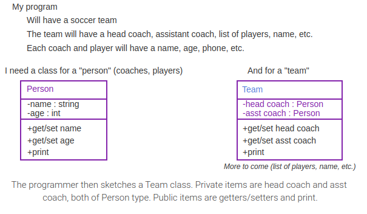

# Module 9 - Objects and Classes

# General Notes

# ZyBooks

## Objects: Introduction

- An **object** is a grouping of data (variables) and operations that can be
  performed on that data (methods).
    - The physical world is made up of material items like wood, metal, plastic,
      fabric, etc. To keep the world understandable, people deal with
      higher-level objects, like chairs, tables, and TV's. Those objects are
      groupings of the lower-level items.

### High-level Object Examples

| Object     | Methods                                                                                  | Fields                                                                 |
|------------|------------------------------------------------------------------------------------------|------------------------------------------------------------------------|
| Chair      | <ul><li>Put stuff in</li></ul>                                                           | <ul><li>Green fabric</li><li>Wood</li></ul>                            |
| Couch      | <ul><li>Sit</li><li>Lie down</li></ul>                                                   | <ul><li>Red fabric</li><li>Wood</li></ul>                              |
| Drawer     | <ul><li>Put stuff in</li><li>Take stuff out</li></ul>                                    | <ul><li>Metal bar</li><li>Wood</li></ul>                               |
| Restaurant | <ul><li>Set main info</li><li>Add cuisine</li><li>Add review</li><li>Print all</li></ul> | <ul><li>Name</li><li>Cuisines</li><li>Phone</li><li>Reviews</li></ul>  |
| Hotel      | <ul><li>Set main info</li><li>Add amenity</li><li>Add review</li><li>Print all</li></ul> | <ul><li>Name</li><li>Amenities</li><li>Phone</li><li>Reviews</li></ul> |

## Abstraction / Information Hiding

**Abstraction** means to have a user interact with an item at a high-level, with
lower-level internal details hidden from the user (aka **information hiding** or
**encapsulation**). 

- Ex: An oven supports an abstraction of a food compartment and a knob to
  control heat. An oven's user need not interact with internal parts of an oven.

Objects strongly support abstraction, hiding entire groups of methods and
variables, exposing only certain methods to a user.

An **abstract data type (ADT)** is a data type whose creation and update are
constrained to specific well-defined operations. 

- A class can be used to implement an ADT.

# Using a Class

- A class is a blueprint for creating objects.

Some **class - object** pairs:

**Coin - penny &rarr; Coin** is the class/blueprint. 

- **penny** is an object of type **Coin**.

**Student - Bart Simpson &rarr; Student** is the class/blueprint. 

- **Bart Simpson** is an object of type **Student**

When creating a class, think about what data an object needs to know about, and
what an object needs to do.

## Classes Intro: Public Member Methods

The **class** construct defines a new type that can group data and methods to
form an object. A class' **public member methods** indicate all operations a
class user can perform on the object.

## Using a Class

Creating an object consists of two steps: 

1. Declaring a reference variable of the class type
2. Assigning the variable with an explicitly allocated instance of the class
   type.

- A **reference variable** can refer to an instance of a class. 
- The **new** operator explicitly allocates an object of the specified class
  type.
- The `.` operator, known as the **member access operator**, is used to invoke a
  method on an object.

## Defining a Class

When defining a class, attributes of the class are called **private fields** or
**instance variables**.

- **private fields:** variables that member methods can access but class users
  cannot.
  - The `private` access modifier precedes each private field declaration.

A programmer defining a class first names the class, declares private fields,
and defines public member methods. A class' fields and methods are collectively
called **class members**.

The programmer defines the details of each member method, sometimes called the
class' **implementation**. 

A **method definition** provides an access modifier, return type, name,
parameters, and the method's statements. A member method can access all private
fields.

Class definitions typically follow this structure:

```
Class Name
------------------------------------------------
private fields/instance variables - can be seen/used throughout the class definition
------------------------------------------------
public methods 
------------------------------------------------
```

### Example: RunnerInfo Class

<u>RunnerInfo.java</u>

```java
class RunnerInfo {
   private int timeRun;
   private double distRun;

   public void setTime(int timeRunSecs) {     // Time run in seconds
      timeRun = timeRunSecs;                   // timeRun refers to the field
   }

   public void setDist(double distRunMiles) {  // Distance run in miles
      distRun = distRunMiles;
   }

   public double getSpeedMph() {               // Speed in miles/hour
      return distRun / (timeRun / 3600.0);     // miles / (secs / (secs / hour))
   }
}
```

---

<u>RaceResults.java</u>

```java
public class RaceResults {
   public static void main(String[] args) {
      RunnerInfo runner1 = new RunnerInfo();          // User-created object of class type RunnerInfo
      RunnerInfo runner2 = new RunnerInfo(); // A second object

      runner1.setTime(360);
      runner1.setDist(1.2);
      runner2.setTime(200);
      runner2.setDist(0.5);

      System.out.println("Runner1's speed in MPH: " + runner1.getSpeedMph());
      System.out.println("Runner2's speed in MPH: " + runner2.getSpeedMph());
   }
}
```

---

<u>Output</u>

```java
Runner1's speed in MPH: 12
Runner2's speed in MPH: 9
```

## Mutators, Accessors, and Private Helpers

### Mutators and Accessors

A class' public methods are commonly classified as either mutators or accessors.

* A **mutator** method may modify ("mutate") a class' fields.
* An **accessor** method accesses fields but may not modify a class' fields.

Commonly, a field has two associated methods: a mutator for setting the value,
and an accessor for getting the value, known as a setter and getter method,
respectively, and typically with names starting with set or get. 

- Other mutators and accessors may exist that aren't associated with just one
  field, such as the `print()` method below.

### Private Helper Methods

A programmer commonly creates private methods, known as **private helper
methods**, to help public methods carry out tasks.

```java
public class MyClass {
   private int numA;

   private int methodX() {
      ...
   }

   public void method1() { 
   

   }
}
```

## Initialization and Constructors

_A good practice is to initialize all variables when declared. This section deals
with initializing the fields of a class when a variable of the class type is
allocated._

### Field Initialization

It is possible to initialize fields in the field declaration, but **it is not
advised to do so. Instead, use a class constructor to initialize fields.**

### Constructors

- A **constructor** is a special class member method that is called when an
  object of that class type is created.
  - It can be used to initialize all fields.
- The constructor has the same name as the class and no return type (not even
  void).

A programmer specifies the constructor that should be called when creating an object:

```java
Restaurant favLunchPlace = new Restaurant(); 
```

- Creates a new `Restaurant` object and calls the constructor `Restaurant()`.
- If a class does not have a programmer-defined constructor, then the Java
  compiler implicitly defines a default constructor with no arguments. 
  - The Java compiler also initializes all fields to their default values.

<u>Restaurant.java</u>

```java
public class Restaurant {
   private String name;
   private int rating;

   public Restaurant() {  // Constructor with no arguments
      name = "NoName";    // Default name: NoName indicates name was not set
      rating = -1;        // Default rating: -1 indicates rating was not set
   }

   public void setName(String restaurantName) {
      name = restaurantName;
   }

   public void setRating(int userRating) {
      rating = userRating;
   }

   public void print() {
      System.out.println(name + " -- " + rating);
   }
}
```

<u>RestaurantFavorites.java</u>

```java
public class RestaurantFavorites {
   public static void main(String[] args) {
      Restaurant favLunchPlace = new Restaurant(); // Calls the constructor

      favLunchPlace.print();

      favLunchPlace.setName("Central Deli");
      favLunchPlace.setRating(4);
      favLunchPlace.print();
   }
}
```

<u>Output</u>

```java
NoName -- -1
Central Deli -- 4
```

## Exploring Further

- [Constructors](http://docs.oracle.com/javase/tutorial/java/javaOO/constructors.html) 
  from Oracle's Java tutorials
- [Initializing Fields](https://docs.oracle.com/javase/tutorial/java/javaOO/initial.html) 
  from Oracle's Java tutorials

## Choosing Classes to Create

- Creating a program may start by a programmer deciding what "things" exist, and
  what each thing contains and does.

### Unified Modeling Language (UML) Example



- Top section is the class name
- Middle section are private fields / instance variables.
- Bottom section shows all the methods, or tasks/behaviors that objects need
  to be able to do.
  - They are usually public.
- The hyphen (`-`) indicates a private item
- The plus (`+`) indicates a public item

## Defining `main()` in a Programmer-defined Class

- The `main()` method can be defined within a programmer-defined class and create
  objects of that class type.
- `main()` is a static method that is independent of class objects. 
- `main()` can access other static methods and static fields of the class, but
  cannot directly access non-static methods or fields.
- A programmer must create objects within `main()` to call non-static methods on
  those objects. 
- Non-static fields and methods are also called instance variables and instance
  methods.

```java
public class BasicCar {

   // Total miles driven by the car
   private int milesDriven;
    
   // Constructor assigns initial values to instance variables
   public BasicCar() {
      milesDriven = 0;   
   }

   // Drive the requested miles
   public void drive(int tripMiles) {
      milesDriven = milesDriven + tripMiles;
   }

   // Return total number of miles driven
   public int checkOdometer() {
      return milesDriven;
   }

   // Main() creates objects of type BasicCar and 
   // calls methods to operate on the objects
   public static void main(String [] args) {
      BasicCar redCorvette = new BasicCar();
      BasicCar fordMustang = new BasicCar();

      redCorvette.drive(100);        
      fordMustang.drive(75);
      fordMustang.drive(300);
      fordMustang.drive(50);        
   }
}
```

## Unit Testing (Classes)

### Testbenches

- A **testbench** is a program whose job is to thoroughly test another program
  (or portion) via a series of input/output checks known as **test cases**.
- **Unit testing** means to create and run a testbench for a specific item (or
  _unit_) like a method or a class.

#### Features of a Good Testbench

- **Automatic checks**
  - Ex: Values are compared, as in `testData.GetNum1() != 100`. For 
    conciseness, only fails are printed.
- **Independent test cases**
  - Ex: The test case for `GetAverage()` assigns new values, vs. relying on 
    earlier values.
- **100% code coverage**
  - Every line of code is executed. A good testbench would have more test 
    cases than below.
- **Includes not just typical values but also border cases**
  - Unusual or extreme test case values like 0, negative numbers, or large 
    numbers.

<u>Class to test: StatsInfo.java</u>

```java
public class StatsInfo {

   // Note: This class intentionally has errors

   private int num1;
   private int num2;

   public void setNum1(int numVal) {
      num1 = numVal;
   }

   public void setNum2(int numVal) {
      num2 = numVal;
   }

   public int getNum1() {
      return num1;
   }

   public int getNum2() {
      return num1;
   }

   public int getAverage() {
      return num1 + num2 / 2;
   }
}
```

---

<u>Testbench: StatsInfoTest.java</u>

```java
public class StatsInfoTest {
   public static void main(String[] args) {
      StatsInfo testData = new StatsInfo();

      // Typical testbench tests more thoroughly

      System.out.println("Beginning tests.");

      // Check set/get num1
      testData.setNum1(100);
      if (testData.getNum1() != 100) {
         System.out.println("   FAILED set/get num1");
      }

      // Check set/get num2
      testData.setNum2(50);
      if (testData.getNum2() != 50) {
         System.out.println("   FAILED set/get num2");
      }

      // Check getAverage()
      testData.setNum1(10);
      testData.setNum2(20);
      if (testData.getAverage() != 15) {
         System.out.println("   FAILED GetAverage for 10, 20");
      }

      testData.setNum1(-10);
      testData.setNum2(0);
      if (testData.getAverage() != -5) {
         System.out.println("   FAILED GetAverage for -10, 0");
      }

      System.out.println("Tests complete.");
   }
}
```

---

<u>Output</u>

```java
Beginning tests.
   FAILED set/get num2
   FAILED GetAverage for 10, 20
   FAILED GetAverage for -10, 0
Tests complete.
```

### Regression Testing

**Regression testing** means to retest an item like a class anytime that item is
changed

- If previously-passed test cases fail, the item has "regressed".

A testbench should be maintained along with the item, to always be usable for
regression testing.

Testbenches may be complex, with thousands of test cases. Various tools support
testing, and companies employ test engineers who only test other programmers'
items. 

- A large percent, like 50% or more, of commercial software development time may
  go into testing.

### Erroneous Unit Tests

An erroneous unit test may fail even if the code being tested is correct. 

- A common error is for a programmer to assume that a failing unit test means
  that the code being tested has a bug. Such an assumption may lead the programmer
  to spend time trying to "fix" code that is already correct. 
- Good practice is to inspect the code of a failing unit test before making
  changes to the code being tested.

### Exploring Further

[JUnit](http://junit.org/) testing framework for Java

## Constructor Overloading

Methods are overloaded when **both** of the following are true:

- [x] They have the same method
- [x] They have different parameter list (either of these two):
  - Different number of parameters
  - The parameter datatypes must be distinguishable

```java
public class Restaurant {
   ...

   // Default constructor
   public Restaurant() {
      name = "NoName";
      rating = -1;
   }

   // Another constructor
   public Restaurant(String initName, int initRating) {
      name = initName;
      rating = initRating;
   }
}
```

If a programmer defines any constructor, the compiler does not implicitly define
a default constructor, so good practice is for the programmer to also explicitly
define a default constructor so that an object creation like new `MyClass()`
remains supported.