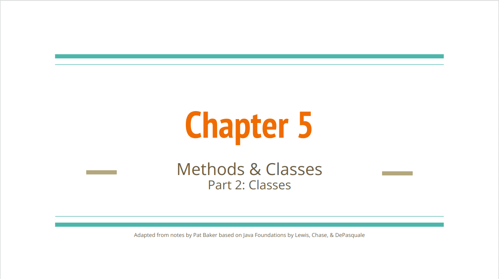
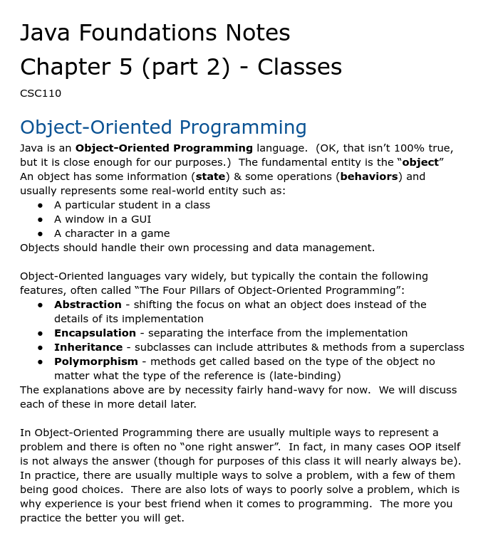
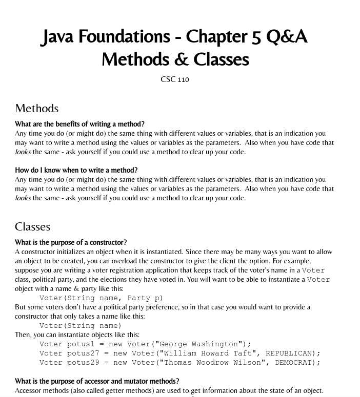

# Module 13 - Handling Exceptions

<!-- TOC -->
* [Module 13 - Handling Exceptions](#module-13---handling-exceptions)
* [General Notes](#general-notes)
* [Module Content](#module-content)
  * [Notes](#notes)
  * [Additional Resources](#additional-resources)
* [ZyBooks](#zybooks)
  * [Handling Exceptions in Java](#handling-exceptions-in-java)
    * [Unhandled exceptions](#unhandled-exceptions)
    * [Catching exceptions](#catching-exceptions)
    * [Handling Exceptions](#handling-exceptions)
      * [Example: `LightTravelTime` Program](#example--lighttraveltime-program)
    * [Common exception types](#common-exception-types)
    * [Conclusion](#conclusion)
  * [Throwing Exceptions](#throwing-exceptions)
    * [Using throw statements](#using-throw-statements)
    * [Using exceptions to separate error checking from normal code](#using-exceptions-to-separate-error-checking-from-normal-code)
      * [Example outputs:](#example-outputs-)
    * [Multiple exception handlers](#multiple-exception-handlers)
      * [Example: BMI calculator with multiple exception handlers](#example--bmi-calculator-with-multiple-exception-handlers)
        * [Example outputs:](#example-outputs--1)
  * [Conclusion](#conclusion-1)
  * [Exceptions with Methods](#exceptions-with-methods)
    * [Specifying Exceptions Thrown by a Method](#specifying-exceptions-thrown-by-a-method)
    * [Checked vs Unchecked Exceptions](#checked-vs-unchecked-exceptions)
    * [Throwing Exceptions in Methods Calling Other Methods](#throwing-exceptions-in-methods-calling-other-methods)
    * [Hierarchical Methods Example: DataTimeSpeedup](#hierarchical-methods-example--datatimespeedup)
      * [Console](#console)
      * [times1.txt](#times1txt)
      * [times2.txt](#times2txt)
      * [times3.txt](#times3txt)
    * [Conclusion](#conclusion-2)
  * [User-defined exceptions](#user-defined-exceptions)
    * [Limitations of using the Exception class](#limitations-of-using-the-exception-class)
    * [Example: Density calculator with multiple user-defined exception types](#example--density-calculator-with-multiple-user-defined-exception-types)
      * [Class Definitions](#class-definitions)
      * [Explanation](#explanation)
    * [Conclusion](#conclusion-3)
  * [Exceptions with Files](#exceptions-with-files)
    * [Handling exceptions from opening invalid files](#handling-exceptions-from-opening-invalid-files)
    * [Closing Files](#closing-files)
      * [Closing multiple files](#closing-multiple-files)
      * [Closing files with the try-with-resources statement](#closing-files-with-the-try-with-resources-statement)
    * [finally block](#finally-block)
    * [Conclusion](#conclusion-4)
<!-- TOC -->

# General Notes

# Module Content

## Notes

> **Google Slides:**
> [Link](https://docs.google.com/presentation/d/107YSaf5JEzA3DHmA1ujbF13MxjI6dxoedeA7sywpzvU/view#slide=id.p)
>
> <a href="https://docs.google.com/presentation/d/107YSaf5JEzA3DHmA1ujbF13MxjI6dxoedeA7sywpzvU/view#slide=id.p"></a>
>
> ---
>
> **Instructor Notes:**
> [Link](https://docs.google.com/document/d/14yEsVmoDYuyI3Sj0FPLraN3xWHWsbHXLD5Ac_2-gPBo/view)
>
> <a href="https://docs.google.com/document/d/14yEsVmoDYuyI3Sj0FPLraN3xWHWsbHXLD5Ac_2-gPBo/view"></a>
>
> ---
>
> **Instructor Q&A:**
> [Link](https://docs.google.com/document/d/1SveqPb7ivX-bIIAiiqtFSMfjO4oloG01t4FYu8etZ4c/view)
>
> <a href="https://docs.google.com/document/d/1SveqPb7ivX-bIIAiiqtFSMfjO4oloG01t4FYu8etZ4c/view"></a>

## Additional Resources

- **Book:**
  [Think Java: How to Think Like a Computer Scientist](http://greenteapress.com/thinkjava6/html/thinkjava6012.html)
  by _Allen B. Downey and Chris Mayfield_
- **Video:**
  [Overview of writing your own Classes and Creating Objects](https://youtu.be/JwpRzmAFC_I "Link")[ ](https://youtu.be/JwpRzmAFC_I)
- **Video:**
  [an Account class and tester class. Similar to BankAccount](https://youtu.be/Nq6dIF4NcsI "Link")
- **Video:**
  [ArrayList Basics (Ch 10)](https://youtu.be/a9JZXYXM4xE)
- **Video:**
  [ArrayLists (Ch 10) - A dynamic Data structure](https://youtu.be/6m6X77xAKcU)
- **Video:**
  [ArrayList: Array vs. ArrayList](https://youtu.be/zvlIE7HXx5o)

# ZyBooks

## Handling Exceptions in Java

### Unhandled exceptions

- An **exception** is an unexpected incident that stops the normal execution of
  a program.
    - _Example:_ Dividing by zero or getting invalid input results in an
      exception.
- A program that does not handle an exception ends execution.

### Catching exceptions

To avoid having a program end when an exception occurs, a program can use 
**try** and **catch** blocks to handle the exception during program execution.

- A **try block** surrounds normal code, which is exited immediately if a
  statement within the try block throws an exception.
- A **catch block** catches an exception thrown in a preceding try block. If the
  thrown exception's type matches the catch block's parameter type, the code
  within the catch block executes.
    - A catch block is called an **exception handler**.

### Handling Exceptions

- A program may be able to resolve some exceptions.
- Instead of just printing the caught exception, a program can discard the
  current input line and get the distance from the user again.

#### Example: `LightTravelTime` Program

```java
import java.util.Scanner;
import java.util.InputMismatchException;

public class LightTravelTime {
   public static void main(String[] args) {
      Scanner scnr = new Scanner(System.in);
      double distMiles = 0.0;
      double lightTravelTime = 0.0;
      boolean needInput = true;

      while (needInput) {
         System.out.print("Enter a distance in miles: ");
         
         try {
            distMiles = scnr.nextDouble();
            lightTravelTime = distMiles / 186282.0;
            needInput = false;
         }
         catch (InputMismatchException e) {
            scnr.nextLine(); // Throw away incorrect input
         }
      }

      System.out.println("Light travels " + distMiles + 
                         " miles in " + lightTravelTime +
                         " seconds");
   }
}
```

- The program repeatedly prompts the user for input until a valid distance value
  is entered.
- The `try` block tries to get the distance from the user, and if an exception
  occurs, the `catch` block discards the current input line and prompts the user
  again.
- If no exception is thrown, the program exits the `while` loop and prints the
  result.

### Common exception types

|                                                                     Type                                                                     | Reason exception is thrown                                                                                         |
|:--------------------------------------------------------------------------------------------------------------------------------------------:|:-------------------------------------------------------------------------------------------------------------------|
|                    [EOFException](https://docs.oracle.com/en/java/javase/11/docs/api/java.base/java/io/EOFException.html)                    | End of file or end of stream has been reached unexpectedly during input                                            |
|         [InputMismatchException](https://docs.oracle.com/en/java/javase/11/docs/api/java.base/java/util/InputMismatchException.html)         | Received input does not match expected type or the input is out of range for the expected type (thrown by Scanner) |
| [ArrayIndexOutOfBoundsException](https://docs.oracle.com/en/java/javase/11/docs/api/java.base/java/lang/ArrayIndexOutOfBoundsException.html) | An array has been accessed with an illegal index (negative or greater than array size)                             |
|           [FileNotFoundException](https://docs.oracle.com/en/java/javase/11/docs/api/java.base/java/io/FileNotFoundException.html)           | Attempt to open a file denoted by a filename failed                                                                |
|            [ArithmeticException](https://docs.oracle.com/en/java/javase/11/docs/api/java.base/java/lang/ArithmeticException.html)            | Arithmetic condition failed (Ex: Divide by zero error)                                                             |

- _Source: [Java™ Platform API Specification](https://docs.oracle.com/)_

### Conclusion

- Exceptions are unexpected incidents that stop the normal execution of a
  program.
- Programs can use try and catch blocks to handle exceptions during program
  execution.
- Some exceptions can be resolved by discarding the current input line and
  prompting the user again.
- Different types of exceptions exist in Java, including EOFException,
  InputMismatchException, ArrayIndexOutOfBoundsException, FileNotFoundException,
  and ArithmeticException.

## Throwing Exceptions

### Using throw statements

- A **throw** statement throws a throwable object, like an exception, during
  program execution.
- A program can throw user-defined exceptions using a throw statement.
- _Ex:_ `throw new Exception("Invalid date.");` creates and throws an exception
  with the message "Invalid date".

### Using exceptions to separate error checking from normal code

- A programmer can detect errors and throw exceptions to keep error-checking
  code separate from normal code and to reduce redundant error checks.
- The program computes the density of an object by taking the ratio of mass and
  volume inputs.
- If either input is negative, the program throws an exception to handle the
  error.

    ```java
    import java.util.Scanner;

    public class DensityCalculator {
       public static void main(String[] args) {
          Scanner scnr = new Scanner(System.in);
          double massVal = 0;   // Object mass (kg)
          double volumeVal = 0; // Object volume (m^3)
          double densityCalc;   // Resulting density
    
          try {
             massVal = scnr.nextDouble();
    
             // Error checking, non-negative mass
             if (massVal < 0.0) {
                throw new Exception("Invalid mass");
             }
    
             volumeVal = scnr.nextDouble();
    
             // Error checking, non-negative volume
             if (volumeVal < 0.0) {
                throw new Exception("Invalid volume");
             }
    
             densityCalc = massVal / volumeVal;
    
             System.out.print("Density: " + densityCalc);
          }
          catch (Exception excpt) {
             // Prints the error message passed by the throw statement.
             System.out.print(excpt.getMessage());
          }
       }
    }
    ```
- The `getMessage()` method returns the `Exception` object's message.

#### Example outputs:

    ```
    3.0 2.0
    Density: 1.5
    ...
    -1.0 2.0
    Invalid mass
    ...
    3.0 -1.0
    Invalid volume
    ```

### Multiple exception handlers

- Code within a try block may throw different types of exceptions.
- The program below computes a person's BMI from weight and height inputs.
- If any input is negative, the program throws an exception of type Exception.
- If any input is not an integer, Scanner's nextInt() method throws an exception
  of type InputMismatchException.

#### Example: BMI calculator with multiple exception handlers

```java
import java.util.Scanner;
import java.util.InputMismatchException;

public class BMICalculator {
   public static void main(String[] args) {
      Scanner scnr = new Scanner(System.in);
      int weightVal = 0;    // User defined weight (lbs)
      int heightVal = 0;    // User defined height (in)
      double bmiCalc;        // Resulting BMI

      try {
         System.out.print("Enter weight (in pounds): ");
         weightVal = scnr.nextInt();

         // Error checking, non-negative weight
         if (weightVal < 0) {
            throw new Exception("Invalid weight.");
         }

         System.out.print("Enter height (in inches): ");
         heightVal = scnr.nextInt();

         // Error checking, non-negative height
         if (heightVal < 0) {
            throw new Exception("Invalid height.");
         }

         bmiCalc = ((double) weightVal /
                    (double) (heightVal * heightVal)) * 703.0f;

         System.out.println("BMI: " + bmiCalc);
      }
      catch (InputMismatchException excpt) {
         System.out.println("Expected a number as input.");
         System.out.println("Cannot compute BMI.");
      }
      catch (Exception excpt) {
         // Prints the error message passed by the throw statement.
         System.out.println(excpt.getMessage());
         System.out.println("Cannot compute BMI.");
      }
   }
}
```

##### Example outputs:

    ```java
    Enter weight (in pounds): 150
    Enter height (in inches): 66
    BMI: 24.207988980716255
    ...
    Enter weight (in pounds): -1
    Invalid weight.
    Cannot compute BMI.
    ...
    Enter weight (in pounds): 150
    Enter height (in inches): sixty
    Expected a number as input.
    Cannot compute BMI.
    ```

## Conclusion

- `throw` statements are used to throw exceptions in a program and can be used
  to handle errors and separate error-checking code from normal code.
- Multiple exception handlers can be used to catch different types of exceptions
  and provide custom messages for each case.

## Exceptions with Methods

### Specifying Exceptions Thrown by a Method

- A program may handle an exception outside of the method that throws the
  exception.
- The `throws` clause specifies the types of exceptions that a method may throw
  and callers of the method should handle.
- A `throws` clause is specified after a method's parameters list and before the
  opening brace.
- A `throws` clause may specify multiple exception types, separated by commas.

### Checked vs Unchecked Exceptions

Java has two types of exceptions:

- **Checked**
    - A Checked exception is an exception that a programmer should be able to
      anticipate and handle.
        - _Ex:_ A program that opens files should anticipate and handle a
          FileNotFoundException.
- **Unchecked**
    - An Unchecked exception is an exception caused by hardware or logic errors
      that
      a programmer usually cannot anticipate and handle.
        - _Ex:_ A program should try to eliminate code that uses null references
          instead of catching and handling NullPointerException.

Java's **catch or specify requirement** requires methods to either catch a
checked
exception using a `catch` block or specify that the method throws the checked
exception using a `throws` clause.

- Code that does not obey the catch or specify requirement does not compile.

|                                                        Unchecked exception                                                         | Notes                                                                                                                               |
|:----------------------------------------------------------------------------------------------------------------------------------:|:------------------------------------------------------------------------------------------------------------------------------------|
|      [NullPointerException](https://docs.oracle.com/en/java/javase/12/docs/api/java.base/java/lang/NullPointerException.html)      | Indicates a null reference.                                                                                                         |
| [IndexOutOfBoundsException](https://docs.oracle.com/en/java/javase/12/docs/api/java.base/java/lang/IndexOutOfBoundsException.html) | Indicates that an index (e.g., an index for an array) is outside the appropriate range.                                             |
|       [ArithmeticException](https://docs.oracle.com/en/java/javase/12/docs/api/java.base/java/lang/ArithmeticException.html)       | Indicates the occurrence of an exceptional arithmetic condition (e.g., integer division by zero).                                   |
|                    [IOError](https://docs.oracle.com/en/java/javase/12/docs/api/java.base/java/io/IOError.html)                    | Indicates the failure of an I/O operation.                                                                                          |
|        [ClassCastException](https://docs.oracle.com/en/java/javase/12/docs/api/java.base/java/lang/ClassCastException.html)        | Indicates an invalid attempt to cast an object to type of which the object is not an instance (e.g., casting a Double to a String). |
|  [IllegalArgumentException](https://docs.oracle.com/en/java/javase/12/docs/api/java.base/java/lang/IllegalArgumentException.html)  | Indicates an illegal or inappropriate method argument.                                                                              |

### Throwing Exceptions in Methods Calling Other Methods

- A method may call another method with a `throws` clause.
- If the calling method does not handle the exception types thrown by the called
  method, the calling method's `throws` clause must specify all exception types
  thrown by the called method.

### Hierarchical Methods Example: DataTimeSpeedup

- The program uses hierarchical method calls to print the speedup of the average
  time values in two files.
- The `calcAvgInputVal()` method may throw an exception of type `Exception`
  while reading from a Scanner.
- `calcAvgSpeedup()` calls `calcAvgInputVal()` and does not catch
  the `Exception` type.
- The `throws` clause for `calcAvgSpeedup()` must specify the type `Exception`.

```java
import java.util.Scanner;
import java.io.FileInputStream;
import java.io.FileNotFoundException;

public class DataTimeSpeedup {
   public static double calcAvgInputVal(Scanner scnr) throws Exception {
      double sumVal = 0;
      int numValues = scnr.nextInt();

      if (numValues < 0) {
         throw new Exception("Negative number of values");
      }

      for (int i = 0; i < numValues; ++i) {
         sumVal += scnr.nextDouble();
      }

      return sumVal / (double) numValues;
   }

   public static double calcAvgSpeedup(String file1, String file2) throws FileNotFoundException, Exception {
      FileInputStream inStream1 = new FileInputStream(file1);
      FileInputStream inStream2 = new FileInputStream(file2);
      Scanner fileScnr1 = new Scanner(inStream1);
      Scanner fileScnr2 = new Scanner(inStream2);

      double file1Avg = calcAvgInputVal(fileScnr1);
      double file2Avg = calcAvgInputVal(fileScnr2);

      return file2Avg / file1Avg;
   }

   public static void main(String[] args) {
      Scanner scnr = new Scanner(System.in);
      String file1;
      String file2;
      double avgSpeedup;
      boolean retry = true;

      while (retry) {
         System.out.print("Enter data file names: ");
         file1 = scnr.next();
         file2 = scnr.next();

         try {
            avgSpeedup = calcAvgSpeedup(file1, file2);
            retry = false;

            System.out.println("Speedup: " + avgSpeedup);
         }
         catch (FileNotFoundException exception) {
            System.out.println(exception.getMessage());
            retry = true;
         }
         catch (Exception exception) {
            System.out.println(exception.getMessage());
            retry = false;
         }
      }
   }
}
```

#### Console

```java
Enter data file names: times1.txt bad.txt
bad.txt (No such file or directory)
Enter data file names: times1.txt times2.txt
Speedup: 1.25

...

Enter data file names: times1.txt times3.txt
Negative number of values
```

#### times1.txt

```java
3
1.0
2.0
3.0
```

#### times2.txt

```java
4
1.0
2.0
3.0
4.0
```

#### times3.txt

```java
-3
1.0
2.0
3.0
```

### Conclusion

- The `throws` clause specifies the types of exceptions that a method may throw
  and callers of the method should handle.
- Java has two types of exceptions: **Checked** and **Unchecked** exceptions.
- Java's catch or specify requirement requires methods to either catch a checked
  exception using a `catch` block or specify that the method throws the checked
  exception using a `throws` clause.
- A method may call another method with a `throws` clause. If the calling method
  does not handle the exception types thrown by the called method, the calling
  method's `throws` clause must specify all exception types thrown by the called
  method.

## User-defined exceptions

User-defined exception types can be used to handle specific exceptions in a
program. A custom exception type can be defined by extending the Exception
class. This approach allows the programmer to define exceptions with custom
messages that are relevant to the program's context. Additionally, by defining
custom exception types, the program can handle each exception separately, making
the code more readable and efficient.

### Limitations of using the Exception class

A catch block that catches the `Exception` type can catch exceptions of any
type.

- Thus, a program that uses the `Exception` type may not be able to
  differentiate between caught exceptions or may catch unintended exception
  types.

### Example: Density calculator with multiple user-defined exception types

The program below throws exceptions of type `InvalidNegativeInputException` for
negative inputs and throws `NaNException` when dividing **0.0** by **0.0**.

By using separate exception handlers for each exception type, the program can
handle each exception separately.

#### Class Definitions

`InvalidNegativeInputException.java`:

```java
public class InvalidNegativeInputException extends Exception {
   public InvalidNegativeInputException(String varName) {
      super("Variable " + varName + " is negative");
   }
}
```

`NaNException.java`:

```java
public class NaNException extends Exception {
   public NaNException(String varName) {
      super("Variable " + varName + " is NaN");
   }
}
```

`DensityCalculator.java`:

```java
import java.util.Scanner;

public class DensityCalculator {
   public static double getPositiveValue(Scanner scnr, String valName)
                        throws InvalidNegativeInputException {

      System.out.print("Enter " + valName + ": ");

      double inputVal = scnr.nextDouble();

      if (inputVal < 0.0) {
          throw new InvalidNegativeInputException(valName);
      }

      return inputVal;
   }

   public static double getDensity(Scanner scnr)
                        throws InvalidNegativeInputException, NaNException {

      double massVal = getPositiveValue(scnr, "massVal");
      double volumeVal = getPositiveValue(scnr, "volumeVal");
      double densityCalc = massVal / volumeVal;

      if (Double.isNaN(densityCalc)) {
         throw new NaNException("densityCalc");
      }

      return densityCalc;
   }

   public static void main(String[] args) {
      Scanner scnr = new Scanner(System.in);

      try {
         System.out.println("Density: " + getDensity(scnr));
      }
      catch (InvalidNegativeInputException excpt) {
         System.out.println(excpt.getMessage());
         // Handle ...
      }
      catch (NaNException excpt) {
         System.out.println(excpt.getMessage());
         // Handle ...
      }
   }
}
```

#### Explanation

The `DensityCalculator` class defines two methods, `getPositiveValue`
and `getDensity`, that throw exceptions of type `InvalidNegativeInputException`
and `NaNException` when the input is negative or NaN, respectively. These
exceptions are defined in the classes `InvalidNegativeInputException`
and `NaNException`.

The `main` method uses try-catch blocks to handle exceptions thrown
by `getDensity`. If an `InvalidNegativeInputException` is caught, the program
prints the exception message, and if a `NaNException` is caught, the program
also prints the exception message. By handling each exception separately, the
program can provide more specific and informative error messages.

### Conclusion

Custom exception types are a powerful tool that can be used to improve the
readability and efficiency of programs. By defining custom exception types, the
program can handle each exception separately, making the code more readable and
efficient. Additionally, custom exception types can provide more specific and
informative error messages that are relevant to the program's context, making it
easier to identify and fix errors. It is important to note that custom exception
types should be used judiciously and only when necessary to avoid
overcomplicating the program's design.

## Exceptions with Files

### Handling exceptions from opening invalid files

- A program may try to open a file that does not exist.
    - _Ex:_ The file may have been deleted, renamed, or moved.
- The `FileInputStream` constructor throws `FileNotFoundException` if the
  specified file cannot be found or opened for reading.

### Closing Files

- A good practice is to close all files to allow the operating system to clean
  up any resources used while reading or writing a file.
- To close the files, the `Scanner` and `PrintWriter` objects should be
  initialized to `null` and closed in a try-catch block.
- The following code reads numbers from an input file, writes the average to an
  output file, and then closes both files before exiting.

#### Closing multiple files

```java
import java.util.Scanner;
import java.io.FileInputStream;
import java.io.FileOutputStream;
import java.io.PrintWriter;
import java.io.FileNotFoundException;
import java.io.IOException;

public class FileDataAverage {
   public static void main(String[] args) {
      Scanner scnr = new Scanner(System.in);
      int expectedNumValues = 0;
      int numValuesRead = 0;
      int valueSum = 0;
      double valueAvg = 0.0;

      FileInputStream fileInStream;
      Scanner fileScanner = null;
      FileOutputStream fileOutStream;
      PrintWriter fileWriter = null;

      try {
         // Open input file.
         fileInStream = new FileInputStream("input.txt");
         fileScanner = new Scanner(fileInStream);
         System.out.println("Opened input.txt");

         // Open output file.
         fileOutStream = new FileOutputStream("output.txt");
         fileWriter = new PrintWriter(fileOutStream);
         System.out.println("Opened output.txt");

         // The first entry in the input file is the expected number of values.
         expectedNumValues = fileScanner.nextInt(); // May throw InputMismatchException

         // Calculate the average input value.
         for (numValuesRead = 0; numValuesRead < expectedNumValues; ++numValuesRead) {
            valueSum += fileScanner.nextInt();  // May throw InputMismatchException
         }

         valueAvg = valueSum / numValuesRead;

         // Print the average to the output file.
         fileWriter.println("Average: " + valueAvg);
      }
      catch (FileNotFoundException exception) {
         System.out.println("Error opening file");
      }

      // Close both files.
      if (fileScanner != null) {
         fileScanner.close();
         System.out.println("Closed input.txt");
      }

      if (fileWriter != null) {
         fileWriter.close();
         System.out.println("Closed output.txt");
      }
   }
}
```

#### Closing files with the try-with-resources statement

- A program can use a try-with-resources statement to automatically close files
  if any exception, caught or uncaught, occurs within a try block.
- The **try-with-resources** statement declares closable resources, like files,
  within parentheses after the try keyword and before the try's opening curly
  brace.
- The declared resources are closed after the try block exits.
- Multiple resources, separated by semicolons, can be declared in a single
  try-with-resources statement.

```java
try (FileInputStream inStrm = new FileInputStream(fName);
    Scanner scnr = new Scanner(inStrm)) {
    // ...
}
catch (FileNotFoundException e) {
    // ...
}
catch (IOException e) {
    // ...
}
```

### finally block

- A `finally` block always executes when a try block exits.
- A programmer can use a `finally` block to do additional processing, even if an
  exception is thrown in the try statement.
- The program below uses a `finally` block to write partial results to the
  output file, even if an `InputMismatchException` exception occurs while
  reading the input file.

```java
import java.util.Scanner;
import java.io.FileInputStream;
import java.io.FileOutputStream;
import java.io.PrintWriter;
import java.io.FileNotFoundException;

public class FileDataSum {
   public static void main(String[] args) {
      Scanner scnr = new Scanner(System.in);
      PrintWriter fileWriter = null;
      int numValues;
      int numValuesRead = 0;
      int valueSum = 0;

      try (Scanner fileScnr = new Scanner(new FileInputStream("input.txt"))) {
         fileWriter = new PrintWriter(new FileOutputStream("output.txt"));
         numValues = fileScnr.nextInt();

         for (numValuesRead = 0; numValuesRead < numValues; ++numValuesRead) {
            valueSum += fileScnr.nextInt();
         }
      }
      catch (FileNotFoundException exception) {
         System.out.println("File not found");
      }
      finally {
         if (fileWriter != null) {
            fileWriter.println(valueSum);
            fileWriter.close();
         }
      }
   }
}
```

### Conclusion

- It is important to handle exceptions when working with files to prevent the
  program from crashing.
- A good practice is to close all files after finishing working with them to
  allow the operating system to clean up any resources used while reading or
  writing a file.
- The try-with-resources statement can be used to automatically close files if
  any exception occurs within a try block.
- The finally block always executes when a try block exits and can be used to do
  additional processing, even if an exception is thrown in the try statement.
        
